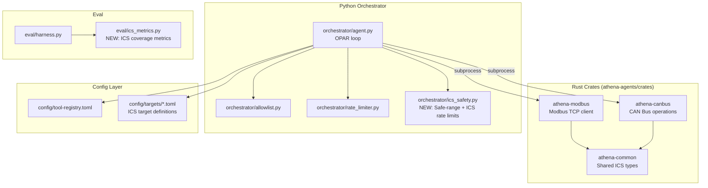

# Design Document: Athena ICS Tooling

## Overview

This design extends the Athena offensive security platform with two new Rust crates (`athena-modbus` and `athena-canbus`) for Industrial Control System protocol testing. The implementation follows established patterns from `athena-fuzzer` and `athena-crafter`: each crate exposes a `lib.rs` with core logic and a `main.rs` CLI entry point, sharing types through `athena-common`. The Python orchestrator gains ICS-specific safety controls (rate limiting, safe-range validation, capability gating), and the eval harness adds ICS coverage metrics.

All tooling targets virtual environments (OpenPLC simulators, GRFICSv2, Linux vcan interfaces) with no real hardware dependency.

## Architecture



## Components and Interfaces

### 1. Shared ICS Types (`athena-common`)

New types added to `crates/athena-common/src/lib.rs`:

```rust
// --- ICS Protocol enum ---
#[derive(Debug, Clone, Copy, Serialize, Deserialize, PartialEq, Eq)]
#[serde(rename_all = "kebab-case")]
pub enum IcsProtocol {
    ModbusTcp,
    CanBus,
}

// --- Modbus result types ---
#[derive(Debug, Clone, Serialize, Deserialize, PartialEq, Eq)]
pub struct ModbusReadResult {
    pub unit_id: u8,
    pub function_code: u8,
    pub address: u16,
    pub quantity: u16,
    pub values: Vec<u16>,
    pub elapsed_ms: u64,
}

#[derive(Debug, Clone, Serialize, Deserialize, PartialEq, Eq)]
pub struct ModbusWriteResult {
    pub unit_id: u8,
    pub function_code: u8,
    pub address: u16,
    pub value_written: Vec<u16>,
    pub elapsed_ms: u64,
}

#[derive(Debug, Clone, Serialize, Deserialize, PartialEq, Eq)]
pub struct ModbusEnumerateResult {
    pub target: String,
    pub responding_units: Vec<u8>,
    pub total_scanned: u16,
    pub timeout_ms: u64,
    pub elapsed_ms: u64,
}

#[derive(Debug, Clone, Serialize, Deserialize, PartialEq, Eq)]
pub struct ModbusFuzzSummary {
    pub seed: u64,
    pub unit_id: u8,
    pub iterations_completed: u32,
    pub elapsed_ms: u64,
    pub records: Vec<ModbusFuzzRecord>,
}

#[derive(Debug, Clone, Serialize, Deserialize, PartialEq, Eq)]
pub struct ModbusFuzzRecord {
    pub iteration: u32,
    pub function_code: u8,
    pub payload_size_bytes: usize,
    pub responded: bool,
}

// --- CAN result types ---
#[derive(Debug, Clone, Copy, Serialize, Deserialize, PartialEq, Eq)]
#[serde(rename_all = "lowercase")]
pub enum CanIdType {
    Standard,
    Extended,
}

#[derive(Debug, Clone, Serialize, Deserialize, PartialEq, Eq)]
pub struct CanCraftResult {
    pub id: u32,
    pub id_type: CanIdType,
    pub dlc: u8,
    pub data_hex: String,
}

#[derive(Debug, Clone, Serialize, Deserialize, PartialEq, Eq)]
pub struct CanInjectResult {
    pub interface: String,
    pub frame_count: u32,
    pub elapsed_ms: u64,
}

#[derive(Debug, Clone, Serialize, Deserialize, PartialEq, Eq)]
pub struct CanSniffFrame {
    pub timestamp_us: u64,
    pub id: u32,
    pub id_type: CanIdType,
    pub dlc: u8,
    pub data_hex: String,
}

#[derive(Debug, Clone, Serialize, Deserialize, PartialEq, Eq)]
pub struct CanSniffResult {
    pub interface: String,
    pub duration_ms: u64,
    pub frames: Vec<CanSniffFrame>,
}

#[derive(Debug, Clone, Serialize, Deserialize, PartialEq, Eq)]
pub struct CanFuzzSummary {
    pub seed: u64,
    pub interface: String,
    pub iterations_completed: u32,
    pub id_range: (u32, u32),
    pub elapsed_ms: u64,
    pub frame_count: u32,
}
```

### 2. Modbus Module (`athena-modbus`)

**Crate layout:**
```
crates/athena-modbus/
├── Cargo.toml
├── src/
│   ├── lib.rs        # Core logic: frame building, validation, connection
│   ├── main.rs       # CLI entry point (clap)
│   ├── frame.rs      # MBAP header + PDU encoding/decoding
│   ├── client.rs     # Async TCP Modbus client
│   └── fuzz.rs       # Deterministic fuzzer (xoshiro256++)
```

**MBAP Frame Format:**
```
┌────────────────┬────────────────┬────────┬─────────┬──────────────┬──────────┐
│ Transaction ID │ Protocol ID    │ Length  │ Unit ID │ Function Code│  Data    │
│ (2 bytes)      │ (2 bytes, 0x0)│(2 bytes)│ (1 byte)│ (1 byte)     │(variable)│
└────────────────┴────────────────┴────────┴─────────┴──────────────┴──────────┘
```

**Key design decisions:**
- Manual Modbus TCP frame construction (no external Modbus library) for full control over fuzzing and malformed packet generation
- Transaction IDs are sequential u16 wrapping at 65535
- Async TCP via `tokio::net::TcpStream` with `tokio::time::timeout`
- Safe-range validation happens in `lib.rs` before frame is built — the tool itself rejects unsafe writes without needing the orchestrator

**Actions:**
| Action | Function Codes | Direction |
|--------|---------------|-----------|
| `read-coils` | FC 01 | Read |
| `read-discrete-inputs` | FC 02 | Read |
| `read-holding-registers` | FC 03 | Read |
| `read-input-registers` | FC 04 | Read |
| `write-coil` | FC 05 | Write |
| `write-register` | FC 06 | Write |
| `write-multiple-coils` | FC 15 | Write |
| `write-multiple-registers` | FC 16 | Write |
| `enumerate` | FC 03 (probe) | Read |
| `fuzz` | FC 1–127 (random) | Write |

**CLI interface:**
```
athena-modbus --target <host:port> --action <action> --unit-id <1-247> \
    [--address <0-65535>] [--quantity <1-125>] [--value <int>] \
    [--values <json-array>] [--seed <u64>] [--iterations <u32>] \
    [--timeout-ms <500-60000>] [--safe-range-min <u16>] [--safe-range-max <u16>]
```

### 3. CAN Module (`athena-canbus`)

**Crate layout:**
```
crates/athena-canbus/
├── Cargo.toml
├── src/
│   ├── lib.rs        # Core logic: frame validation, crafting
│   ├── main.rs       # CLI entry point (clap)
│   ├── socket.rs     # Linux SocketCAN raw socket operations (libc)
│   ├── sniff.rs      # Frame capture with duration
│   ├── replay.rs     # Timed replay from capture file
│   └── fuzz.rs       # Deterministic CAN fuzzer (xoshiro256++)
```

**CAN Frame Structure (SocketCAN `can_frame`):**
```rust
#[repr(C)]
struct CanFrame {
    can_id: u32,      // 11-bit standard or 29-bit extended + flags
    can_dlc: u8,      // Data length code (0-8)
    __pad: u8,
    __res0: u8,
    __res1: u8,
    data: [u8; 8],    // Payload
}
```

**Key design decisions:**
- Direct `libc` socket operations for SocketCAN (AF_CAN, SOCK_RAW, CAN_RAW)
- Standard frame: ID bits 0–10, Extended frame: ID bits 0–28 + EFF flag (bit 31)
- Sniff uses a non-blocking read loop with `tokio::time::sleep` for duration control
- Replay reads a JSON capture file and uses `tokio::time::sleep` between frames to preserve original timing deltas
- Fuzzer generates random IDs within a configurable range and random data (0–8 bytes)

**Actions:**
| Action | Capabilities Required | I/O |
|--------|--------------------|-----|
| `craft` | None | Pure computation, stdout |
| `inject` | `CAN_INJECT` | Write to vcan |
| `sniff` | None | Read from vcan |
| `replay` | `CAN_INJECT` | Write to vcan |
| `fuzz` | `CAN_INJECT` | Write to vcan |

**CLI interface:**
```
athena-canbus --interface <vcan0> --action <action> \
    [--id <hex>] [--data <hex>] [--extended] \
    [--duration-ms <1000-300000>] [--capture-file <path>] \
    [--seed <u64>] [--iterations <u32>] \
    [--id-range-start <hex>] [--id-range-end <hex>] \
    [--timeout-ms <1000-300000>]
```

### 4. ICS Safety Controls (`orchestrator/ics_safety.py`)

```python
@dataclass
class SafeRange:
    register_address: int
    min_value: int
    max_value: int

@dataclass
class IcsTargetConfig:
    target_id: str
    host: str
    port: int
    protocol: str  # "modbus-tcp" | "canbus"
    ics_rate_limit: int  # actions per minute (default 10)
    safe_ranges: list[SafeRange]
    capabilities_required: list[str]  # e.g., ["ICS_WRITE", "CAN_INJECT"]

def validate_write_against_safe_range(
    address: int, value: int, safe_ranges: list[SafeRange]
) -> tuple[bool, str | None]:
    """Check if a write value is within the safe range for a given address.
    Returns (allowed, error_message)."""

def load_ics_target_config(path: Path) -> IcsTargetConfig:
    """Load and validate an ICS target TOML configuration file."""
```

The orchestrator's `act` phase is extended:
1. Check if target is ICS (protocol in `["modbus-tcp", "canbus"]`)
2. If ICS: use ICS rate limit instead of default 60 actions/min
3. If write operation: validate against safe ranges before execution
4. If capability missing: emit `needs_review` ground-truth record and halt

### 5. ICS Eval Metrics (`eval/ics_metrics.py`)

```python
@dataclass
class IcsCoverageReport:
    function_codes_tested: set[int]
    function_code_coverage_pct: float
    registers_accessed: set[int]
    register_coverage_pct: float
    can_ids_exercised: set[int]
    can_id_coverage_pct: float
    safety_boundary_compliance: float  # ratio of safe writes / total writes
    boundary_violations: list[BoundaryViolation]

@dataclass
class BoundaryViolation:
    register_address: int
    attempted_value: int
    safe_min: int
    safe_max: int
    timestamp: str
```

### 6. Tool Registry Entries

New entries in `config/tool-registry.toml`:

```toml
[tools.modbus-read]
executable = "${ATHENA_BIN_DIR}/athena-modbus"
invocation = "subprocess"
required_capabilities = []
description = "Modbus TCP register/coil reader"

[tools.modbus-write]
executable = "${ATHENA_BIN_DIR}/athena-modbus"
invocation = "subprocess"
required_capabilities = ["ICS_WRITE"]
description = "Modbus TCP register/coil writer"

[tools.modbus-fuzz]
executable = "${ATHENA_BIN_DIR}/athena-modbus"
invocation = "subprocess"
required_capabilities = ["ICS_WRITE"]
description = "Modbus TCP protocol fuzzer"

[tools.modbus-enumerate]
executable = "${ATHENA_BIN_DIR}/athena-modbus"
invocation = "subprocess"
required_capabilities = []
description = "Modbus TCP unit ID enumerator"

[tools.canbus-craft]
executable = "${ATHENA_BIN_DIR}/athena-canbus"
invocation = "subprocess"
required_capabilities = []
description = "CAN frame crafter"

[tools.canbus-inject]
executable = "${ATHENA_BIN_DIR}/athena-canbus"
invocation = "subprocess"
required_capabilities = ["CAN_INJECT"]
description = "CAN frame injector"

[tools.canbus-sniff]
executable = "${ATHENA_BIN_DIR}/athena-canbus"
invocation = "subprocess"
required_capabilities = []
description = "CAN bus frame sniffer"

[tools.canbus-fuzz]
executable = "${ATHENA_BIN_DIR}/athena-canbus"
invocation = "subprocess"
required_capabilities = ["CAN_INJECT"]
description = "CAN bus fuzzer"
```

### 7. ICS Target Configurations

**`config/targets/openplc.toml`:**
```toml
[target]
id = "openplc"
host = "openplc.lab.local"
port = 502
protocol = "modbus-tcp"
ics_rate_limit = 10

[target.safe_ranges]
100 = [0, 1000]
101 = [0, 500]
200 = [0, 65535]

[target.vulnerabilities]
categories = ["default-credentials", "unauthenticated-access", "function-code-abuse"]
```

**`config/targets/grfics.toml`:**
```toml
[target]
id = "grfics"
host = "grfics.lab.local"
port = 502
protocol = "modbus-tcp"
ics_rate_limit = 5

[target.safe_ranges]
0 = [0, 100]
1 = [0, 100]

[target.vulnerabilities]
categories = ["process-manipulation", "sensor-spoofing", "dos"]
```

**`config/targets/vcan-lab.toml`:**
```toml
[target]
id = "vcan-lab"
interface = "vcan0"
protocol = "canbus"
ics_rate_limit = 10

[target.id_ranges]
standard = [0, 2047]
extended = [0, 536870911]

[target.vulnerabilities]
categories = ["frame-injection", "replay-attack", "bus-flooding"]
```

## Data Models

### Modbus TCP Frame (Wire Format)

| Field | Size | Description |
|-------|------|-------------|
| Transaction ID | 2 bytes (BE) | Client-generated, incremented per request |
| Protocol ID | 2 bytes (BE) | Always 0x0000 for Modbus |
| Length | 2 bytes (BE) | Number of following bytes (Unit ID + PDU) |
| Unit ID | 1 byte | Target device address (1–247) |
| Function Code | 1 byte | Operation identifier (1–127) |
| Data | Variable | Request/response payload |

### CAN Frame (SocketCAN)

| Field | Size | Description |
|-------|------|-------------|
| CAN ID | 4 bytes | Bits 0–10 standard, 0–28 extended; bit 31 = EFF flag |
| DLC | 1 byte | Data length (0–8) |
| Padding | 3 bytes | Reserved |
| Data | 8 bytes | Payload (only DLC bytes meaningful) |

### ICS Target Config Schema

```
target.id: string (unique identifier)
target.host: string (hostname/IP)
target.port: integer (1-65535)
target.protocol: "modbus-tcp" | "canbus"
target.ics_rate_limit: integer (actions per minute, default 10)
target.safe_ranges: map[address → [min, max]]
target.vulnerabilities.categories: string[]
```

## Correctness Properties

*A property is a characteristic or behavior that should hold true across all valid executions of a system — essentially, a formal statement about what the system should do. Properties serve as the bridge between human-readable specifications and machine-verifiable correctness guarantees.*

### Property 1: Modbus ICS Type Serialization Round-Trip

*For any* valid `ModbusReadResult`, `ModbusWriteResult`, `ModbusEnumerateResult`, or `ModbusFuzzSummary` instance, serializing to JSON and deserializing back SHALL produce an equivalent value.

**Validates: Requirements 14.4**

### Property 2: CAN ICS Type Serialization Round-Trip

*For any* valid `CanCraftResult`, `CanInjectResult`, `CanSniffResult`, or `CanFuzzSummary` instance, serializing to JSON and deserializing back SHALL produce an equivalent value.

**Validates: Requirements 14.4**

### Property 3: Modbus MBAP Frame Encoding Round-Trip

*For any* valid Modbus request (unit ID in 1–247, function code in 1–127, valid data), encoding to bytes and decoding back SHALL produce an equivalent request structure.

**Validates: Requirements 1.1, 1.2, 1.3, 1.4, 12.3**

### Property 4: CAN Frame Validation Correctness

*For any* standard arbitration ID in 0–0x7FF with data length 0–8, frame validation SHALL succeed. *For any* ID exceeding 0x7FF without the extended flag, validation SHALL fail.

**Validates: Requirements 5.1, 5.3, 5.4**

### Property 5: Extended CAN Frame ID Range

*For any* extended arbitration ID in 0–0x1FFFFFFF with data length 0–8, frame validation with the extended flag SHALL succeed. *For any* ID exceeding 0x1FFFFFFF, validation SHALL fail regardless of flags.

**Validates: Requirements 5.2, 5.3**

### Property 6: Safe Range Boundary Enforcement

*For any* register address with a configured safe range [min, max], writes with values within [min, max] SHALL be accepted and writes with values outside [min, max] SHALL be rejected with a `safety_boundary_violation` error.

**Validates: Requirements 2.6, 9.2, 9.5**

### Property 7: Modbus Fuzzer Determinism

*For any* seed, unit ID, and iteration count, running the Modbus fuzzer twice with the same parameters SHALL produce identical function codes and payload sizes in the same order.

**Validates: Requirements 4.1, 4.4**

### Property 8: Modbus Fuzzer Function Code Range

*For any* seed and iteration count, all generated function codes in a Modbus fuzz run SHALL be in the range 1–127.

**Validates: Requirements 4.4**

### Property 9: CAN Fuzzer Determinism

*For any* seed, ID range, and iteration count, running the CAN fuzzer twice with the same parameters SHALL produce identical frame sequences.

**Validates: Requirements 7.2**

### Property 10: Payload Hex Normalization Consistency

*For any* valid hex string (even length, only hex characters), the CAN craft result SHALL contain the normalized lowercase representation, and its byte length SHALL equal `data_hex.len() / 2`.

**Validates: Requirements 5.1, 5.2, 12.4**

### Property 11: ICS Rate Limiter Respects Configured Limit

*For any* ICS target with a configured rate limit N, an `IcsRateLimiter(N)` SHALL allow at most N actions in a single burst (bucket starts full) before rejecting subsequent requests.

**Validates: Requirements 9.1, 9.4**

### Property 12: Tool Registry Argument Validation Bounds

*For any* Modbus address value in 0–65535, validation SHALL succeed. *For any* value outside that range, validation SHALL fail. The same holds for unit IDs (1–247), function codes (1–127), CAN standard IDs (0–0x7FF), and CAN extended IDs (0–0x1FFFFFFF).

**Validates: Requirements 8.3**

## Error Handling

### Rust Crates (Modbus + CAN)

All errors follow the existing `ErrorOutput` pattern from `athena-common`:

| Error Category | Condition | Exit Code |
|---------------|-----------|-----------|
| `validation_error` | Invalid CLI arguments, out-of-range values | 1 |
| `connection_error` | Target unreachable (Modbus) | 1 |
| `connection_timeout` | TCP connect timeout exceeded | 1 |
| `response_timeout` | No Modbus response within timeout | 1 |
| `modbus_exception` | Device returned exception response | 1 |
| `safety_boundary_violation` | Write value outside safe range | 1 |
| `interface_error` | vcan interface missing or inaccessible | 1 |
| `capture_file_error` | Replay file missing or malformed | 1 |

Error JSON is always written to stderr; stdout is reserved for successful results.

### Python Orchestrator

| Condition | Action |
|-----------|--------|
| Missing `ICS_WRITE` capability for write | Emit `needs_review` ground-truth, halt action |
| Missing `CAN_INJECT` capability | Emit `needs_review` ground-truth, halt action |
| Safe-range violation detected pre-execution | Emit `needs_review` ground-truth, halt action |
| ICS rate limit exceeded | Block action, log rate-limit breach event |
| Target config file invalid | Raise `IcsConfigError`, do not start engagement |

## Testing Strategy

### Property-Based Tests (Rust — using `proptest`)

Each correctness property maps to a `proptest` test case with minimum 100 iterations:

- **Properties 1–2**: Generate arbitrary ICS result structs, verify serde round-trip
- **Property 3**: Generate valid MBAP requests, verify encode/decode round-trip
- **Properties 4–5**: Generate arbitrary u32 IDs and u8 DLCs, verify validation boundaries
- **Property 6**: Generate random (address, value, min, max) tuples, verify enforcement
- **Properties 7, 9**: Run fuzzer twice with same config, compare output vectors
- **Property 8**: Run fuzzer with random seeds, assert all function codes in 1–127
- **Property 10**: Generate random hex strings, verify normalization + length invariant
- **Property 11**: Instantiate rate limiter with random N, verify burst behavior
- **Property 12**: Generate boundary values for each parameter type, verify validation

### Property-Based Tests (Python — using `hypothesis`)

- ICS safety controls: generate random safe-range configs and write values, verify enforcement
- ICS target config loading: generate TOML variations, verify parse/reject behavior
- Eval metrics: generate random action histories, verify coverage calculation correctness

### Unit Tests

- Modbus frame encoding for each function code (FC 01–06, 15, 16)
- Modbus exception response parsing
- CAN frame crafting for standard and extended IDs
- CLI argument parsing edge cases
- Tool registry schema validation
- ICS target config loading (valid + invalid)
- Eval metric aggregation with known data

### Integration Tests

- Start an OpenPLC simulator, run read/write/enumerate/fuzz operations end-to-end
- Set up vcan0 interface, test inject/sniff/replay/fuzz cycle
- Orchestrator integration: verify capability gating, rate limiting, and ground-truth emission with ICS tools

### Test Dependencies

**Rust** (`Cargo.toml` dev-dependencies):
```toml
proptest = "1"
tokio-test = "0.4"
```

**Python** (`pyproject.toml` dev):
```
hypothesis>=6.0
```
