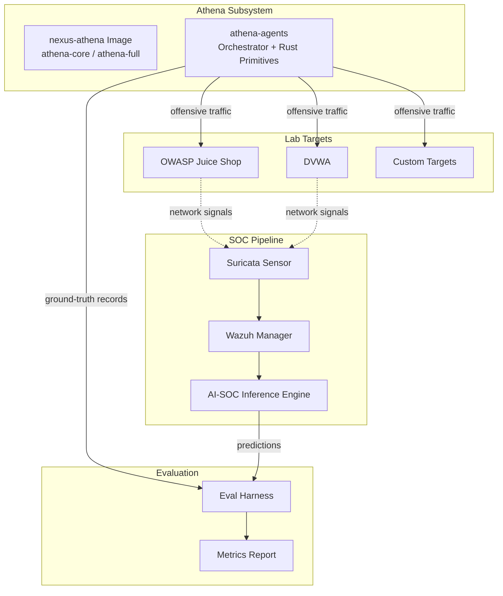
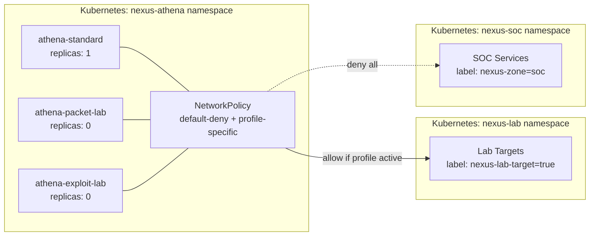
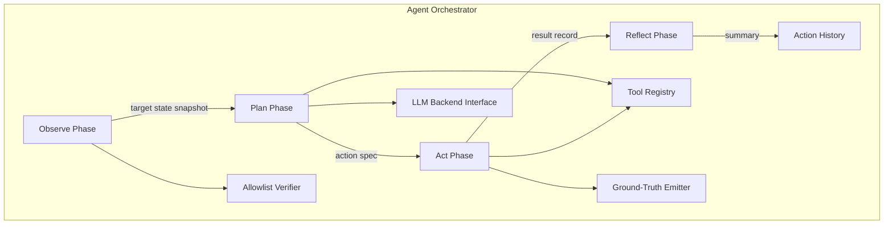

# Design Document: Athena Refinement

## Overview

This design covers two coordinated efforts within the Underground Nexus Athena subsystem (Component E):

1. **Nexus-Athena Image Modernization** — Refactor the existing single-Dockerfile `nexus-athena` image into a multi-stage, multi-platform build producing tiered targets (`athena-core` and `athena-full`), with fully implemented runtime profiles (standard, packet-lab, exploit-lab) and Kubernetes NetworkPolicies enforcing namespace isolation.

2. **Athena-Agents Repository** — Create a new repository housing an AI offensive agent framework consisting of a Python-based Agent Orchestrator (observe/plan/act/reflect loop), Rust offensive primitives (port scanner, protocol fuzzer, packet crafter), a configuration-driven Tool Registry, ground-truth telemetry output, an Eval Harness for purple-team metrics, and LLM backend abstraction.

The combined system forms a closed purple-team feedback loop: Athena generates labeled offensive traffic → SOC sensors (Suricata, Wazuh) capture it → AI-SOC Inference Engine (Component B) scores events → Eval Harness reconciles predictions against ground-truth labels to measure detection accuracy.

### Design Principles

- **Isolation by default**: Athena runs in restricted namespaces/networks; elevated capabilities require explicit opt-in profiles.
- **Separation of concerns**: Offensive tooling stays in Athena; SOC services and analyst workbench remain independent.
- **Configuration-driven**: Tool availability, targets, and LLM backends are declared in structured config files, not hard-coded.
- **Labeled telemetry**: Every offensive action produces structured ground-truth records enabling automated evaluation.
- **Multi-platform**: Images and binaries support both `linux/amd64` and `linux/arm64`.

---

## Architecture

### System Context



### Deployment Architecture



---

## Components and Interfaces

### Component 1: Multi-Stage Dockerfile (`nexus-athena`)

**Location**: `nexus-athena/Dockerfile` (replaces separate `Dockerfile` and `Dockerfile.arm64`)

```dockerfile
# Stage 1: athena-core
FROM kalilinux/kali-rolling AS athena-core
# Recon + scripting tools only
# Multi-platform via docker buildx (linux/amd64, linux/arm64)

# Stage 2: athena-full
FROM athena-core AS athena-full
# Extends core with Metasploit, Wireshark, radare2
```

**Key design decisions**:

| Decision | Choice | Rationale |
|----------|--------|-----------|
| Base image | `kalilinux/kali-rolling` | Stable rolling base; `kali-bleeding-edge` is too volatile for reproducible builds. Architecture-agnostic (supports both amd64 and arm64 via manifest). |
| Multi-platform | Single Dockerfile + `docker buildx` | Eliminates the separate `Dockerfile.arm64`; platform-specific compiler packages selected via `ARG TARGETPLATFORM`. |
| radare2 pinning | `ARG RADARE2_REF=5.9.8` (tagged release) | Already in place; ensures reproducible builds. |
| VOLUME removal | Remove all VOLUME directives | Prevents implicit host mounts; volumes are managed externally via compose/k8s. |
| Non-root user | `athena` UID 1000 | Default execution identity; capabilities documented as labels. |
| Image size | Core target ≤ 1.5 GB compressed | Achieved by omitting Metasploit (~800 MB), Wireshark, and radare2 from core. |

**Stage composition**:

```
athena-core:
  - nmap, python3, python3-pip, python3-scapy
  - git, curl, wget, netcat-openbsd, iproute2, dnsutils, tcpdump
  - ca-certificates, vim (minimal editor)
  - Non-root user (athena, UID 1000)
  - OCI labels documenting required capabilities

athena-full (FROM athena-core):
  - metasploit-framework
  - wireshark (tshark CLI)
  - radare2 (pinned to RADARE2_REF tag)
```

### Component 2: Runtime Profiles

#### Docker Compose Profiles

**Location**: `nexus-athena/deploy/compose/athena-profiles.yml`

Three services, each gated by a named Compose profile:

| Service | Profile flag | Capabilities | Network |
|---------|-------------|--------------|---------|
| `athena.standard` | *(default, no profile needed)* | All dropped, no additions | `athena_lab` |
| `athena.packet-lab` | `--profile packet-lab` | `NET_ADMIN`, `NET_RAW` | `athena_lab` |
| `athena.exploit-lab` | `--profile exploit-lab` | `NET_ADMIN`, `NET_RAW`, `SYS_PTRACE` | `athena_lab` |

All services share:
- `security_opt: [no-new-privileges:true]`
- `cap_drop: [ALL]` (before `cap_add`)
- Attached only to `athena_lab` bridge network

#### Kubernetes Manifests

**Location**: `nexus-athena/deploy/kubernetes/base/`

New file: `athena-exploit-lab.yaml`

```yaml
apiVersion: apps/v1
kind: Deployment
metadata:
  name: athena-exploit-lab
  namespace: nexus-athena
  labels:
    app.kubernetes.io/name: nexus-athena
    app.kubernetes.io/component: exploit-lab
  annotations:
    nexus-athena/required-capabilities: "NET_ADMIN,NET_RAW,SYS_PTRACE"
    nexus-athena/profile-type: "exploit-lab"
spec:
  replicas: 0  # Requires explicit kubectl scale to activate
  selector:
    matchLabels:
      app.kubernetes.io/name: nexus-athena
      app.kubernetes.io/component: exploit-lab
  template:
    metadata:
      labels:
        app.kubernetes.io/name: nexus-athena
        app.kubernetes.io/component: exploit-lab
    spec:
      containers:
        - name: athena
          image: phoenixvlabs/nexus-athena:full-latest
          command: ["/bin/bash", "-lc", "sleep infinity"]
          securityContext:
            allowPrivilegeEscalation: false
            capabilities:
              drop: ["ALL"]
              add: ["NET_ADMIN", "NET_RAW", "SYS_PTRACE"]
```

### Component 3: Kubernetes NetworkPolicies

**Location**: `nexus-athena/deploy/kubernetes/base/`

Three policy resources layered together:

#### 3a. Default Deny (`network-policy-default-deny.yaml`)

```yaml
apiVersion: networking.k8s.io/v1
kind: NetworkPolicy
metadata:
  name: athena-default-deny
  namespace: nexus-athena
spec:
  podSelector: {}
  policyTypes: [Ingress, Egress]
  egress:
    - to:
        - namespaceSelector:
            matchLabels:
              kubernetes.io/metadata.name: kube-system
          podSelector:
            matchLabels:
              k8s-app: kube-dns
      ports:
        - protocol: UDP
          port: 53
```

Effect: All pods in `nexus-athena` can only resolve DNS. All ingress and non-DNS egress blocked.

#### 3b. Lab Egress (`network-policy-lab-egress.yaml`)

```yaml
apiVersion: networking.k8s.io/v1
kind: NetworkPolicy
metadata:
  name: athena-lab-egress
  namespace: nexus-athena
spec:
  podSelector:
    matchLabels:
      app.kubernetes.io/name: nexus-athena
  policyTypes: [Egress]
  egress:
    - to:
        - namespaceSelector:
            matchLabels:
              nexus-lab-network: "true"
          podSelector:
            matchLabels:
              nexus-lab-target: "true"
    - to:
        - namespaceSelector:
            matchLabels:
              kubernetes.io/metadata.name: kube-system
          podSelector:
            matchLabels:
              k8s-app: kube-dns
      ports:
        - protocol: UDP
          port: 53
```

Effect: When applied, Athena pods can reach labeled lab targets. DNS still allowed.

#### 3c. SOC Deny (`network-policy-soc-deny.yaml`)

```yaml
apiVersion: networking.k8s.io/v1
kind: NetworkPolicy
metadata:
  name: athena-deny-soc
  namespace: nexus-athena
spec:
  podSelector: {}
  policyTypes: [Egress]
  egress:
    - to:
        - namespaceSelector:
            matchExpressions:
              - key: nexus-zone
                operator: DoesNotExist
```

This policy ensures that even if other policies allow egress, any namespace labeled `nexus-zone: soc` remains unreachable. Implementation note: Kubernetes NetworkPolicy is additive (union of allowed), so the SOC deny is enforced by never including `nexus-zone: soc` namespaces in any allow rule. The default-deny already blocks it; this explicit rule documents intent and survives additional policy additions.

### Component 4: Agent Orchestrator

**Location**: `athena-agents/orchestrator/` (Python package)



#### Execution Cycle

```python
class AgentOrchestrator:
    """Core observe/plan/act/reflect execution cycle."""

    async def run_scenario(self, scenario: ScenarioConfig) -> ScenarioResult:
        self.verify_allowlist_integrity()
        self.validate_target(scenario.target)
        action_count = 0

        while action_count < scenario.max_actions:
            # Phase 1: Observe
            state = await self.observe(scenario.target)

            # Phase 2: Plan
            action_spec = await self.plan(state, self.action_history)

            # Phase 3: Act
            result = await self.act(action_spec)
            self.emit_ground_truth(action_spec, result)
            action_count += 1

            # Phase 4: Reflect
            summary = await self.reflect(action_spec, result)
            self.action_history.append(summary)

            if result.terminal:
                break

        return self.finalize_scenario(reason="limit-reached" if action_count >= scenario.max_actions else "completed")
```

#### Key Interfaces

```python
# orchestrator/interfaces.py

@dataclass
class TargetState:
    """Structured snapshot from observe phase."""
    target: str
    open_ports: list[int]
    services: list[ServiceInfo]
    timestamp: datetime

@dataclass
class ActionSpec:
    """Output from plan phase."""
    tool_id: str
    arguments: dict[str, Any]
    technique: str | None  # MITRE ATT&CK ID
    rationale: str

@dataclass
class ActionResult:
    """Output from act phase."""
    success: bool
    output: dict[str, Any]
    error: str | None
    terminal: bool

@dataclass
class ReflectSummary:
    """Output from reflect phase, appended to action history."""
    action_spec: ActionSpec
    result: ActionResult
    evaluation: str
    next_recommendation: str
```

#### Allowlist Verification

The allowlist is a JSON file containing approved target entries. Before each execution cycle, the orchestrator:
1. Reads the allowlist file
2. Computes SHA-256 hash of the file contents
3. Compares against the expected hash stored in configuration (or verifies a detached signature)
4. Rejects execution if verification fails

```python
@dataclass
class AllowlistEntry:
    host: str
    port_range: tuple[int, int]
    protocol: str
    label: str  # e.g., "juice-shop-lab"

def verify_allowlist(path: Path, expected_hash: str) -> list[AllowlistEntry]:
    """Load and verify allowlist integrity. Raises AllowlistError on failure."""
```

#### Rate Limiting

A token-bucket rate limiter controls actions per minute:

```python
class RateLimiter:
    def __init__(self, actions_per_minute: int = 60):
        # Configurable range: 1-600
        self.bucket_size = actions_per_minute
        self.refill_rate = actions_per_minute / 60.0  # tokens per second
```

### Component 5: Rust Offensive Primitives

**Location**: `athena-agents/crates/`

```
athena-agents/
├── crates/
│   ├── athena-scanner/      # Async TCP port scanner
│   │   ├── Cargo.toml
│   │   └── src/
│   │       ├── main.rs      # CLI entry point
│   │       └── lib.rs       # Core scanning logic
│   ├── athena-fuzzer/       # Protocol fuzzer
│   │   ├── Cargo.toml
│   │   └── src/
│   │       ├── main.rs
│   │       └── lib.rs
│   ├── athena-crafter/      # Packet crafter
│   │   ├── Cargo.toml
│   │   └── src/
│   │       ├── main.rs
│   │       └── lib.rs
│   └── athena-common/       # Shared types and JSON output
│       ├── Cargo.toml
│       └── src/lib.rs
├── Cargo.toml               # Workspace root
```

#### Port Scanner (`athena-scanner`)

CLI interface:
```
athena-scanner --target <addr> --start-port <u16> --end-port <u16> \
               [--concurrency <u16>] [--timeout-ms <u32>]
```

Output (JSON to stdout):
```json
{
  "target": "192.168.1.100",
  "ports": [
    {"port": 80, "status": "open"},
    {"port": 443, "status": "open"},
    {"port": 8080, "status": "closed"}
  ],
  "scan_duration_ms": 1523
}
```

Implementation: Uses `tokio` with a semaphore-bounded connection pool. Each port attempt is a `TcpStream::connect` with the configured per-connection timeout.

#### Protocol Fuzzer (`athena-fuzzer`)

CLI interface:
```
athena-fuzzer --target <addr> --protocol <type> --seed <u64> \
              [--iterations <u32>]
```

Output (JSON to stdout, one summary object):
```json
{
  "seed": 42,
  "protocol": "http",
  "iterations_completed": 1000,
  "elapsed_ms": 4521,
  "mutations": [
    {"iteration": 0, "payload_size_bytes": 128, "protocol": "http"},
    ...
  ]
}
```

Implementation: Deterministic PRNG (xoshiro256++) seeded from the CLI argument. Mutations are protocol-aware (HTTP header mangling, TCP flag manipulation, etc.).

#### Packet Crafter (`athena-crafter`)

CLI interface:
```
athena-crafter --protocol <tcp|udp|icmp> --src-port <u16> --dst-port <u16> \
               --payload <hex-string> [--flags <string>]
```

Output (JSON to stdout):
```json
{
  "protocol": "tcp",
  "total_length_bytes": 74,
  "payload_hex": "48454c4c4f"
}
```

#### Cross-cutting concerns

- All binaries output JSON to stdout on success
- All binaries output a JSON error object to stderr on validation failure (exit code 1)
- Build targets: `x86_64-unknown-linux-musl` and `aarch64-unknown-linux-musl` (statically linked)
- Shared types in `athena-common` for consistent JSON serialization

### Component 6: Tool Registry

**Location**: `athena-agents/config/tool-registry.toml`

**Format**: TOML chosen over YAML for stricter typing and cleaner inline tables.

```toml
[tools.port-scanner]
executable = "${ATHENA_BIN_DIR}/athena-scanner"
invocation = "subprocess"
required_capabilities = []
description = "Async TCP port scanner"

[tools.port-scanner.args]
target = { type = "string", required = true }
start_port = { type = "integer", required = true, min = 1, max = 65535 }
end_port = { type = "integer", required = true, min = 1, max = 65535 }
concurrency = { type = "integer", required = false, default = 1024, min = 1, max = 65535 }
timeout_ms = { type = "integer", required = false, default = 3000, min = 100, max = 30000 }

[tools.protocol-fuzzer]
executable = "${ATHENA_BIN_DIR}/athena-fuzzer"
invocation = "subprocess"
required_capabilities = []

[tools.protocol-fuzzer.args]
target = { type = "string", required = true }
protocol = { type = "string", required = true, enum = ["http", "tcp", "dns"] }
seed = { type = "integer", required = true, min = 0 }
iterations = { type = "integer", required = false, default = 1000, min = 1, max = 1000000 }

[tools.packet-crafter]
executable = "${ATHENA_BIN_DIR}/athena-crafter"
invocation = "subprocess"
required_capabilities = ["NET_RAW"]

[tools.packet-crafter.args]
protocol = { type = "string", required = true, enum = ["tcp", "udp", "icmp"] }
src_port = { type = "integer", required = true, min = 1, max = 65535 }
dst_port = { type = "integer", required = true, min = 1, max = 65535 }
payload = { type = "string", required = true }

[tools.nmap-scan]
executable = "/usr/bin/nmap"
invocation = "subprocess"
required_capabilities = []

[tools.nmap-scan.args]
target = { type = "string", required = true }
flags = { type = "string", required = false, default = "-sT" }

[tools.scapy-craft]
module = "orchestrator.tools.scapy_craft"
invocation = "in-process"
required_capabilities = ["NET_RAW"]

[tools.scapy-craft.args]
packet_spec = { type = "object", required = true }
```

#### Schema validation at startup

The orchestrator loads and validates the registry at startup using a Pydantic model:

```python
class ToolArg(BaseModel):
    type: Literal["string", "integer", "object"]
    required: bool = True
    default: Any = None
    min: int | None = None
    max: int | None = None
    enum: list[str] | None = None

class ToolEntry(BaseModel):
    executable: str | None = None
    module: str | None = None
    invocation: Literal["subprocess", "in-process"]
    required_capabilities: list[str] = []
    description: str = ""
    args: dict[str, ToolArg]
```

### Component 7: Ground-Truth Telemetry

**Output format**: JSON Lines (one JSON object per line)

```python
@dataclass
class GroundTruthRecord:
    scenario_id: str          # UUID identifying the scenario
    run_id: str               # UUID identifying this execution run
    timestamp: str            # ISO 8601 UTC (e.g., "2024-01-15T10:30:00.000Z")
    target: str               # Target identifier
    payload_family: str       # Category of payload (e.g., "sqli", "xss")
    technique: str | None     # MITRE ATT&CK ID or null
    expected_result: str      # What the attack should achieve
    safety_boundary: str      # Lab isolation context
    label: GroundTruthLabel   # Enum: malicious | benign_control | failed_attack | successful_simulation | needs_review
    artifact_reference: str   # Path or URI to related artifacts
```

**Output behavior**:
- If `ATHENA_GT_OUTPUT` environment variable is set, records are appended to that file path
- Otherwise, records are written to stdout
- Each record is a single JSON object on exactly one line
- Records are independently parseable (no enclosing array)

### Component 8: Eval Harness

**Location**: `athena-agents/eval/`

#### Matching Algorithm

```python
def match_records(
    ground_truth: list[GroundTruthRecord],
    predictions: list[PredictionRecord],
    time_window_seconds: int = 300
) -> MatchResult:
    """
    Match ground-truth records to predictions.

    Algorithm:
    1. Sort both lists by timestamp
    2. For each ground-truth record, find predictions where:
       - scenario_id matches AND technique matches
       - |prediction.timestamp - gt.timestamp| <= time_window_seconds
    3. If multiple predictions match, take the earliest (first within window)
    4. Mark that prediction as consumed (one-to-one matching)
    5. Unmatched ground-truth = false negatives
    6. Unmatched predictions = false positives
    7. Matched pairs = true positives
    """
```

#### Metrics Computation

```python
@dataclass
class TechniqueMetrics:
    technique: str
    true_positives: int
    false_positives: int
    false_negatives: int
    precision: float  # TP / (TP + FP)
    recall: float     # TP / (TP + FN)
    f1: float         # 2 * (P * R) / (P + R)

@dataclass
class EvalReport:
    model_name: str
    model_version: str
    time_window_seconds: int
    total_ground_truth: int
    total_predictions: int
    per_technique: list[TechniqueMetrics]
    aggregate_precision: float   # micro-averaged
    aggregate_recall: float      # micro-averaged
    aggregate_f1: float          # micro-averaged
    skipped_records: list[SkippedRecord]
    warning: str | None          # Set if either input is empty
    duplicates_excluded: int
```

#### Filtering

The harness supports filtering by `scenario_id`, `technique`, or `payload_family` before metric computation. Filters are applied as inclusive predicates on the ground-truth and prediction sets.

### Component 9: LLM Backend Abstraction

**Location**: `athena-agents/orchestrator/llm/`

```python
# llm/interface.py
class LLMBackend(Protocol):
    async def generate(self, prompt: str, max_tokens: int = 1024) -> str: ...
    async def health_check(self) -> bool: ...
    @property
    def backend_id(self) -> str: ...

# llm/ollama.py
class OllamaBackend(LLMBackend):
    """HTTP client for Ollama REST API."""

# llm/vllm.py
class VLLMBackend(LLMBackend):
    """HTTP client for vLLM OpenAI-compatible API."""

# llm/llamacpp.py
class LlamaCppBackend(LLMBackend):
    """HTTP client for llama.cpp server API."""
```

Configuration:
```toml
# config/llm.toml
[backend]
type = "ollama"  # ollama | vllm | llamacpp
url = "http://localhost:11434"
model = "llama3:8b"
timeout_seconds = 10
```

Startup validation:
1. Parse `type` field; reject if not in `{ollama, vllm, llamacpp}`
2. Instantiate the corresponding backend class
3. Call `health_check()` with 10-second timeout
4. If unreachable, report URL and failure reason, exit non-zero

### Component 10: SOC Pipeline Integration

Athena-generated traffic flows through the existing SOC pipeline without modifications:

```
Athena Agent → Lab Target (in lab network) → Suricata sensor (monitors lab segment) → Wazuh Manager → AI-SOC Inference Engine
```

**Traffic labeling**: The Agent Orchestrator sets environment variables and metadata headers on generated traffic:
- `X-Athena-Scenario-Id` header (for HTTP-based attacks)
- Environment variable `ATHENA_SCENARIO_LABEL` available to all tools
- SOC dashboards filter training traffic using these labels

**Resilience**: If the SOC pipeline doesn't acknowledge event ingestion within 30 seconds, the orchestrator continues execution and stores ground-truth records locally. On pipeline recovery, locally buffered records are forwarded within 5 minutes.

### Component 11: Target Environment Definitions

**Location**: `athena-agents/config/targets/`

```toml
# targets/juice-shop.toml
[target]
id = "juice-shop"
host = "juice-shop.lab.local"
port = 3000
protocol = "http"
base_path = "/"
timeout_seconds = 5

[target.vulnerabilities]
categories = ["injection", "broken-auth", "xss", "security-misconfiguration"]
owasp_top_10 = ["A03:2021", "A07:2021", "A01:2021", "A05:2021"]
```

The same schema supports custom targets — any target definition providing `host`, `port`, `protocol`, `base_path`, and `vulnerabilities` fields is valid.

### Component 12: Repository Structure (`athena-agents`)

```
athena-agents/
├── Cargo.toml                    # Workspace: members = ["crates/*"]
├── pyproject.toml                # Python orchestrator package
├── Makefile                      # Unified build/test entry points
├── Dockerfile                    # Multi-stage agent runner image
├── config/
│   ├── tool-registry.toml
│   ├── llm.toml
│   ├── targets/
│   │   ├── juice-shop.toml
│   │   └── dvwa.toml
│   └── allowlist.json
├── crates/
│   ├── athena-scanner/
│   ├── athena-fuzzer/
│   ├── athena-crafter/
│   └── athena-common/
├── orchestrator/
│   ├── __init__.py
│   ├── agent.py                  # AgentOrchestrator class
│   ├── interfaces.py             # Dataclasses and protocols
│   ├── allowlist.py              # Allowlist loading and verification
│   ├── rate_limiter.py           # Token-bucket rate limiter
│   ├── tool_registry.py          # Registry loading and validation
│   ├── ground_truth.py           # GroundTruthRecord + emitter
│   ├── llm/
│   │   ├── __init__.py
│   │   ├── interface.py
│   │   ├── ollama.py
│   │   ├── vllm.py
│   │   └── llamacpp.py
│   └── tools/
│       └── scapy_craft.py        # In-process tool example
├── eval/
│   ├── __init__.py
│   ├── harness.py                # Matching + metrics
│   └── report.py                 # Report generation
├── tests/
│   ├── rust/                     # (via cargo test)
│   ├── python/
│   │   ├── test_orchestrator.py
│   │   ├── test_tool_registry.py
│   │   ├── test_ground_truth.py
│   │   ├── test_eval_harness.py
│   │   └── test_properties.py   # Property-based tests
│   └── integration/
│       └── test_e2e_scenario.py
└── docs/
    └── architecture.md
```

**Makefile targets**:
```makefile
build:     ## Compile Rust + install Python deps
test:      ## cargo test + pytest
lint:      ## cargo clippy + ruff
fmt:       ## cargo fmt + ruff format
image:     ## Build agent runner Docker image
```

**Dockerfile** (multi-stage):
```dockerfile
# Stage 1: Rust builder
FROM rust:1.78-alpine AS rust-builder
# Build static binaries for musl

# Stage 2: Python environment
FROM python:3.12-slim AS python-env
# Install orchestrator package

# Stage 3: Final runner
FROM python:3.12-slim AS runner
COPY --from=rust-builder /app/target/release/athena-* /usr/local/bin/
COPY --from=python-env /app /app
# No build toolchains in final image
USER athena
```

---

## Data Models

### Ground-Truth Record Schema

```json
{
  "$schema": "http://json-schema.org/draft-07/schema#",
  "type": "object",
  "required": ["scenario_id", "run_id", "timestamp", "target", "payload_family", "technique", "expected_result", "safety_boundary", "label", "artifact_reference"],
  "properties": {
    "scenario_id": { "type": "string", "format": "uuid" },
    "run_id": { "type": "string", "format": "uuid" },
    "timestamp": { "type": "string", "format": "date-time" },
    "target": { "type": "string" },
    "payload_family": { "type": "string" },
    "technique": { "type": ["string", "null"] },
    "expected_result": { "type": "string" },
    "safety_boundary": { "type": "string" },
    "label": { "type": "string", "enum": ["malicious", "benign_control", "failed_attack", "successful_simulation", "needs_review"] },
    "artifact_reference": { "type": "string" }
  }
}
```

### Tool Registry Entry Schema

```json
{
  "type": "object",
  "required": ["invocation", "args"],
  "properties": {
    "executable": { "type": "string" },
    "module": { "type": "string" },
    "invocation": { "type": "string", "enum": ["subprocess", "in-process"] },
    "required_capabilities": { "type": "array", "items": { "type": "string" } },
    "description": { "type": "string" },
    "args": {
      "type": "object",
      "additionalProperties": {
        "type": "object",
        "required": ["type"],
        "properties": {
          "type": { "type": "string", "enum": ["string", "integer", "object"] },
          "required": { "type": "boolean" },
          "default": {},
          "min": { "type": "integer" },
          "max": { "type": "integer" },
          "enum": { "type": "array", "items": { "type": "string" } }
        }
      }
    }
  }
}
```

### Eval Report Schema

```json
{
  "type": "object",
  "required": ["model_name", "model_version", "time_window_seconds", "total_ground_truth", "total_predictions", "per_technique", "aggregate_precision", "aggregate_recall", "aggregate_f1"],
  "properties": {
    "model_name": { "type": "string" },
    "model_version": { "type": "string" },
    "time_window_seconds": { "type": "integer", "minimum": 1, "maximum": 86400 },
    "total_ground_truth": { "type": "integer" },
    "total_predictions": { "type": "integer" },
    "per_technique": {
      "type": "array",
      "items": {
        "type": "object",
        "properties": {
          "technique": { "type": "string" },
          "true_positives": { "type": "integer" },
          "false_positives": { "type": "integer" },
          "false_negatives": { "type": "integer" },
          "precision": { "type": "number" },
          "recall": { "type": "number" },
          "f1": { "type": "number" }
        }
      }
    },
    "aggregate_precision": { "type": "number" },
    "aggregate_recall": { "type": "number" },
    "aggregate_f1": { "type": "number" },
    "skipped_records": { "type": "array" },
    "warning": { "type": ["string", "null"] },
    "duplicates_excluded": { "type": "integer" }
  }
}
```

### Audit Trail Entry

```json
{
  "type": "object",
  "required": ["timestamp", "target", "action_type", "status"],
  "properties": {
    "timestamp": { "type": "string", "format": "date-time" },
    "target": { "type": "string" },
    "action_type": { "type": "string" },
    "tool_id": { "type": "string" },
    "status": { "type": "string", "enum": ["success", "failure"] },
    "detail": { "type": "string" }
  }
}
```

---

## Correctness Properties

*A property is a characteristic or behavior that should hold true across all valid executions of a system — essentially, a formal statement about what the system should do. Properties serve as the bridge between human-readable specifications and machine-verifiable correctness guarantees.*

### Property 1: Ground-Truth Serialization Round Trip

*For any* valid `GroundTruthRecord` instance, serializing to JSON and deserializing back SHALL produce a field-by-field equivalent object.

**Validates: Requirements 7.5**

### Property 2: Port Scanner Output Completeness

*For any* valid target address and port range `[start, end]` where `1 <= start <= end <= 65535`, the scanner output SHALL contain exactly `end - start + 1` port entries, each with the scanned port number and a status of either "open" or "closed".

**Validates: Requirements 5.1**

### Property 3: Fuzzer Deterministic Reproducibility

*For any* given seed, protocol, and iteration count, invoking the protocol fuzzer twice with identical parameters SHALL produce identical mutation sequences (same payload sizes at each iteration index).

**Validates: Requirements 5.2**

### Property 4: Fuzzer Summary Completeness

*For any* completed fuzzer execution with configured iteration count N, the summary JSON SHALL report `iterations_completed <= N` and a non-negative `elapsed_ms` value.

**Validates: Requirements 5.8**

### Property 5: Tool Registry Argument Validation

*For any* tool entry in the registry and any set of arguments where a required argument is missing or an argument violates its declared type constraint (integer out of range, string not in enum), the orchestrator SHALL reject invocation with a validation error.

**Validates: Requirements 6.8**

### Property 6: Eval Harness Metric Consistency

*For any* set of matched true positives (TP), false positives (FP), and false negatives (FN), the computed precision SHALL equal `TP / (TP + FP)`, recall SHALL equal `TP / (TP + FN)`, and F1 SHALL equal `2 * precision * recall / (precision + recall)` (or 0 when denominator is 0).

**Validates: Requirements 8.1**

### Property 7: Eval Harness One-to-One Matching

*For any* ground-truth record that matches more than one prediction within the time window, only the earliest prediction SHALL be counted as a true positive, and remaining matches SHALL be excluded as duplicates. The sum of true positives, false positives, false negatives, and duplicates excluded SHALL equal the sum of total ground-truth records and total predictions.

**Validates: Requirements 8.7**

### Property 8: Allowlist Rejection

*For any* target string not present in the verified allowlist, the Agent Orchestrator SHALL refuse execution and the scenario action history SHALL remain empty.

**Validates: Requirements 4.2, 4.3, 11.1**

### Property 9: Rate Limiter Invariant

*For any* sequence of N action requests submitted within a one-minute window where N exceeds the configured rate limit R, at most R actions SHALL be executed and `N - R` actions SHALL be queued or rejected.

**Validates: Requirements 11.3, 11.4**

### Property 10: Action Limit Termination

*For any* configured maximum action count M (where `1 <= M <= 1000`), the Agent Orchestrator SHALL execute at most M actions before halting, and the final ground-truth record SHALL include a termination reason.

**Validates: Requirements 4.6**

### Property 11: Rust Primitives Input Validation Error Format

*For any* invalid CLI input to a Rust primitive binary (port out of range, missing required argument, invalid type), the binary SHALL exit with a non-zero exit code and write a JSON object to stderr containing at minimum an `error` field and a `message` field.

**Validates: Requirements 5.4**

### Property 12: Eval Harness Empty Input Handling

*For any* evaluation where the ground-truth set or prediction set is empty, all metric values (precision, recall, F1) SHALL be 0 and a warning field SHALL be present in the output.

**Validates: Requirements 8.8**

---

## Error Handling

### Agent Orchestrator Errors

| Error Condition | Behavior |
|----------------|----------|
| Target not in allowlist | Refuse execution, log rejected target, emit alert |
| Allowlist unavailable or fails integrity check | Refuse all execution, emit audit alert |
| Tool not found in registry | Skip action, log warning, record skip in action history |
| Tool capability mismatch | Skip invocation, log missing capabilities, record skip |
| Tool argument validation failure | Reject invocation with descriptive error |
| LLM backend unreachable at startup | Exit with error identifying URL and reason |
| LLM backend unreachable during scenario | Halt scenario, log failure with timestamp |
| Target unreachable | Halt scenario, emit `needs_review` ground-truth record |
| Tool execution error | Halt scenario, log failure phase and details |
| Rate limit exceeded | Queue or reject excess actions, log breach event |
| Max actions reached | Halt cycle, emit final summary record with `limit-reached` |

### Rust Primitives Errors

| Error Condition | Exit Code | Stderr Output |
|----------------|-----------|---------------|
| Invalid port range | 1 | `{"error": "validation", "message": "start_port must be <= end_port"}` |
| Port out of bounds | 1 | `{"error": "validation", "message": "port must be 1-65535"}` |
| Invalid concurrency | 1 | `{"error": "validation", "message": "concurrency must be 1-65535"}` |
| Target unreachable | 2 | `{"error": "connection", "message": "..."}` |
| Invalid protocol type | 1 | `{"error": "validation", "message": "unsupported protocol: ..."}` |

### Eval Harness Errors

| Error Condition | Behavior |
|----------------|----------|
| Empty ground-truth or predictions | Return report with metrics = 0, warning field set |
| Record missing required field | Exclude from evaluation, add to `skipped_records` with reason |
| Invalid timestamp format | Exclude record, add to `skipped_records` |

---

## Testing Strategy

### Testing Approach

This feature spans infrastructure configuration (Docker, Kubernetes manifests, NetworkPolicies) and application logic (orchestrator, Rust primitives, eval harness). The testing strategy uses different approaches for each:

**Infrastructure (Requirements 1-3, 10, 12, 13)**: Snapshot tests, schema validation, integration tests, and smoke tests. PBT does not apply.

**Application Logic (Requirements 4-9, 11)**: Dual testing with unit tests (specific examples and edge cases) and property-based tests (universal correctness properties).

### Unit Tests

- **Rust crates**: `cargo test` with example-based tests for each binary's happy path, edge cases (empty port range, max iterations), and error paths (invalid input).
- **Python orchestrator**: `pytest` with tests covering:
  - Allowlist loading and hash verification
  - Tool registry parsing and validation
  - LLM backend factory instantiation
  - Action history management
  - Ground-truth record emission
- **Eval harness**: Example-based tests for known TP/FP/FN scenarios, boundary cases (single record, exact timestamp match, window edge).

### Property-Based Tests

**Library**: `hypothesis` (Python), `proptest` (Rust)

**Configuration**: Minimum 100 iterations per property test.

| Property | Test Location | Tag |
|----------|--------------|-----|
| Property 1: Ground-Truth Round Trip | `tests/python/test_properties.py` | Feature: athena-refinement, Property 1: Ground-truth serialization round trip |
| Property 2: Port Scanner Output | `crates/athena-scanner/src/lib.rs` | Feature: athena-refinement, Property 2: Port scanner output completeness |
| Property 3: Fuzzer Determinism | `crates/athena-fuzzer/src/lib.rs` | Feature: athena-refinement, Property 3: Fuzzer deterministic reproducibility |
| Property 4: Fuzzer Summary | `crates/athena-fuzzer/src/lib.rs` | Feature: athena-refinement, Property 4: Fuzzer summary completeness |
| Property 5: Argument Validation | `tests/python/test_properties.py` | Feature: athena-refinement, Property 5: Tool registry argument validation |
| Property 6: Metric Consistency | `tests/python/test_properties.py` | Feature: athena-refinement, Property 6: Eval harness metric consistency |
| Property 7: One-to-One Matching | `tests/python/test_properties.py` | Feature: athena-refinement, Property 7: Eval harness one-to-one matching |
| Property 8: Allowlist Rejection | `tests/python/test_properties.py` | Feature: athena-refinement, Property 8: Allowlist rejection |
| Property 9: Rate Limiter | `tests/python/test_properties.py` | Feature: athena-refinement, Property 9: Rate limiter invariant |
| Property 10: Action Limit | `tests/python/test_properties.py` | Feature: athena-refinement, Property 10: Action limit termination |
| Property 11: Input Validation Error | `crates/athena-common/src/lib.rs` | Feature: athena-refinement, Property 11: Rust primitives input validation error format |
| Property 12: Empty Input Handling | `tests/python/test_properties.py` | Feature: athena-refinement, Property 12: Eval harness empty input handling |

### Integration Tests

- **Docker build**: Verify `athena-core` and `athena-full` targets build successfully for both platforms.
- **Image size gate**: Assert `athena-core` compressed size ≤ 1.5 GB.
- **Kubernetes manifests**: `kubectl apply --dry-run=client` validation.
- **NetworkPolicy**: Deploy to a test cluster and verify connectivity matrix (lab targets reachable, SOC namespace blocked).
- **End-to-end scenario**: Run a minimal agent scenario against a local Juice Shop instance, verify ground-truth output, and confirm Suricata captures events.

### Smoke Tests

- Agent orchestrator starts and validates LLM backend connectivity.
- Tool registry loads without errors.
- Rust binaries execute `--help` without crash.
- Kubernetes deployments start with `replicas: 0` (no unintended activation).
