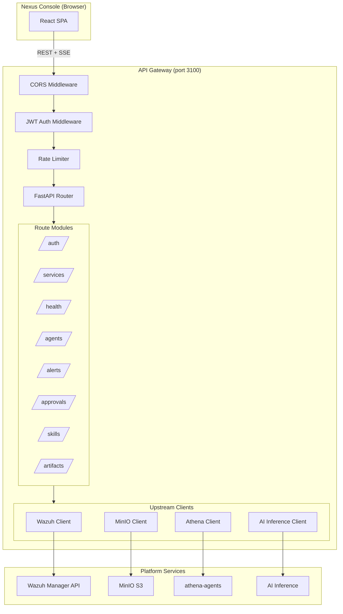

# Design Document: Nexus API Gateway

## Overview

The Nexus API Gateway is a stateless Python/FastAPI backend service that acts as the single aggregation point between the Nexus Console React SPA and all platform backend services. It exposes a unified REST API at `/api/v1/*`, handles JWT authentication, proxies health checks, aggregates alerts from Wazuh, streams real-time OPAR events via SSE, and provides pre-signed MinIO download URLs — all without persisting any data itself.

The gateway replaces direct frontend-to-service communication, solving CORS restrictions, credential exposure, and network topology coupling. It lives at `platform/api-gateway/` and follows the same patterns as the existing `platform/ai-inference/` FastAPI service.

### Key Design Decisions

| Decision | Choice | Rationale |
|----------|--------|-----------|
| Language/Framework | Python 3.11 + FastAPI | Consistent with `platform/ai-inference`; native async; Pydantic models; good SSE support |
| HTTP client | httpx (async) | Async-native; connection pooling; timeout support; drop-in for upstream calls |
| MinIO SDK | minio (Python) | Official SDK; pre-signed URL generation; async-compatible with threadpool |
| JWT handling | PyJWT | Lightweight; widely used; supports HS256/RS256 |
| SSE | sse-starlette | Starlette-native SSE responses; works with FastAPI directly |
| Logging | structlog | Structured JSON output; processor pipeline; context binding |
| Rate limiting | slowapi (in-memory) | Lightweight; no external store needed for single-instance |
| Container | Multi-stage Docker (python:3.11-slim) | Minimal image; consistent with ai-inference |
| Port | 3100 (configurable) | Avoids conflict with Console (3000), ai-inference (8000) |

### Dependency Summary

```
fastapi>=0.115.0
uvicorn[standard]>=0.30.0
httpx>=0.27.0
minio>=7.2.0
PyJWT>=2.9.0
sse-starlette>=2.0.0
structlog>=24.0.0
slowapi>=0.1.9
pydantic>=2.9.0
pydantic-settings>=2.5.0
```

---

## Architecture



### Request Flow

1. Console sends HTTP request to Gateway (port 3100)
2. CORS middleware validates origin against allowlist
3. JWT middleware validates Authorization header (except `/auth/login`, `/healthz`, `/readyz`)
4. Rate limiter checks `/auth/login` requests against per-IP counters
5. Route handler processes request, calls upstream client(s) as needed
6. Response is serialized via Pydantic model and returned

### SSE Flow

1. Console opens `EventSource` to `/api/v1/agents/events` with auth token in query param
2. Gateway authenticates, then opens upstream connection to athena-agents event source
3. Events are filtered/transformed and forwarded to the SSE response stream
4. Heartbeat comments sent every 15s to prevent connection timeout
5. On upstream disconnect: error event sent to client, exponential backoff reconnection

---

## Components and Interfaces

### 1. Application Bootstrap

```python
# src/app.py
from fastapi import FastAPI
from fastapi.middleware.cors import CORSMiddleware

def create_app() -> FastAPI:
    """Application factory — creates and configures the FastAPI instance."""
    app = FastAPI(
        title="Nexus API Gateway",
        version="1.0.0",
        docs_url="/docs" if settings.debug else None,
    )
    # Middleware order matters: CORS first, then auth, then rate limiting
    app.add_middleware(CORSMiddleware, ...)
    app.add_middleware(JWTAuthMiddleware, ...)
    # Register route modules
    app.include_router(auth_router, prefix="/api/v1/auth")
    app.include_router(services_router, prefix="/api/v1")
    app.include_router(health_router, prefix="/api/v1")
    app.include_router(agents_router, prefix="/api/v1/agents")
    app.include_router(alerts_router, prefix="/api/v1")
    app.include_router(approvals_router, prefix="/api/v1")
    app.include_router(skills_router, prefix="/api/v1")
    app.include_router(artifacts_router, prefix="/api/v1")
    return app
```

### 2. Configuration (pydantic-settings)

```python
# src/config.py
from pydantic_settings import BaseSettings
from pydantic import Field
from typing import Literal

class GatewaySettings(BaseSettings):
    # Server
    port: int = 3100
    debug: bool = False
    log_level: Literal["debug", "info", "warn", "error"] = "info"

    # Auth
    jwt_secret: str  # required — fail to start if missing
    jwt_algorithm: str = "HS256"
    jwt_expiration_minutes: int = 480  # 8 hours
    auth_provider: Literal["local", "vault"] = "local"
    vault_url: str | None = None

    # Upstream services
    wazuh_api_url: str  # required
    wazuh_api_user: str = "wazuh-wui"
    wazuh_api_password: str = ""  # loaded from env or Vault
    ai_inference_url: str = "http://ai-inference:8000"
    athena_agents_url: str = "http://athena-agents:8080"
    minio_endpoint: str = "minio:9000"
    minio_access_key: str = ""
    minio_secret_key: str = ""
    minio_secure: bool = False
    minio_bucket: str = "nexus-memory"

    # CORS
    cors_allowed_origins: list[str] = ["http://localhost:3000"]

    # Rate limiting
    login_rate_limit: str = "10/minute"  # per IP

    # Service registry
    service_registry_path: str = "/app/config/services.json"

    class Config:
        env_prefix = "NEXUS_GW_"
        env_file = ".env"
```

### 3. JWT Authentication Middleware

```python
# src/middleware/auth.py
from starlette.middleware.base import BaseHTTPMiddleware
from starlette.requests import Request
from starlette.responses import JSONResponse
import jwt

PUBLIC_PATHS = {"/api/v1/auth/login", "/healthz", "/readyz", "/docs", "/openapi.json"}

class JWTAuthMiddleware(BaseHTTPMiddleware):
    async def dispatch(self, request: Request, call_next):
        if request.url.path in PUBLIC_PATHS or request.method == "OPTIONS":
            return await call_next(request)

        token = self._extract_token(request)
        if not token:
            return JSONResponse(status_code=401, content={
                "error": "Missing authentication token",
                "code": "AUTH_TOKEN_MISSING"
            })

        try:
            payload = jwt.decode(token, settings.jwt_secret, algorithms=[settings.jwt_algorithm])
            request.state.user = payload
        except jwt.ExpiredSignatureError:
            return JSONResponse(status_code=401, content={
                "error": "Token has expired",
                "code": "AUTH_TOKEN_EXPIRED"
            })
        except jwt.InvalidTokenError:
            return JSONResponse(status_code=401, content={
                "error": "Invalid authentication token",
                "code": "AUTH_TOKEN_INVALID"
            })

        return await call_next(request)

    def _extract_token(self, request: Request) -> str | None:
        auth_header = request.headers.get("Authorization", "")
        if auth_header.startswith("Bearer "):
            return auth_header[7:]
        # SSE fallback: token in query param
        return request.query_params.get("token")
```

### 4. Upstream Clients

```python
# src/clients/wazuh.py
class WazuhClient:
    """Async client for Wazuh Manager REST API."""
    def __init__(self, base_url: str, user: str, password: str):
        self._client = httpx.AsyncClient(
            base_url=base_url,
            verify=False,  # Wazuh self-signed certs
            timeout=httpx.Timeout(10.0, connect=5.0),
        )
        self._user = user
        self._password = password
        self._token: str | None = None

    async def authenticate(self) -> None: ...
    async def get_alerts(self, severity: str | None, source: str | None,
                         from_ts: str | None, to_ts: str | None,
                         limit: int = 100) -> dict: ...
    async def close(self) -> None: ...


# src/clients/minio_client.py
class MinIOClient:
    """Wrapper around minio SDK for object listing and pre-signed URLs."""
    def __init__(self, endpoint: str, access_key: str, secret_key: str,
                 secure: bool, bucket: str):
        self._client = Minio(endpoint, access_key, secret_key, secure=secure)
        self._bucket = bucket

    def list_objects(self, prefix: str) -> list[dict]: ...
    def get_presigned_url(self, key: str, expires_minutes: int = 15) -> str: ...
    def get_object_content(self, key: str) -> str: ...


# src/clients/athena.py
class AthenaClient:
    """Client for athena-agents service (sessions, events, approvals)."""
    def __init__(self, base_url: str):
        self._client = httpx.AsyncClient(
            base_url=base_url,
            timeout=httpx.Timeout(10.0, connect=5.0),
        )

    async def get_sessions(self) -> list[dict]: ...
    async def get_event_stream(self) -> AsyncIterator[dict]: ...
    async def get_approvals(self, status: str | None) -> list[dict]: ...
    async def submit_decision(self, approval_id: str, decision: str) -> dict: ...
    async def close(self) -> None: ...


# src/clients/ai_inference.py
class AIInferenceClient:
    """Client for the AI triage inference service."""
    def __init__(self, base_url: str):
        self._client = httpx.AsyncClient(
            base_url=base_url,
            timeout=httpx.Timeout(10.0, connect=5.0),
        )

    async def get_triage(self, alert_id: str) -> dict | None: ...
    async def close(self) -> None: ...
```

### 5. Route Modules

```python
# src/routes/auth.py
@router.post("/login")
async def login(credentials: LoginRequest) -> LoginResponse: ...

@router.post("/refresh")
async def refresh_token(request: Request) -> LoginResponse: ...


# src/routes/services.py
@router.get("/services")
async def list_services() -> list[ServiceEntry]: ...


# src/routes/health.py
@router.get("/health/{service_id}")
async def check_service_health(service_id: str) -> HealthCheckResponse: ...


# src/routes/agents.py
@router.get("/agents/events")
async def agent_event_stream(request: Request) -> EventSourceResponse: ...

@router.get("/agents/sessions")
async def list_agent_sessions() -> list[AgentSession]: ...


# src/routes/alerts.py
@router.get("/alerts")
async def list_alerts(
    severity: str | None = None,
    source: str | None = None,
    from_ts: str | None = Query(None, alias="from"),
    to_ts: str | None = Query(None, alias="to"),
    limit: int = Query(100, ge=1, le=500),
) -> AlertsResponse: ...

@router.get("/alerts/{alert_id}/triage")
async def get_alert_triage(alert_id: str) -> TriageResponse: ...


# src/routes/approvals.py
@router.get("/approvals")
async def list_approvals(status: str | None = "pending") -> list[ApprovalAction]: ...

@router.post("/approvals/{approval_id}/decision")
async def submit_decision(approval_id: str, body: DecisionRequest) -> DecisionResponse: ...


# src/routes/skills.py
@router.get("/skills")
async def list_skills(
    search: str | None = None,
    tag: str | None = None,
    domain: str | None = None,
) -> list[SkillEntry]: ...

@router.get("/skills/{skill_id}/content")
async def get_skill_content(skill_id: str) -> PlainTextResponse: ...


# src/routes/artifacts.py
@router.get("/artifacts")
async def list_artifacts(category: ArtifactCategory) -> list[ArtifactObject]: ...

@router.get("/artifacts/{key:path}/download-url")
async def get_download_url(key: str) -> DownloadUrlResponse: ...
```

### 6. SSE Event Streaming

```python
# src/routes/agents.py
from sse_starlette.sse import EventSourceResponse
import asyncio

HEARTBEAT_INTERVAL = 15  # seconds
RECONNECT_BASE_DELAY = 1  # seconds
RECONNECT_MAX_DELAY = 30  # seconds

async def _event_generator(athena_client: AthenaClient):
    """Generator that yields OPAR events from athena-agents with heartbeat."""
    reconnect_delay = RECONNECT_BASE_DELAY

    while True:
        try:
            async for event in athena_client.get_event_stream():
                reconnect_delay = RECONNECT_BASE_DELAY  # reset on success
                yield {
                    "event": "opar",
                    "data": json.dumps(event),
                    "id": event.get("id", ""),
                }
        except (httpx.ConnectError, httpx.ReadTimeout):
            yield {
                "event": "error",
                "data": json.dumps({"error": "Upstream connection lost", "code": "UPSTREAM_DISCONNECTED"}),
            }
            await asyncio.sleep(reconnect_delay)
            reconnect_delay = min(reconnect_delay * 2, RECONNECT_MAX_DELAY)
        except asyncio.CancelledError:
            break

@router.get("/agents/events")
async def agent_event_stream(request: Request):
    return EventSourceResponse(
        _event_generator(request.app.state.athena_client),
        ping=HEARTBEAT_INTERVAL,
    )
```

### 7. Health and Readiness Probes

```python
# src/routes/probes.py
@router.get("/healthz")
async def health_check():
    """Liveness probe — returns 200 if process is running."""
    return {"status": "ok"}

@router.get("/readyz")
async def readiness_check():
    """Readiness probe — verifies upstream connectivity."""
    checks = {}
    # Check Wazuh API
    try:
        await app.state.wazuh_client.authenticate()
        checks["wazuh"] = "ok"
    except Exception:
        checks["wazuh"] = "unreachable"

    # Check MinIO
    try:
        app.state.minio_client._client.bucket_exists(settings.minio_bucket)
        checks["minio"] = "ok"
    except Exception:
        checks["minio"] = "unreachable"

    all_ok = all(v == "ok" for v in checks.values())
    status_code = 200 if all_ok else 503
    return JSONResponse(
        status_code=status_code,
        content={"status": "ready" if all_ok else "not_ready", "checks": checks}
    )
```

### 8. Error Handling

```python
# src/middleware/error_handler.py
from fastapi import Request
from fastapi.responses import JSONResponse
from starlette.exceptions import HTTPException as StarletteHTTPException

class ErrorResponse(BaseModel):
    error: str
    code: str
    details: str | None = None

async def global_exception_handler(request: Request, exc: Exception) -> JSONResponse:
    """Catch-all handler ensuring consistent error format."""
    if isinstance(exc, StarletteHTTPException):
        return JSONResponse(
            status_code=exc.status_code,
            content=ErrorResponse(
                error=exc.detail,
                code=f"HTTP_{exc.status_code}",
            ).model_dump(exclude_none=True),
        )
    # Unexpected errors — log full traceback, return generic 500
    logger.exception("Unhandled error", path=request.url.path)
    return JSONResponse(
        status_code=500,
        content=ErrorResponse(
            error="Internal server error",
            code="INTERNAL_ERROR",
        ).model_dump(exclude_none=True),
    )
```

### 9. Structured Logging

```python
# src/logging_config.py
import structlog

def configure_logging(log_level: str):
    structlog.configure(
        processors=[
            structlog.contextvars.merge_contextvars,
            structlog.processors.add_log_level,
            structlog.processors.TimeStamper(fmt="iso"),
            structlog.processors.JSONRenderer(),
        ],
        wrapper_class=structlog.make_filtering_bound_logger(
            getattr(logging, log_level.upper())
        ),
    )
```

**Request logging** is handled by middleware that records:
- method, path, status, duration_ms, client_ip, user_sub (from JWT)
- Excludes logging of request/response bodies on auth endpoints (Req 20.2)

---

## Data Models

### Pydantic Request/Response Models

```python
# src/models/auth.py
class LoginRequest(BaseModel):
    username: str
    password: str

class LoginResponse(BaseModel):
    token: str
    expires_at: str  # ISO 8601


# src/models/services.py
class ServiceEntry(BaseModel):
    id: str
    name: str
    description: str
    category: Literal["security", "workbenches", "storage", "infrastructure", "agents"]
    url: str
    icon_id: str = Field(alias="iconId")
    health_endpoint: str | None = Field(None, alias="healthEndpoint")

    class Config:
        populate_by_name = True


# src/models/health.py
class HealthCheckResponse(BaseModel):
    service_id: str = Field(alias="serviceId")
    status: Literal["healthy", "timeout", "error", "unknown"]
    status_code: int | None = Field(None, alias="statusCode")
    response_time_ms: float | None = Field(None, alias="responseTimeMs")

    class Config:
        populate_by_name = True


# src/models/agents.py
class OPAREvent(BaseModel):
    id: str
    timestamp: str
    session_id: str = Field(alias="sessionId")
    phase: Literal["observe", "plan", "act", "reflect"]
    target: str
    tool_name: str | None = Field(None, alias="toolName")
    outcome_status: Literal["success", "failure", "pending", "blocked"] = Field(alias="outcomeStatus")
    payload: dict = {}

    class Config:
        populate_by_name = True

class AgentSession(BaseModel):
    id: str
    status: str
    start_time: str = Field(alias="startTime")
    target: str
    event_count: int = Field(alias="eventCount")

    class Config:
        populate_by_name = True


# src/models/alerts.py
class SOCAlert(BaseModel):
    id: str
    timestamp: str
    severity: Literal["critical", "high", "medium", "low", "informational"]
    source: Literal["wazuh", "suricata"]
    rule_name: str = Field(alias="ruleName")
    affected_host: str = Field(alias="affectedHost")
    acknowledged: bool = False
    athena_scenario: str | None = Field(None, alias="athenaScenario")
    payload: dict = {}

    class Config:
        populate_by_name = True

class AlertsResponse(BaseModel):
    alerts: list[SOCAlert]
    total: int

class TriageResponse(BaseModel):
    confidence_score: float = Field(alias="confidenceScore")
    recommended_action: str = Field(alias="recommendedAction")
    reasoning_excerpt: str = Field(alias="reasoningExcerpt")

    class Config:
        populate_by_name = True


# src/models/approvals.py
class ApprovalAction(BaseModel):
    id: str
    session_id: str = Field(alias="sessionId")
    proposed_tool: str = Field(alias="proposedTool")
    target: str
    arguments_summary: str = Field(alias="argumentsSummary")
    submitted_at: str = Field(alias="submittedAt")
    status: Literal["pending", "approved", "rejected"]

    class Config:
        populate_by_name = True

class DecisionRequest(BaseModel):
    decision: Literal["approve", "reject"]

class DecisionResponse(BaseModel):
    success: bool


# src/models/skills.py
class SkillEntry(BaseModel):
    id: str
    name: str
    description: str
    tags: list[str]
    domain: Literal["red-team", "blue-team", "infrastructure", "general"]
    content_url: str = Field(alias="contentUrl")

    class Config:
        populate_by_name = True


# src/models/artifacts.py
ArtifactCategory = Literal["pcaps", "sboms", "skills", "sessions"]

class ArtifactObject(BaseModel):
    key: str
    name: str
    size: int
    last_modified: str = Field(alias="lastModified")
    category: ArtifactCategory

    class Config:
        populate_by_name = True

class DownloadUrlResponse(BaseModel):
    url: str
```

### Service Registry Configuration Schema

```json
{
  "services": [
    {
      "id": "wazuh-dash",
      "name": "Wazuh Dashboard",
      "description": "SIEM and XDR platform",
      "category": "security",
      "url": "https://wazuh:5601",
      "iconId": "shield",
      "healthEndpoint": "/api/status"
    }
  ]
}
```

### JWT Token Payload

```json
{
  "sub": "analyst@nexus",
  "iat": 1700000000,
  "exp": 1700028800,
  "role": "analyst"
}
```

### Environment Variables Summary

| Variable | Required | Default | Description |
|----------|----------|---------|-------------|
| `NEXUS_GW_JWT_SECRET` | Yes | — | JWT signing secret |
| `NEXUS_GW_WAZUH_API_URL` | Yes | — | Wazuh Manager API base URL |
| `NEXUS_GW_WAZUH_API_USER` | No | `wazuh-wui` | Wazuh API username |
| `NEXUS_GW_WAZUH_API_PASSWORD` | Yes | — | Wazuh API password |
| `NEXUS_GW_AI_INFERENCE_URL` | No | `http://ai-inference:8000` | AI Inference service URL |
| `NEXUS_GW_ATHENA_AGENTS_URL` | No | `http://athena-agents:8080` | Athena agents service URL |
| `NEXUS_GW_MINIO_ENDPOINT` | No | `minio:9000` | MinIO endpoint |
| `NEXUS_GW_MINIO_ACCESS_KEY` | Yes | — | MinIO access key |
| `NEXUS_GW_MINIO_SECRET_KEY` | Yes | — | MinIO secret key |
| `NEXUS_GW_MINIO_SECURE` | No | `false` | Use TLS for MinIO |
| `NEXUS_GW_MINIO_BUCKET` | No | `nexus-memory` | Default MinIO bucket |
| `NEXUS_GW_CORS_ALLOWED_ORIGINS` | No | `["http://localhost:3000"]` | Allowed CORS origins (JSON array) |
| `NEXUS_GW_AUTH_PROVIDER` | No | `local` | Auth mode: `local` or `vault` |
| `NEXUS_GW_VAULT_URL` | No | — | Vault URL (required if auth_provider=vault) |
| `NEXUS_GW_PORT` | No | `3100` | Server listen port |
| `NEXUS_GW_LOG_LEVEL` | No | `info` | Logging level |
| `NEXUS_GW_SERVICE_REGISTRY_PATH` | No | `/app/config/services.json` | Path to service registry JSON |
| `NEXUS_GW_LOGIN_RATE_LIMIT` | No | `10/minute` | Rate limit on login endpoint |

---

## Correctness Properties

*A property is a characteristic or behavior that should hold true across all valid executions of a system — essentially, a formal statement about what the system should do. Properties serve as the bridge between human-readable specifications and machine-verifiable correctness guarantees.*

### Property 1: JWT round-trip integrity

*For any* valid username and role combination, encoding a JWT payload and then decoding it with the same secret SHALL produce a payload with identical `sub`, `role`, `iat`, and `exp` fields.

**Validates: Requirements 1.1, 2.5**

### Property 2: Expired token rejection

*For any* JWT token whose `exp` claim is in the past, the authentication middleware SHALL reject the request with HTTP 401 regardless of other payload contents.

**Validates: Requirements 2.2, 2.4**

### Property 3: Service registry categorization completeness

*For any* set of service entries loaded from configuration, grouping by category SHALL produce groups that collectively contain all original entries without loss or duplication, and every entry's category SHALL be one of the five valid values.

**Validates: Requirements 3.1, 3.4**

### Property 4: Health check timeout determinism

*For any* service with a configured health endpoint, if the upstream does not respond within 5 seconds, the gateway SHALL return HTTP 504 — independent of upstream response content or partial response state.

**Validates: Requirements 4.2, 4.3**

### Property 5: Alert filter correctness

*For any* set of alerts and any combination of severity, source, and time-range filter parameters, all alerts in the response SHALL satisfy every active filter predicate, and no alert satisfying all predicates SHALL be excluded from the result.

**Validates: Requirements 7.1, 7.2, 7.3**

### Property 6: Alert limit clamping

*For any* `limit` query parameter value, the gateway SHALL clamp it to the range [1, 500] and the response array SHALL contain at most `limit` items. The default (absent parameter) SHALL be 100.

**Validates: Requirements 7.3**

### Property 7: Athena scenario tagging preservation

*For any* upstream alert containing `X-Athena-Scenario` metadata, the gateway SHALL include the `athenaScenario` field in the response; for any alert without such metadata, the field SHALL be absent or null.

**Validates: Requirements 7.4**

### Property 8: Approval ordering invariant

*For any* set of pending approval actions, the response array SHALL be ordered by `submittedAt` ascending (oldest first) — the ordering is stable regardless of insertion order in the upstream source.

**Validates: Requirements 9.3**

### Property 9: Skills search filter consistency

*For any* set of skill entries and any combination of search text, tag, and domain filters, all returned skills SHALL match every active filter criterion, and no matching skill SHALL be excluded.

**Validates: Requirements 11.1, 11.2, 11.3**

### Property 10: Artifact category validation

*For any* `category` query parameter, if it is not one of `["pcaps", "sboms", "skills", "sessions"]`, the gateway SHALL return HTTP 400 — regardless of what objects exist in MinIO.

**Validates: Requirements 13.2, 13.3**

### Property 11: Error response format consistency

*For any* error produced by the gateway (4xx or 5xx), the response body SHALL conform to the `{ error: string, code: string, details?: string }` schema, and SHALL NOT contain stack traces or internal paths.

**Validates: Requirements 16.1, 16.2, 16.3**

### Property 12: Configuration startup validation

*For any* environment configuration, if any required variable (`jwt_secret`, `wazuh_api_url`, `minio_access_key`, `minio_secret_key`) is missing, the gateway SHALL fail to start with a descriptive error — it SHALL NOT start in a degraded state.

**Validates: Requirements 17.5**

### Property 13: Rate limit enforcement

*For any* source IP, after `N` (configurable, default 10) login attempts within the time window (default 60s), all subsequent login requests from that IP SHALL receive HTTP 429 with a `Retry-After` header.

**Validates: Requirements 21.1, 21.2**

### Property 14: Stateless response determinism

*For any* authenticated request with identical JWT claims and identical upstream service state, two separate gateway instances SHALL produce identical responses — the response SHALL not depend on instance-local state beyond rate-limit counters.

**Validates: Requirements 19.1, 19.2, 19.3, 19.4**

### Property 15: Pre-signed URL generation correctness

*For any* valid artifact key that exists in MinIO, the gateway SHALL return a URL string that contains the artifact key path and includes query parameters for signature and expiration — the URL SHALL NOT expose MinIO credentials directly.

**Validates: Requirements 14.1, 14.3**

---

## Error Handling

### Error Response Contract

All errors follow Requirement 16's format:

```json
{
  "error": "Human-readable error description",
  "code": "MACHINE_READABLE_CODE",
  "details": "Optional additional context"
}
```

### Error Scenarios by Category

| Scenario | HTTP Status | Code | Behavior |
|----------|-------------|------|----------|
| Missing/invalid JWT | 401 | `AUTH_TOKEN_INVALID` | Reject request immediately |
| Expired JWT | 401 | `AUTH_TOKEN_EXPIRED` | Reject; client should redirect to login |
| Bad credentials on login | 401 | `AUTH_CREDENTIALS_INVALID` | No token issued |
| Auth provider unreachable | 503 | `AUTH_PROVIDER_UNAVAILABLE` | Descriptive error |
| Rate limit exceeded | 429 | `RATE_LIMIT_EXCEEDED` | Include `Retry-After` header |
| Service ID not found | 404 | `SERVICE_NOT_FOUND` | For health check proxy |
| No health endpoint configured | 200 | — | Return `{ status: "unknown" }` |
| Health check timeout (>5s) | 504 | `HEALTH_CHECK_TIMEOUT` | Timeout on upstream |
| Wazuh API unreachable | 502 | `UPSTREAM_WAZUH_UNAVAILABLE` | Descriptive error |
| AI Inference unreachable | 502 | `UPSTREAM_INFERENCE_UNAVAILABLE` | Descriptive error |
| AI Inference timeout (>10s) | 504 | `INFERENCE_TIMEOUT` | Triage request timeout |
| Triage result not found | 404 | `TRIAGE_NOT_FOUND` | No analysis available |
| athena-agents unreachable | 502 | `UPSTREAM_ATHENA_UNAVAILABLE` | For approvals/sessions |
| Approval not found / no longer pending | 404/409 | `APPROVAL_NOT_FOUND` / `APPROVAL_CONFLICT` | Decision submission |
| MinIO unreachable | 502 | `UPSTREAM_MINIO_UNAVAILABLE` | For skills/artifacts |
| Artifact key not found | 404 | `ARTIFACT_NOT_FOUND` | Pre-signed URL / content |
| Invalid category parameter | 400 | `INVALID_CATEGORY` | Not in allowed set |
| Malformed service registry config | 500 | `CONFIG_INVALID` | Logged at startup; service runs degraded |
| SSE upstream disconnect | — | SSE error event | Client receives `event: error`, reconnects |
| Unhandled exception | 500 | `INTERNAL_ERROR` | Logged; no stack trace in response |

### Upstream Client Resilience

- **httpx timeout**: All upstream calls have explicit `connect` (5s) and `read` (10s) timeouts
- **Retry**: No automatic retry on upstream failures (stateless; client can retry)
- **Circuit breaker**: Not implemented in v1; documented as future enhancement
- **Connection pooling**: httpx `AsyncClient` reuses connections per upstream host
- **Graceful shutdown**: `app.on_event("shutdown")` closes all client connections

---

## Testing Strategy

### Testing Approach

This feature involves backend API logic with clear input/output behavior, data transformations, and filtering. Property-based testing is well-suited for:
- JWT encode/decode round-trips
- Filter logic (alerts, skills, artifacts)
- Error response format validation
- Configuration validation
- Rate limiting behavior

### Property-Based Testing (Hypothesis)

Library: **hypothesis** (Python's standard PBT library)

Each correctness property is implemented as a single property-based test with minimum 100 iterations:

| Property | Test Target | Generator Strategy |
|----------|-------------|-------------------|
| 1 | `encode_jwt()` / `decode_jwt()` | Arbitrary usernames (text), roles, timestamps |
| 2 | `JWTAuthMiddleware.dispatch()` | Arbitrary tokens with expired `exp` values |
| 3 | `load_service_registry()` / `group_by_category()` | Arbitrary service entry lists with valid categories |
| 4 | `proxy_health_check()` | Arbitrary service IDs + simulated timeout responses |
| 5 | `filter_alerts()` | Arbitrary alert lists + arbitrary filter combos |
| 6 | `clamp_limit()` | Arbitrary integers (negative, zero, huge) |
| 7 | `map_athena_scenario()` | Arbitrary alerts with/without scenario metadata |
| 8 | `sort_approvals()` | Arbitrary approval lists with random timestamps |
| 9 | `filter_skills()` | Arbitrary skill lists + search/tag/domain combos |
| 10 | `validate_category()` | Arbitrary strings |
| 11 | Exception handlers | Arbitrary HTTP exceptions + unhandled exceptions |
| 12 | `GatewaySettings` validation | Arbitrary env var combinations |
| 13 | Rate limiter | Sequences of login requests from arbitrary IPs |
| 14 | Route handlers (mocked upstreams) | Same inputs across isolated handler calls |
| 15 | `generate_presigned_url()` | Arbitrary valid keys |

**Tag format:** Each test tagged with `# Feature: nexus-api-gateway, Property N: <description>`

### Unit Tests (pytest)

- **Route handlers:** Each endpoint returns correct status codes and response shapes for valid/invalid inputs
- **Middleware:** Auth middleware correctly passes/rejects based on token state
- **Error handling:** Global handler formats all exceptions consistently
- **Configuration:** Missing required vars raise descriptive startup errors
- **Client mocking:** Each upstream client is tested with mocked httpx responses

### Integration Tests (pytest + httpx test client)

- **Full auth flow:** Login → receive token → authenticated request → refresh → expired rejection
- **Health check proxy:** Mock upstream services, verify timeout and error propagation
- **SSE streaming:** Connect to event stream, verify heartbeat and event format
- **CORS preflight:** OPTIONS requests return correct headers
- **Rate limiting:** Exceed limit, verify 429 response with Retry-After

### Container Tests

- **Docker build:** Image builds successfully with multi-stage
- **Startup validation:** Container fails to start with missing required env vars
- **Health probes:** `/healthz` returns 200; `/readyz` returns 503 when upstreams are down
- **Port binding:** Container listens on configured port

---

## File Structure

```
platform/api-gateway/
├── Dockerfile
├── requirements.txt
├── requirements-dev.txt
├── config/
│   └── services.json          # Default service registry
├── src/
│   ├── __init__.py
│   ├── app.py                 # Application factory
│   ├── config.py              # GatewaySettings (pydantic-settings)
│   ├── logging_config.py      # structlog configuration
│   ├── main.py                # Entrypoint: uvicorn runner
│   ├── middleware/
│   │   ├── __init__.py
│   │   ├── auth.py            # JWT validation middleware
│   │   ├── error_handler.py   # Global exception handler
│   │   └── request_logger.py  # Structured request logging
│   ├── clients/
│   │   ├── __init__.py
│   │   ├── wazuh.py           # Wazuh Manager API client
│   │   ├── minio_client.py    # MinIO S3 client wrapper
│   │   ├── athena.py          # athena-agents client
│   │   └── ai_inference.py    # AI Inference client
│   ├── models/
│   │   ├── __init__.py
│   │   ├── auth.py
│   │   ├── services.py
│   │   ├── health.py
│   │   ├── agents.py
│   │   ├── alerts.py
│   │   ├── approvals.py
│   │   ├── skills.py
│   │   ├── artifacts.py
│   │   └── errors.py
│   └── routes/
│       ├── __init__.py
│       ├── auth.py
│       ├── services.py
│       ├── health.py
│       ├── agents.py
│       ├── alerts.py
│       ├── approvals.py
│       ├── skills.py
│       ├── artifacts.py
│       └── probes.py          # /healthz and /readyz
├── tests/
│   ├── conftest.py            # Shared fixtures, test client setup
│   ├── test_auth.py
│   ├── test_services.py
│   ├── test_health.py
│   ├── test_agents.py
│   ├── test_alerts.py
│   ├── test_approvals.py
│   ├── test_skills.py
│   ├── test_artifacts.py
│   ├── test_error_handling.py
│   ├── test_config.py
│   ├── test_rate_limit.py
│   └── properties/            # Property-based tests
│       ├── test_jwt_properties.py
│       ├── test_filter_properties.py
│       ├── test_validation_properties.py
│       └── test_format_properties.py
└── docker-compose.override.yml  # Local dev with mock upstreams
```

### Dockerfile

```dockerfile
# Stage 1: Dependencies
FROM python:3.11-slim AS deps
WORKDIR /app
COPY requirements.txt .
RUN pip install --no-cache-dir -r requirements.txt

# Stage 2: Application
FROM python:3.11-slim AS runtime
WORKDIR /app
COPY --from=deps /usr/local/lib/python3.11/site-packages /usr/local/lib/python3.11/site-packages
COPY --from=deps /usr/local/bin /usr/local/bin
COPY src/ ./src/
COPY config/ ./config/

EXPOSE 3100

ENV NEXUS_GW_PORT=3100
CMD ["uvicorn", "src.main:app", "--host", "0.0.0.0", "--port", "3100"]
```

### Compose Integration

```yaml
# Addition to deploy/compose/baseline.yml
api-gateway:
  container_name: nexus-api-gateway
  build:
    context: ../../platform/api-gateway
    dockerfile: Dockerfile
  ports:
    - "3100:3100"
  environment:
    NEXUS_GW_JWT_SECRET: ${NEXUS_GW_JWT_SECRET}
    NEXUS_GW_WAZUH_API_URL: https://wazuh-manager:55000
    NEXUS_GW_WAZUH_API_PASSWORD: ${WAZUH_API_PASSWORD}
    NEXUS_GW_MINIO_ENDPOINT: minio:9000
    NEXUS_GW_MINIO_ACCESS_KEY: ${MINIO_ACCESS_KEY}
    NEXUS_GW_MINIO_SECRET_KEY: ${MINIO_SECRET_KEY}
    NEXUS_GW_ATHENA_AGENTS_URL: http://athena-agents:8080
    NEXUS_GW_AI_INFERENCE_URL: http://ai-inference:8000
    NEXUS_GW_CORS_ALLOWED_ORIGINS: '["http://localhost:3000","http://nexus-console:80"]'
  depends_on:
    - nexus-console
  restart: always
  networks:
    Inner-Athena:
```
