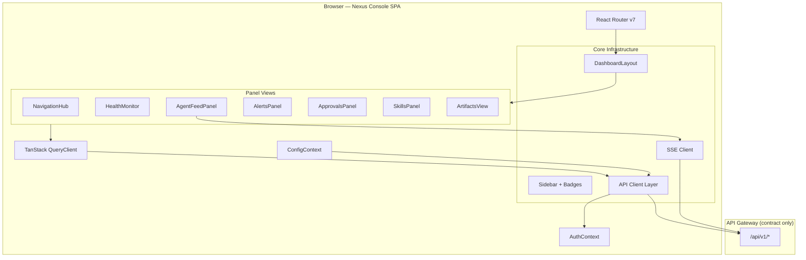
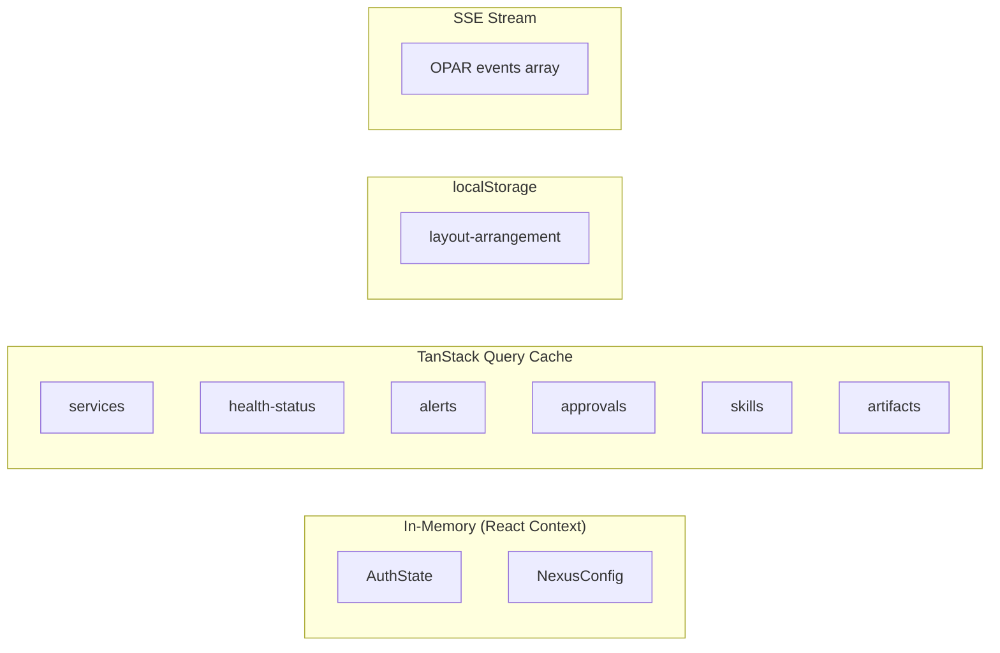

# Design Document: Nexus Console Upgrade

## Overview

This design transforms the existing minimal Nexus Console scaffold into a fully operational SOC dashboard. The current app is a single-page React 19 + Vite 8 application with static link cards. The upgrade introduces a modular panel architecture with real-time data feeds, authenticated API communication, persistent layout configuration, and a dark operations-center theme.

The Console acts as a pure frontend client. All data comes from an API Gateway that aggregates backend services (Wazuh, Suricata, athena-agents OPAR loop, MinIO, Vault). The API Gateway is designed as an independent contract here so it can be built separately.

### Key Design Decisions

| Decision | Choice | Rationale |
|----------|--------|-----------|
| Routing | React Router v7 (SPA mode) | Native React 19 support, Vite plugin, client-side only |
| Server state | TanStack Query v5 | Caching, refetching, optimistic updates — purpose-built for this |
| Real-time | EventSource (SSE) | Simpler than WebSocket for unidirectional event streams; reconnection built-in |
| Markdown | `react-markdown` + `remark-gfm` | Lightweight, tree-based rendering, GFM table/tasklist support |
| Styling | CSS Modules + CSS custom properties | Already using custom properties; no framework needed; dark theme via vars |
| Layout persistence | localStorage via custom hook | Matches Req 7.4–7.5; no external dependency needed |
| Auth token storage | In-memory (React context) | Req 10.3 explicitly prohibits localStorage for tokens |
| HTTP client | Native `fetch` wrapped in typed helpers | No axios dependency; TanStack Query handles retry/caching |

### Dependency Additions

```json
{
  "dependencies": {
    "react-router": "^7.6.0",
    "@tanstack/react-query": "^5.80.0",
    "react-markdown": "^9.0.0",
    "remark-gfm": "^4.0.0"
  },
  "devDependencies": {
    "vitest": "^3.2.0",
    "@testing-library/react": "^16.3.0",
    "@testing-library/jest-dom": "^6.6.0",
    "fast-check": "^4.6.0"
  }
}
```

---

## Architecture



### Layer Responsibilities

| Layer | Responsibility |
|-------|---------------|
| **Config** | Load environment/runtime config; expose service URLs to all consumers |
| **Auth** | Store token in memory; attach to requests; handle 401 redirect |
| **API Client** | Typed fetch wrappers; base URL from config; auth header injection |
| **TanStack Query** | Cache server state; manage refetch intervals; provide loading/error states |
| **SSE Client** | Connect to `/api/v1/agents/events` stream; parse OPAR events; feed into query cache |
| **Router** | Map URL paths to panel views; preserve deep-linking |
| **Layout** | Responsive grid; persist arrangement; collapse on mobile |
| **Panels** | Self-contained feature views consuming hooks |

---

## Components and Interfaces

### 1. Configuration System

```typescript
// src/config/types.ts
interface NexusConfig {
  apiGatewayUrl: string;
  services: ServiceEntry[];
  healthPollIntervalMs: number; // default 30000
  authProvider: 'vault' | 'oidc';
  authEndpoint: string;
}

interface ServiceEntry {
  id: string;
  name: string;
  description: string;
  category: ServiceCategory;
  url: string;
  iconId: string;
  healthEndpoint?: string; // optional — Req 2.6
}

type ServiceCategory = 'security' | 'workbenches' | 'storage' | 'infrastructure' | 'agents';
```

**Loading order:**
1. Build-time: `import.meta.env.VITE_API_GATEWAY_URL` and other `VITE_*` vars
2. Runtime: fetch `/config.json` — if found, merge over build-time defaults (Req 9.2–9.3)

```typescript
// src/config/useConfig.ts
function useConfig(): NexusConfig {
  // React context populated at app init
}
```

### 2. Authentication Layer

```typescript
// src/auth/AuthContext.ts
interface AuthState {
  token: string | null;
  isAuthenticated: boolean;
  login: (credentials: LoginCredentials) => Promise<void>;
  logout: () => void;
}

interface LoginCredentials {
  username: string;
  password: string;
}
```

**Behavior:**
- Token stored in a `useRef` inside the provider (never serialized to storage) — Req 10.3
- All API calls retrieve token from context
- On 401/403 response → clear state, redirect to `/login` — Req 10.4
- Supports Vault token exchange or OIDC code flow — Req 10.5

### 3. API Client

```typescript
// src/api/client.ts
interface ApiClient {
  get<T>(path: string, params?: Record<string, string>): Promise<T>;
  post<T>(path: string, body: unknown): Promise<T>;
  put<T>(path: string, body: unknown): Promise<T>;
  delete<T>(path: string): Promise<T>;
}

// Wrapper that injects auth header and base URL
function createApiClient(config: NexusConfig, getToken: () => string | null): ApiClient;
```

**Error handling:** On non-2xx response, throws typed `ApiError` with status code and body. TanStack Query catches these for retry/error display logic.

### 4. Service Health Monitor

```typescript
// src/hooks/useHealthMonitor.ts
interface HealthStatus {
  serviceId: string;
  status: 'healthy' | 'degraded' | 'offline' | 'unknown';
  lastChecked: number;
  consecutiveFailures: number;
  responseTimeMs?: number;
}

function useHealthMonitor(): {
  statuses: Map<string, HealthStatus>;
  summary: { healthy: number; degraded: number; offline: number; unknown: number };
}
```

**Polling logic:**
- Uses TanStack Query with `refetchInterval: config.healthPollIntervalMs`
- Per-service query: `GET <healthEndpoint>` with 5s timeout
- Status transitions: 0 failures → healthy; 1–2 consecutive → degraded; 3+ → offline
- Services without `healthEndpoint` → `unknown` (Req 2.6)

### 5. Agent Feed (SSE)

```typescript
// src/api/agentFeedSSE.ts
interface OPAREvent {
  id: string;
  timestamp: string;        // ISO 8601
  sessionId: string;
  phase: 'observe' | 'plan' | 'act' | 'reflect';
  target: string;
  toolName?: string;        // present when phase === 'act'
  outcomeStatus: 'success' | 'failure' | 'pending' | 'blocked';
  payload: Record<string, unknown>;
}

// src/hooks/useAgentFeed.ts
function useAgentFeed(filters?: AgentFeedFilters): {
  events: OPAREvent[];
  isConnected: boolean;
  connectionError: string | null;
  retry: () => void;
}

interface AgentFeedFilters {
  phase?: OPAREvent['phase'];
  target?: string;
  outcomeStatus?: OPAREvent['outcomeStatus'];
}
```

**SSE endpoint:** `GET /api/v1/agents/events` (text/event-stream)
- Reconnection handled by `EventSource` natively with exponential backoff wrapper
- Events pushed into a local React state array (newest first)
- When connection drops → show error banner (Req 3.7)

### 6. Alerts Panel

```typescript
// src/api/types/alerts.ts
interface SOCAlert {
  id: string;
  timestamp: string;
  severity: 'critical' | 'high' | 'medium' | 'low' | 'informational';
  source: 'wazuh' | 'suricata';
  ruleName: string;
  affectedHost: string;
  acknowledged: boolean;
  athenaScenario?: string;  // present if X-Athena-Scenario header in metadata
  payload: Record<string, unknown>;
  wazuhDashboardUrl?: string;
  triageResult?: AITriageResult;
}

interface AITriageResult {
  confidenceScore: number;      // 0.0–1.0
  recommendedAction: string;
  reasoningExcerpt: string;
}

// src/hooks/useAlerts.ts
function useAlerts(filters?: AlertFilters): {
  alerts: SOCAlert[];
  unacknowledgedCriticalHighCount: number;
  isLoading: boolean;
  error: ApiError | null;
}

interface AlertFilters {
  severity?: SOCAlert['severity'][];
  source?: SOCAlert['source'];
  timeRange?: { start: string; end: string };
}
```

**Fetch:** `GET /api/v1/alerts?limit=100&severity=...&source=...&from=...&to=...`
**AI Triage:** Embedded in alert response (joined server-side) or lazy-loaded via `GET /api/v1/alerts/{id}/triage`

### 7. Approvals Panel

```typescript
// src/api/types/approvals.ts
interface ApprovalAction {
  id: string;
  sessionId: string;
  proposedTool: string;
  target: string;
  argumentsSummary: string;
  submittedAt: string;       // ISO 8601
  status: 'pending';
}

interface ApprovalDecision {
  actionId: string;
  decision: 'approve' | 'reject';
}

// src/hooks/useApprovals.ts
function useApprovals(): {
  pending: ApprovalAction[];
  pendingCount: number;
  approve: (id: string) => Promise<void>;
  reject: (id: string) => Promise<void>;
  isSubmitting: boolean;
  submitError: ApiError | null;
}
```

**Endpoints:**
- `GET /api/v1/approvals?status=pending`
- `POST /api/v1/approvals/{id}/decision` → `{ decision: 'approve' | 'reject' }`

**Optimistic update:** On approve/reject, immediately remove from list. If POST fails, revert and show error (Req 5.6).

**Real-time:** Polls every 5s via TanStack Query refetchInterval, or receives SSE push on same event stream channel.

### 8. Skills Browser

```typescript
// src/api/types/skills.ts
interface Skill {
  id: string;
  name: string;
  description: string;
  tags: string[];          // e.g. ['red-team', 'reconnaissance']
  domain: 'red-team' | 'blue-team' | 'infrastructure' | 'general';
  contentUrl: string;      // URL to fetch raw markdown
}

// src/hooks/useSkills.ts
function useSkills(filters?: SkillFilters): {
  skills: Skill[];
  isLoading: boolean;
}

interface SkillFilters {
  search?: string;         // free-text across name + description
  tag?: string;
  domain?: Skill['domain'];
}
```

**Endpoints:**
- `GET /api/v1/skills?search=...&tag=...&domain=...`
- `GET /api/v1/skills/{id}/content` → raw markdown text

**Rendering:** `react-markdown` with `remark-gfm` plugin renders skill content in a preview pane with monospace font (Req 13.3).

### 9. MinIO Artifacts

```typescript
// src/api/types/artifacts.ts
type ArtifactCategory = 'pcaps' | 'sboms' | 'skills' | 'sessions';

interface ArtifactObject {
  key: string;
  name: string;
  size: number;            // bytes
  lastModified: string;    // ISO 8601
  category: ArtifactCategory;
}

// src/hooks/useArtifacts.ts
function useArtifacts(category: ArtifactCategory): {
  objects: ArtifactObject[];
  isLoading: boolean;
  error: ApiError | null;
  getDownloadUrl: (key: string) => Promise<string>; // pre-signed URL
}
```

**Endpoints:**
- `GET /api/v1/artifacts?category=pcaps`
- `GET /api/v1/artifacts/{key}/download-url` → `{ url: string }` (pre-signed)

### 10. Sidebar with Badge Counts

```typescript
// src/components/Sidebar/types.ts
interface NavItem {
  id: string;
  label: string;
  icon: string;
  path: string;
  badge?: number;          // displayed when > 0
}
```

Badge sources:
- **Alerts badge:** `unacknowledgedCriticalHighCount` from `useAlerts` (Req 4.6)
- **Approvals badge:** `pendingCount` from `useApprovals` (Req 5.5)

Badges update reactively via TanStack Query cache invalidation.

### 11. Dashboard Layout

```typescript
// src/components/Layout/types.ts
interface PanelArrangement {
  panels: PanelConfig[];
}

interface PanelConfig {
  id: string;
  column: number;
  row: number;
  colSpan: number;
  rowSpan: number;
  visible: boolean;
}

// src/hooks/useLayoutPersistence.ts
function useLayoutPersistence(): {
  arrangement: PanelArrangement;
  saveArrangement: (arr: PanelArrangement) => void;
  resetToDefault: () => void;
}
```

**Storage:** `localStorage` key `nexus-console:layout` (Req 7.4–7.5).

**Responsive breakpoints:**
- ≥1200px: multi-column grid (2–3 columns) — Req 7.2
- <1200px: single-column stack — Req 7.3
- <768px: sidebar collapses to hamburger menu — Req 8.6

---

## Data Models

### API Gateway Contract (OpenAPI summary)

| Method | Path | Description | Response |
|--------|------|-------------|----------|
| POST | `/api/v1/auth/login` | Authenticate user | `{ token: string }` |
| POST | `/api/v1/auth/refresh` | Refresh token | `{ token: string }` |
| GET | `/api/v1/services` | List all service entries | `ServiceEntry[]` |
| GET | `/api/v1/health/{serviceId}` | Proxy health check | `{ status: number }` |
| GET | `/api/v1/agents/events` | SSE stream of OPAR events | `text/event-stream` |
| GET | `/api/v1/agents/sessions` | List agent sessions | `AgentSession[]` |
| GET | `/api/v1/alerts` | List alerts (filterable) | `{ alerts: SOCAlert[], total: number }` |
| GET | `/api/v1/alerts/{id}/triage` | AI triage for alert | `AITriageResult` |
| GET | `/api/v1/approvals` | List pending approvals | `ApprovalAction[]` |
| POST | `/api/v1/approvals/{id}/decision` | Submit approval decision | `{ success: boolean }` |
| GET | `/api/v1/skills` | List skills (filterable) | `Skill[]` |
| GET | `/api/v1/skills/{id}/content` | Raw skill markdown | `text/markdown` |
| GET | `/api/v1/artifacts` | List artifact objects | `ArtifactObject[]` |
| GET | `/api/v1/artifacts/{key}/download-url` | Pre-signed download URL | `{ url: string }` |
| GET | `/config.json` | Runtime config override | `Partial<NexusConfig>` |

### State Management Model



### Service Registry (Default Entries)

| ID | Name | Category | Default URL | Health Endpoint |
|----|------|----------|-------------|-----------------|
| wazuh-dash | Wazuh Dashboard | security | `https://{host}:5601` | `/api/status` |
| grafana | Grafana | security | `http://{host}:3000` | `/api/health` |
| minio | MinIO Console | storage | `http://{host}:9001` | `/minio/health/live` |
| jupyter | Jupyter Workbench | workbenches | `http://{host}:8888` | `/api/status` |
| portainer | Portainer | infrastructure | `https://{host}:9443` | `/api/status` |
| pihole | Pi-Hole | infrastructure | `http://{host}:8081/admin` | — |
| vault | Vault UI | infrastructure | `http://{host}:8200` | `/v1/sys/health` |
| ai-inference | AI Inference API | agents | `http://{host}:8000` | `/health` |

---

## Correctness Properties

*A property is a characteristic or behavior that should hold true across all valid executions of a system — essentially, a formal statement about what the system should do. Properties serve as the bridge between human-readable specifications and machine-verifiable correctness guarantees.*

### Property 1: Service Registry categorization completeness

*For any* set of ServiceEntry objects in the registry, grouping by category and concatenating the groups SHALL produce a list containing all original entries (no entry lost or duplicated during categorization).

**Validates: Requirements 1.1, 1.4**

### Property 2: Health status derivation from failure count

*For any* service with a consecutiveFailures count, the derived status SHALL be: 0 → 'healthy', 1–2 → 'degraded', ≥3 → 'offline'; and for services with no health endpoint, the status SHALL always be 'unknown' regardless of failure count.

**Validates: Requirements 2.2, 2.3, 2.6**

### Property 3: Health summary counts are consistent

*For any* collection of HealthStatus entries, the sum of `summary.healthy + summary.degraded + summary.offline + summary.unknown` SHALL equal the total number of services in the registry.

**Validates: Requirements 2.4**

### Property 4: Agent feed chronological ordering

*For any* list of OPAREvents appended to the Agent Feed, the displayed list SHALL be sorted by timestamp in descending order (newest first), regardless of arrival order.

**Validates: Requirements 3.1**

### Property 5: Agent feed filter consistency

*For any* set of OPAREvents and any combination of filters (phase, target, outcomeStatus), all events in the filtered result SHALL satisfy every active filter predicate, and no event satisfying all predicates SHALL be excluded.

**Validates: Requirements 3.5**

### Property 6: Alert severity color mapping completeness

*For any* valid severity level, the color mapping function SHALL return exactly one color value, and every severity level in the type union SHALL have a mapping (no gaps).

**Validates: Requirements 4.2**

### Property 7: Alert filtering correctness

*For any* set of SOCAlert entries and any combination of filter criteria (severity, source, timeRange), all alerts in the result SHALL satisfy every active filter, and no alert satisfying all criteria SHALL be excluded.

**Validates: Requirements 4.4**

### Property 8: Athena-labeled alert tagging

*For any* SOCAlert with a non-empty `athenaScenario` field, the rendered alert SHALL include a "Simulated" tag; for any alert without that field, no "Simulated" tag SHALL appear.

**Validates: Requirements 4.7**

### Property 9: Approval list ordering

*For any* set of pending ApprovalActions, the displayed list SHALL be ordered by `submittedAt` ascending (oldest first).

**Validates: Requirements 5.1**

### Property 10: Approval decision removes from pending

*For any* pending ApprovalAction, after a successful approve or reject decision, the action SHALL no longer appear in the pending list.

**Validates: Requirements 5.3, 5.4**

### Property 11: Skills search filter correctness

*For any* set of Skills and any combination of search text, tag, and domain filters, all skills in the result SHALL match the active filter criteria, and no matching skill SHALL be excluded.

**Validates: Requirements 6.3**

### Property 12: Skills domain grouping completeness

*For any* set of Skills, grouping by domain tag SHALL produce groups that collectively contain all original skills without loss or duplication.

**Validates: Requirements 6.4**

### Property 13: Layout persistence round-trip

*For any* valid PanelArrangement, serializing to localStorage and then deserializing SHALL produce an arrangement structurally equal to the original.

**Validates: Requirements 7.4, 7.5**

### Property 14: Responsive breakpoint determinism

*For any* viewport width value, the layout mode SHALL be deterministically derived: width ≥ 1200 → multi-column, width < 1200 → single-column, width < 768 → collapsed sidebar.

**Validates: Requirements 7.2, 7.3, 8.6**

### Property 15: Configuration merge precedence

*For any* build-time config and runtime config.json, the merged result SHALL contain all runtime values overriding build-time values for matching keys, while preserving build-time values for keys absent in the runtime config.

**Validates: Requirements 9.2, 9.3**

### Property 16: Badge count accuracy

*For any* set of alerts and approvals, the sidebar badge for Alerts SHALL equal the count of unacknowledged alerts with severity 'critical' or 'high', and the Approvals badge SHALL equal the count of items with status 'pending'.

**Validates: Requirements 4.6, 5.5, 8.3**

---

## Error Handling

| Scenario | Behavior | UX |
|----------|----------|-----|
| API Gateway unreachable | TanStack Query retries 3x with exponential backoff | Toast notification + stale data shown with "Last updated" timestamp |
| SSE connection drops | EventSource auto-reconnect + manual retry button | Banner in Agent Feed: "Connection lost — Retrying..." (Req 3.7) |
| Auth token expired (401) | Clear auth state, redirect to `/login` | Session expired message on login page (Req 10.4) |
| Auth forbidden (403) | Same as 401 flow | "Access denied" message |
| Health endpoint timeout (>5s) | Count as failure; increment consecutiveFailures | Service card shows degraded/offline indicator (Req 2.3) |
| Approval submission fails | Revert optimistic removal; retain item in list | Inline error message on the action item (Req 5.6) |
| MinIO unavailable | Show connection error + fallback link to MinIO Console UI | "MinIO unavailable" banner with direct link (Req 12.4) |
| Config.json not found | Silently fall back to build-time env vars | No user-visible error (Req 9.3) |
| Skill content fetch fails | Show error state in preview pane | "Failed to load skill content" with retry link |
| No active agent sessions | Show placeholder message | "No active agent sessions" in Agent Feed (Req 3.6) |

### Global Error Boundary

A top-level React error boundary catches unhandled render errors and displays a recovery screen with:
- Error description (non-technical)
- "Reload" button
- Link to Settings for configuration verification

---

## Testing Strategy

### Unit Tests (Vitest + React Testing Library)

- **Component rendering:** Each panel renders correctly with mock data
- **Hook behavior:** `useHealthMonitor`, `useAlerts`, `useApprovals`, `useSkills`, `useArtifacts` return correct states
- **Auth flow:** Login, logout, token injection, 401 redirect
- **Config loading:** Build-time fallback, runtime override merge
- **Responsive layout:** Breakpoint logic produces correct layout mode
- **Error states:** Each panel handles API errors gracefully

### Property-Based Tests (fast-check)

Each correctness property above is implemented as a property-based test with minimum 100 iterations:

| Property | Test Target | Generator Strategy |
|----------|-------------|-------------------|
| 1 | `groupServicesByCategory()` | Arbitrary `ServiceEntry[]` with random categories |
| 2 | `deriveHealthStatus()` | Arbitrary `{ consecutiveFailures: nat, hasEndpoint: bool }` |
| 3 | `computeHealthSummary()` | Arbitrary `HealthStatus[]` |
| 4 | `sortEventsByTimestamp()` | Arbitrary `OPAREvent[]` with random timestamps |
| 5 | `filterAgentEvents()` | Arbitrary events + arbitrary filter combinations |
| 6 | `severityToColor()` | All severity values (exhaustive, small domain) |
| 7 | `filterAlerts()` | Arbitrary `SOCAlert[]` + arbitrary filter combos |
| 8 | `shouldShowSimulatedTag()` | Arbitrary alerts with/without athenaScenario |
| 9 | `sortApprovalsBySubmittedAt()` | Arbitrary `ApprovalAction[]` |
| 10 | `removeApprovalFromList()` | Arbitrary pending list + arbitrary removal target |
| 11 | `filterSkills()` | Arbitrary `Skill[]` + arbitrary filter combos |
| 12 | `groupSkillsByDomain()` | Arbitrary `Skill[]` |
| 13 | `serializeLayout` / `deserializeLayout` | Arbitrary `PanelArrangement` |
| 14 | `getLayoutMode()` | Arbitrary positive integers for viewport width |
| 15 | `mergeConfig()` | Arbitrary partial configs |
| 16 | `computeBadgeCounts()` | Arbitrary alerts + approvals arrays |

**Tag format:** Each test tagged with `// Feature: nexus-console-upgrade, Property N: <description>`

### Integration Tests

- **Full login → dashboard flow:** Verify auth gate redirects unauthenticated users
- **SSE reconnection:** Mock SSE endpoint, simulate disconnect, verify reconnect + banner
- **Panel navigation:** Sidebar clicks route to correct panel views
- **LocalStorage layout:** Save arrangement, reload app, verify restoration

### Accessibility

- Semantic HTML landmarks (`<nav>`, `<main>`, `<aside>`)
- ARIA labels on interactive elements (badges, expand/collapse)
- Keyboard navigation for sidebar, tables, and cards
- Color contrast verified against WCAG 2.1 AA (4.5:1 minimum) — Req 13.4
- Focus management on panel switches

---

## File Structure

```
src/
├── main.tsx
├── App.tsx                      # Router + providers wrapper
├── api/
│   ├── client.ts               # Typed fetch wrapper
│   ├── endpoints.ts            # Endpoint path constants
│   └── types/
│       ├── alerts.ts
│       ├── approvals.ts
│       ├── artifacts.ts
│       ├── auth.ts
│       ├── config.ts
│       ├── health.ts
│       ├── opar-events.ts
│       ├── services.ts
│       └── skills.ts
├── auth/
│   ├── AuthContext.tsx
│   ├── AuthGuard.tsx           # Redirects unauthenticated to /login
│   └── LoginView.tsx
├── config/
│   ├── ConfigContext.tsx
│   ├── defaults.ts             # Build-time defaults
│   ├── loader.ts               # Runtime config.json fetch + merge
│   └── types.ts
├── components/
│   ├── Layout/
│   │   ├── DashboardLayout.tsx
│   │   ├── DashboardLayout.module.css
│   │   └── types.ts
│   ├── Sidebar/
│   │   ├── Sidebar.tsx
│   │   ├── Sidebar.module.css
│   │   ├── NavItem.tsx
│   │   └── types.ts
│   ├── common/
│   │   ├── Badge.tsx
│   │   ├── ErrorBanner.tsx
│   │   ├── StatusDot.tsx
│   │   └── Spinner.tsx
│   └── panels/
│       ├── AgentFeed/
│       │   ├── AgentFeedPanel.tsx
│       │   ├── EventRow.tsx
│       │   ├── EventDetail.tsx
│       │   └── AgentFeed.module.css
│       ├── Alerts/
│       │   ├── AlertsPanel.tsx
│       │   ├── AlertRow.tsx
│       │   ├── AlertDetail.tsx
│       │   ├── TriageSummary.tsx
│       │   └── Alerts.module.css
│       ├── Approvals/
│       │   ├── ApprovalsPanel.tsx
│       │   ├── ApprovalCard.tsx
│       │   └── Approvals.module.css
│       ├── Artifacts/
│       │   ├── ArtifactsView.tsx
│       │   ├── ArtifactList.tsx
│       │   └── Artifacts.module.css
│       ├── Health/
│       │   ├── HealthMonitor.tsx
│       │   ├── HealthSummaryBar.tsx
│       │   ├── ServiceHealthCard.tsx
│       │   └── Health.module.css
│       ├── Navigation/
│       │   ├── NavigationHub.tsx
│       │   ├── ServiceCard.tsx
│       │   └── Navigation.module.css
│       └── Skills/
│           ├── SkillsPanel.tsx
│           ├── SkillList.tsx
│           ├── SkillPreview.tsx
│           └── Skills.module.css
├── hooks/
│   ├── useAgentFeed.ts
│   ├── useAlerts.ts
│   ├── useApprovals.ts
│   ├── useArtifacts.ts
│   ├── useHealthMonitor.ts
│   ├── useLayoutPersistence.ts
│   └── useSkills.ts
├── routes.tsx                  # Route definitions
├── theme/
│   ├── variables.css           # CSS custom properties (dark theme)
│   └── global.css              # Reset + typography
└── utils/
    ├── formatters.ts           # Date, size, duration formatting
    └── filters.ts              # Shared filter logic (used by properties)
```
