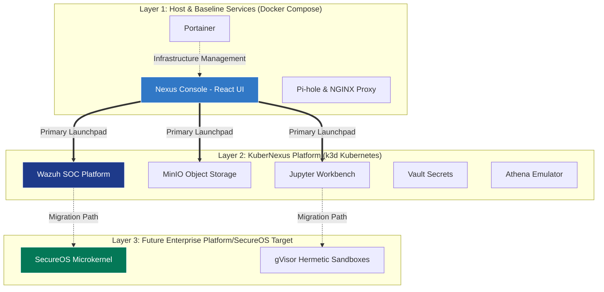

# Underground Nexus

Underground Nexus is an AI-assisted security lab, SOC planning workspace, and secure software factory companion for the broader Enterprise Platform platform.

The repository currently serves two purposes:

- Maintain the existing Docker-based Underground Nexus lab profile.
- Define the next architecture for a production-like Kubernetes/UDS path and a future Enterprise Platform/SecureOS security subsystem.

## Current Status

Underground Nexus is in a Phase 1 bootstrap state. The Docker lab exists today, while the Kubernetes/UDS production-like path and future Enterprise Platform/SecureOS deployment model are being refined in the architecture documents.

The current architecture direction is:

- Use the Docker lab for local experimentation and Security+ style learning.
- Move production-like orchestration toward Kubernetes, Pulumi, Argo CD, and optionally UDS/Zarf.
- Treat SecureOS, gVisor, and Control Plane as future Enterprise Platform platform targets.
- Keep Suricata as the network/protocol side of a hybrid sensor.
- Use Wazuh as the near-term SOC event store.
- Use MinIO for artifacts, evidence, datasets, backups, and package archives.
- Use Vault as the preferred production-like secrets manager.

## Architecture

The system is currently divided into three conceptual layers: the baseline host management stack, the Kubernetes SOC workload cluster, and the future hermetic runtime target.



## Repository Layout

```text
.
├── AGENTS.md
├── CLAUDE.md
├── GEMINI.md
├── docs/
│   ├── 00-ai-collaboration.md
│   ├── 00-doc-index.md
│   ├── architecture/
│   ├── decisions/
│   └── reports/
├── deploy/
│   ├── compose/
│   ├── kubernetes/
│   ├── scripts/
│   └── uds/
├── images/
│   └── docker/
├── platform/
│   ├── ai-inference/
│   ├── athena/
│   ├── mcp/
│   ├── sensors/
│   ├── soc/
│   └── workbench/
└── supply-chain/
```

## Architecture Documents

Start with [docs/00-doc-index.md](docs/00-doc-index.md).

The main architecture documents live in [docs/architecture/](docs/architecture/):

1. [Component Architecture](docs/architecture/01-component-architecture.md)
2. [Enterprise Production Setup](docs/architecture/02-enterprise-production-setup.md)
3. [Phased Implementation Roadmap](docs/architecture/03-phased-implementation-roadmap.md)
4. [AI-Native Enterprise Platform Proposal](docs/architecture/04-ai-native-enterprise platform-proposal.md)
5. [Sensor Deep Dive](docs/architecture/05-sensor-deep-dive.md)
6. [AI-SOC Inference Engine](docs/architecture/06-ai-soc-inference-engine.md)
7. [MCP Workbench](docs/architecture/07-mcp-workbench.md)
8. [Athena Adversary Fuzzer](docs/architecture/08-athena-adversary-fuzzer.md)
9. [Production Deployment Lifecycle](docs/architecture/09-production-deployment-lifecycle.md)
10. [AI-Infused Security+ Labs](docs/architecture/10-ai-infused-security-plus-labs.md)
11. [AI-Native Integration Principles](docs/architecture/11-ai-native-integration-principles.md)

## AI Collaboration

This repository is set up for multiple AI assistants:

- [AGENTS.md](AGENTS.md) for Codex-style coding agents.
- [CLAUDE.md](CLAUDE.md) for Claude review and architecture critique.
- [GEMINI.md](GEMINI.md) for Gemini research synthesis and platform comparison.
- [docs/00-ai-collaboration.md](docs/00-ai-collaboration.md) for shared vocabulary, model roles, and review protocol.

## Local Docker Lab

The legacy local lab image is still supported.

Pull the image:

```sh
docker pull pyrrhus/nexus0:latest
```

Run the container in privileged Docker-in-Docker mode:

```sh
docker run -itd --name=Underground-Nexus \
    -h Underground-Nexus \
    --privileged \
    --init \
    -p 1000:1000 -p 9050:9443 \
    -v underground-nexus-docker-socket:/var/run \
    -v underground-nexus-data:/var/lib/docker/volumes \
    -v nexus-bucket:/nexus-bucket \
    pyrrhus/nexus0:latest
```

Bootstrap the lab from inside the running container:

```sh
docker exec Underground-Nexus sh deploy-olympiad.sh
```

For local repository testing, the script lives at:

```sh
sh deploy/scripts/deploy-olympiad.sh
```

Open a shell in the running container:

```sh
docker exec -it Underground-Nexus /bin/sh
```

### Lab Services

The current lab profile includes:

| Service | Purpose |
| --- | --- |
| Nexus Console | Custom React dashboard serving as the primary platform UI and launchpad |
| Pi-hole | Lab DNS filtering and local DNS control |
| Portainer CE | Lab-only baseline host container management |
| MinIO | Kubernetes-native object storage for artifacts and evidence |
| Vault | Local test Vault via StatefulSet |
| Athena | Kali-based adversary emulation environment |
| Workbench webtop | Operator desktop and development surface |
| SOC webtop | Analyst desktop profile |
| OpenVSCode Server | Browser-accessible code environment |
| k3d | Local Kubernetes cluster bootstrap |

Pi-hole, Portainer, and Vault dev mode are local lab conveniences. They are not the final production security architecture.

## Local-Only and Deprecated Direction

The current Docker lab preserves several components because they are useful for learning, debugging, and standalone local experimentation. They should not be treated as production targets.

| Component | Status | Direction |
| --- | --- | --- |
| Nexus Console | Local-only | Currently built for the local Docker lab baseline; serves as the primary gateway UI. |
| Portainer CE | Local-only | Relegated to baseline host visibility; replace with Argo CD for production-like GitOps. |
| Pi-hole | Local-only | Keep for lab DNS filtering; use Kubernetes DNS, network policy, and Istio for cluster and service traffic control. |
| Legacy webtop-soc | Deprecated direction | Replaced with headless microservices and sensors in `platform/soc/`. |
| Legacy Vault dev mode | Deprecated direction | Replaced with Kubernetes-native Vault (StatefulSet for test, Helm HA for prod). |
| Privileged Docker-in-Docker image | Local-only | Keep for the bootstrap lab; avoid as the production runtime model. |
| Sysbox image | Experimental | Keep as an alternate lab runtime until its role is revalidated. |
| Docker Swarm bootstrap | Deprecated direction | Keep only while needed by the legacy script; prefer Kubernetes for future orchestration. |
| Hard-coded lab IPs and default credentials | Deprecated direction | Replace with profile configuration, generated secrets, and documented access patterns. |
| Long-form command output in README | Deprecated direction | Move durable supply-chain examples and scan output into `supply-chain/` or generated reports. |

## Build Images

The Underground Nexus lab is packaged as a self-contained container environment. The build process recursively copies the `deploy/` and `platform/` directories into the image so that the local baseline stack (including the custom Nexus Console React UI and KuberNexus manifests) is natively available at runtime.

Image build assets are split by type:

- Dockerfiles: [images/docker/](images/docker/) (DinD and Sysbox variants)

The Dockerfiles expect the repository root as the build context:

```sh
docker build -t <username>/core-nexus:latest -f images/docker/Dockerfile .
docker build -t <username>/core-nexus:latest-sysbox -f images/docker/Dockerfile.sysbox.image .
```

The production builds and image publishing are fully automated via GitHub Actions (`.github/workflows/`), pushing directly to Docker Hub upon updates to the `main` branch.

## Supply Chain

Supply-chain support material lives in [supply-chain/](supply-chain/).

The target direction is:

- Signed container images.
- SBOM generation.
- Vulnerability scanning.
- Artifact provenance and attestations.
- GitHub OIDC or another keyless signing path where practical.

Historical key-based Cosign verification notes should move into `supply-chain/` if they need to be preserved.

## Current Limitations

- The Docker lab still relies on privileged container behavior.
- The bootstrap script is useful but should become more idempotent and profile-aware.
- Portainer remains lab-only; Argo CD is the production-like GitOps direction.
- Vault dev mode is local-only; production-like deployments should use a proper Vault HA design.
- Kubernetes/UDS SOC, AI Inference, Workbench, and Athena assets are active and deployed in the local `kind` cluster, and we are working toward production GitOps and UDS delivery.
- SecureOS, gVisor, and Control Plane are future Enterprise Platform targets, not current runtime dependencies.

## Roadmap

Use [docs/architecture/03-phased-implementation-roadmap.md](docs/architecture/03-phased-implementation-roadmap.md) as the roadmap source of truth.

High-level phases:

1. **Phase 1:** Preserve and refine the Linux/Docker/Kubernetes bridge.
2. **Phase 2:** Begin migration toward hermetic runtime patterns and SecureOS-compatible telemetry.
3. **Phase 3:** Mature the future Enterprise Platform/SecureOS high-assurance target.

## License

This project is licensed under the [MIT License](LICENSE).
