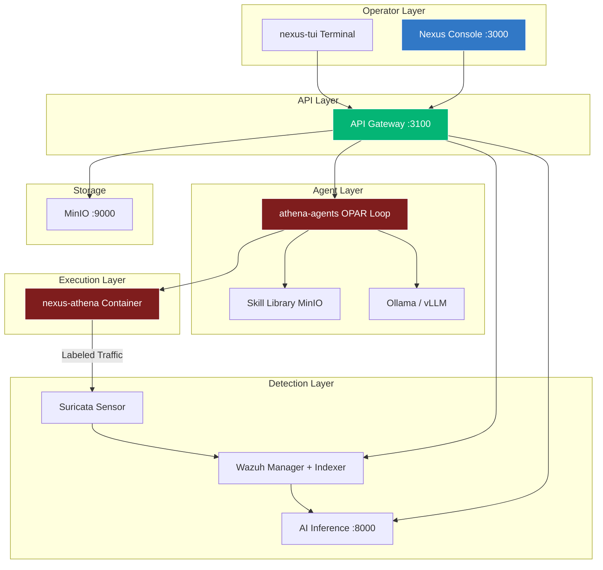

# Underground Nexus

An AI-native security operations platform with LLM-driven adversary emulation, automated detection engineering, and skill-driven agent memory.

Underground Nexus combines a SOC detection pipeline (Wazuh + Suricata), autonomous red-team agents (OPAR loop), and a unified operator interface (web console + terminal TUI) into a closed-loop system where the agent generates labeled attack traffic, sensors detect it, and the platform measures coverage gaps.

## Quick Start (Dev Stack)

Preferred: start Vault beside this stack, then bring up compose with exported secrets.

```bash
# Terminal A — nexus-hashistack (Vault :8200)
cd ../nexus-hashistack
./scripts/nexus-dev-up.sh
./scripts/admin-bootstrap-approle.sh
./scripts/export-core-nexus-env.sh
cp .env.core-nexus ../core-nexus/.env.vault

# Terminal B — platform
cd ../core-nexus
./scripts/dev-stack.sh up --from-vault
./scripts/seed-minio-skills.sh

open http://localhost:3000          # Console (gateway local login)
open http://localhost:3100/docs     # API Gateway
open http://localhost:8200          # Vault UI (sidecar)
```

Offline / no Vault (compose defaults only):

```bash
./scripts/dev-stack.sh up
```

Strict labs can refuse defaults: `NEXUS_REQUIRE_VAULT=1 ./scripts/dev-stack.sh up --from-vault`.

Console login uses the **API Gateway** (`authProvider: local`), not Vault user auth. The Vault tile is a deep-link to the hashistack sidecar. See `docs/architecture/12-vault-environments-specification.md`.

## Architecture



## Repositories

| Repository | Purpose |
|------------|---------|
| **core-nexus** (this repo) | Architecture hub, Nexus Console, API Gateway, AI Inference, nexus-tui, deploy manifests, skills |
| **nexus-hashistack** | Sole local Vault (+ optional Consul) pack — run beside this repo; core-nexus only consumes |
| **nexus-athena** | Kali-based red-team container with 5 runtime profiles |
| **athena-agents** | LLM-driven OPAR orchestrator (Python + Rust) |
| **nexus-webtop-soc** | SOC baseline compose stack (Wazuh + Suricata) |
| **nexus-webtop-workbench** | Browser-based analyst desktop |

## Components

| Component | Location | Port | Purpose |
|-----------|----------|------|---------|
| Nexus Console | `platform/nexus-console/` | 3000 | React dashboard — navigation, health, agent feed, alerts, approvals, skills, artifacts |
| API Gateway | `platform/api-gateway/` | 3100 | FastAPI aggregation layer — JWT auth, proxies all backends |
| AI Inference | `platform/ai-inference/` | 8000 | Threat scoring, triage enrichment, vector memory |
| nexus-tui | `cmd/nexus-tui/` | — | Go terminal console for SSH/air-gapped environments |
| Agent Memory | `docs/skills/` | — | Git-based skills + MinIO sync + session logs |
| MinIO | compose service | 9000/9001 | Object storage (PCAPs, SBOMs, skills, sessions) |

## Repository Layout

```text
.
├── cmd/
│   └── nexus-tui/              # Go terminal SOC console
├── deploy/
│   └── compose/
│       ├── dev.yml             # Unified dev stack (recommended)
│       ├── baseline.yml        # Legacy Olympiad stack
│       └── README.md
├── docs/
│   ├── 00-ai-collaboration.md
│   ├── 00-doc-index.md
│   ├── architecture/           # 14 numbered architecture docs
│   ├── decisions/
│   ├── reports/
│   ├── scenarios/
│   ├── skills/                 # Portable agent memory (skills + sessions)
│   └── 100-days-challenge.md
├── images/
│   └── docker/                 # Legacy DinD deployment image
├── platform/
│   ├── ai-inference/           # FastAPI AI triage service
│   ├── api-gateway/            # FastAPI aggregation gateway
│   ├── athena/                 # Athena component reference
│   ├── mcp/                    # MCP server scaffold
│   ├── nexus-console/          # React 19 dashboard
│   ├── sensors/                # Sensor integration (references nexus-webtop-soc)
│   ├── soc/                    # SOC integration (references nexus-webtop-soc)
│   └── workbench/              # JupyterLab integration
├── scripts/
│   ├── dev-stack.sh            # Dev compose helper
│   ├── seed-minio-skills.sh    # Upload skills to MinIO
│   └── sync-skills.sh          # Sync skills: git ↔ local ↔ MinIO
└── supply-chain/
```

## Architecture Documents

Start with [docs/00-doc-index.md](docs/00-doc-index.md).

| # | Document | Topic |
|---|----------|-------|
| 1 | [Component Architecture](docs/architecture/01-component-architecture.md) | Current component map and target roles |
| 2 | [Enterprise Production Setup](docs/architecture/02-enterprise-production-setup.md) | Kubernetes, Pulumi, Argo CD, UDS/Zarf |
| 3 | [Phased Implementation Roadmap](docs/architecture/03-phased-implementation-roadmap.md) | Phase 1-3 maturity model |
| 4 | [AI-Native Platform Proposal](docs/architecture/04-ai-native-platform-proposal.md) | Long-horizon Enterprise Platform/SecureOS |
| 5 | [Sensor Deep Dive](docs/architecture/05-sensor-deep-dive.md) | Hybrid Suricata + runtime telemetry |
| 6 | [AI-SOC Inference Engine](docs/architecture/06-ai-soc-inference-engine.md) | AI triage and model governance |
| 7 | [MCP Workbench](docs/architecture/07-mcp-workbench.md) | MCP server and purple-team MLOps |
| 8 | [Athena Adversary Fuzzer](docs/architecture/08-athena-adversary-fuzzer.md) | LLM-driven adversarial data generation |
| 9 | [Production Deployment Lifecycle](docs/architecture/09-production-deployment-lifecycle.md) | Future bare-metal lifecycle |
| 10 | [AI-Infused Security+ Labs](docs/architecture/10-ai-infused-security-plus-labs.md) | Lab scenarios |
| 11 | [AI-Native Integration Principles](docs/architecture/11-ai-native-integration-principles.md) | Stimulation, emulation, skill memory |
| 12 | [Vault Environments](docs/architecture/12-vault-environments-specification.md) | Vault intent (implemented in nexus-hashistack) |
| 13 | [Agent Workflows and Memory](docs/architecture/13-agent-workflows-and-memory.md) | OPAR loop, skills, nexus-tui, safety |

## Agent Skill Memory

Skills encode proven approaches so agents skip rediscovery on repeat encounters:

```bash
# Check sync status
./scripts/sync-skills.sh status

# Push git skills to local Kiro
./scripts/sync-skills.sh push-local

# Push to MinIO for headless agents
./scripts/sync-skills.sh push-minio
```

Skills live at three levels:
- `docs/skills/` — git (versioned, source of truth)
- `~/.kiro/skills/` — local (Kiro reads here)
- MinIO `nexus-memory/skills/` — platform (OPAR agents read here)

## Athena Agent Profiles

The `nexus-athena` container supports 5 runtime profiles:

| Profile | Purpose | Capabilities |
|---------|---------|-------------|
| `standard` | Basic red-team | Unprivileged |
| `packet-lab` | Packet capture | NET_ADMIN, NET_RAW |
| `exploit-lab` | Metasploit, exploit dev | NET_ADMIN, NET_RAW, SYS_PTRACE |
| `agent` | LLM-driven OPAR | Network to LLM endpoint |
| `agent-ics` | Autonomous ICS/OT | ICS_WRITE, CAN_INJECT + agent |

## AI Collaboration

- [AGENTS.md](AGENTS.md) — Kiro/Codex agent instructions
- [CLAUDE.md](CLAUDE.md) — Claude architecture critique
- [GEMINI.md](GEMINI.md) — Gemini research synthesis
- [docs/00-ai-collaboration.md](docs/00-ai-collaboration.md) — Shared vocabulary, model roles, non-negotiable decisions

## Current Phase

**Phase 1: Bootstrap** — 5 of 7 exit criteria complete.

See [Phase 1 details](docs/architecture/03-phased-implementation-roadmap.md).

## License

[MIT License](LICENSE)
