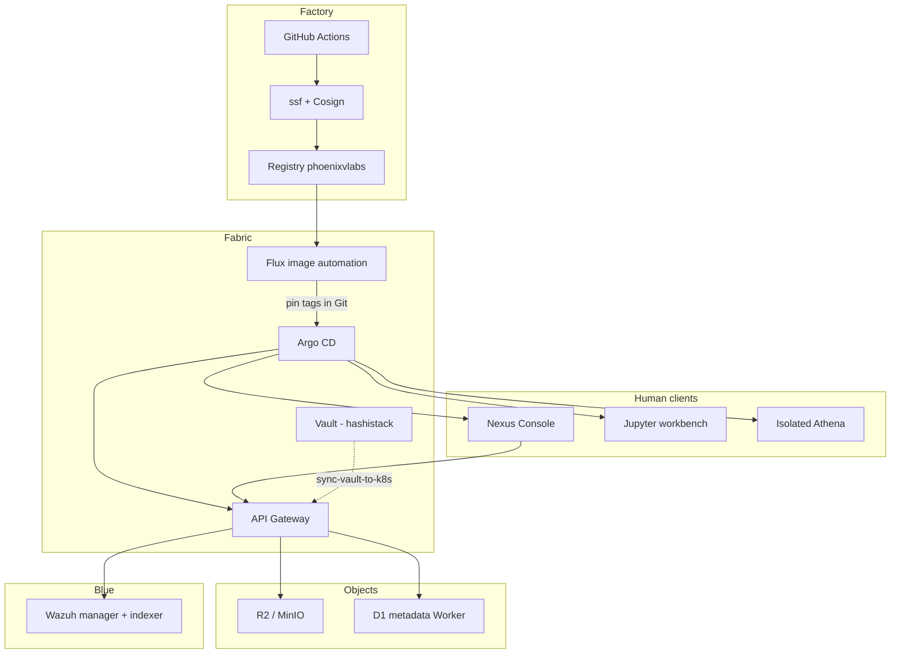

# Underground Nexus (`core-nexus`)

Architecture hub and platform source for **Underground Nexus**: a **programmable fabric** and **secure software factory**, with an attached **red / blue / purple range**.

This repository holds numbered architecture docs, platform components (Console, API gateway, workbench, sensors, metadata), and deploy manifests (Compose lab + Kubernetes/GitOps). Sibling repos own Vault, Athena runtime, and agent orchestration.

Canonical narrative: [`docs/architecture/01-component-architecture.md`](docs/architecture/01-component-architecture.md) §0.  
Locked decisions: [`docs/decisions/`](docs/decisions/). Collaboration rules: [`docs/00-ai-collaboration.md`](docs/00-ai-collaboration.md).

## What it is

| Plane | Role | Surfaces in this ecosystem |
| --- | --- | --- |
| **Fabric** | Deployable workloads, identity, secrets, observability | Kubernetes overlays, Vault (via `nexus-hashistack`), GitOps |
| **Factory** | Build → SBOM → sign → attest → promote | CI + [`nebucloud/ssf`](https://github.com/nebucloud/ssf) / [kiln](https://github.com/nebucloud/kiln) + **Flux** (image automation) + **Argo CD** (app delivery) |
| **Blue** | Detection and ops UX | Headless Wazuh + sensors + AI triage + **Nexus Console** (optional `nexus-tui`) |
| **Purple** | Ground-truth evaluation | **Jupyter** workbench + MCP |
| **Red** | Controlled stimulation / emulation | Isolated **Athena** + `athena-agents` |

**Keep as human clients:** Nexus Console, Jupyter purple workspace, isolated Athena.  
**Retired as product desktops:** `nexus-webtop-soc` / `nexus-webtop-workbench` (archive compose only — do not treat as recommended surfaces).

**Objects:** lab MinIO (S3); production **Cloudflare R2** (blobs) + **D1** (artifact/run metadata).  
**Secrets:** Vault lives in [`nexus-hashistack`](https://github.com/acald-creator/nexus-hashistack) — not deployed from this repo.

## Architecture (lab spine)



GitOps bootstrap sketch: [`deploy/gitops/`](deploy/gitops/). First Argo apps sync Console+gateway (`overlays/r2`) and range Jupyter+Athena (`overlays/gitops-range`).

## Repositories

| Repository | Role |
| --- | --- |
| **core-nexus** (this repo) | Architecture, Console, gateway, workbench defs, SOC/k8s deploy, skills |
| **nexus-hashistack** | Local/shared Vault (+ optional Consul); AppRole export for `--from-vault` |
| **nexus-athena** | Red-team container image and execution environment |
| **athena-agents** | LLM OPAR orchestrator (allowlist + capability gates) |
| **nebucloud/ssf** + **kiln** | Secure software factory CLI / hermetic build (not duplicated here) |
| **nexus-webtop-*** | **Retired** — archive only |

## Platform components

| Component | Path | Notes |
| --- | --- | --- |
| Nexus Console | `platform/nexus-console/` | React ops UI — launchpad, alerts, approvals, artifacts |
| API Gateway | `platform/api-gateway/` | FastAPI — JWT auth, Wazuh/object-store/D1 proxies |
| Jupyter workbench | `platform/workbench/` | Purple analyst workspace (`nexus-workbench` image) |
| Metadata Worker | `platform/nexus-metadata/` | Cloudflare Worker + D1 artifact/run index |
| AI inference | `platform/ai-inference/` | Triage enrichment (optional in thin spine) |
| nexus-tui | `cmd/nexus-tui/` | Terminal client for constrained environments |
| Skills | `docs/skills/` | Versioned agent memory (git ↔ local ↔ object store) |

## Quick start

### Compose lab (with Vault)

```bash
# Terminal A — Vault
cd ../nexus-hashistack
./scripts/nexus-dev-up.sh
./scripts/admin-bootstrap-approle.sh   # optional
./scripts/export-core-nexus-env.sh
cp .env.core-nexus ../core-nexus/.env.vault

# Terminal B — platform
cd ../core-nexus
./scripts/dev-stack.sh up --from-vault
./scripts/seed-minio-skills.sh

open http://localhost:3000   # Console (gateway local login)
open http://localhost:3100/docs
open http://localhost:8200   # Vault UI (sidecar)
```

Without Vault: `./scripts/dev-stack.sh up` (compose defaults). Strict labs: `NEXUS_REQUIRE_VAULT=1 ./scripts/dev-stack.sh up --from-vault`.

Console login is **gateway JWT** (`authProvider: local`), not Vault userpass. Vault appears as a Console deep-link. See [`docs/architecture/12-vault-environments-specification.md`](docs/architecture/12-vault-environments-specification.md).

### Kubernetes / GitOps lab

```bash
# Bootstrap Argo + Flux image automation (see deploy/gitops/README.md)
export NEXUS_GIT_URL="https://github.com/acald-creator/core-nexus.git"
./deploy/gitops/bootstrap.sh

# Secrets into cluster (R2 lab uses nexus/prod)
source ../nexus-hashistack/.approle/gateway.env 2>/dev/null || true
NEXUS_VAULT_GW_PATH=nexus/prod ./deploy/scripts/sync-vault-to-k8s.sh

# Port-forwards for Console launchpad
kubectl -n soc port-forward svc/nexus-console 3000:80
kubectl -n soc port-forward svc/nexus-api-gateway 3100:3100
kubectl -n soc port-forward svc/nexus-workbench 8888:8888
```

Publish/sign images: `.github/workflows/publish-platform-images.yml` (Docker Hub + Cosign; optional `ssf` once installed).

## Documentation

| Start here | Purpose |
| --- | --- |
| [`docs/00-doc-index.md`](docs/00-doc-index.md) | Ordered reading list |
| [`docs/architecture/01-component-architecture.md`](docs/architecture/01-component-architecture.md) | Locked product narrative + component map |
| [`docs/architecture/02-enterprise-production-setup.md`](docs/architecture/02-enterprise-production-setup.md) | K8s, Flux+Argo, factory loop |
| [`docs/architecture/03-phased-implementation-roadmap.md`](docs/architecture/03-phased-implementation-roadmap.md) | Phase 1–3 maturity |
| [`docs/architecture/13-agent-workflows-and-memory.md`](docs/architecture/13-agent-workflows-and-memory.md) | OPAR, skills, safety |

Agent entrypoints: [`AGENTS.md`](AGENTS.md), [`CLAUDE.md`](CLAUDE.md), [`GEMINI.md`](GEMINI.md).

## Skills sync

```bash
./scripts/sync-skills.sh status
./scripts/sync-skills.sh push-local    # → ~/.kiro/skills/
./scripts/sync-skills.sh push-minio    # → object store for headless agents
```

Source of truth: `docs/skills/` (git).

## Guardrails

- Do not put SOC control-plane or factory trust into desktop images.
- Offensive tooling belongs in `nexus-athena` / `athena-agents`, not this repo’s default images.
- LLM agents stay inside allowlist and capability-gate constraints; human approval before autonomous response.
- Prefer Flux + Argo for fabric delivery; do not invent a second Cosign/SBOM stack beside `nebucloud/ssf`.
- Keep credentials and certificates out of git.

## License

[MIT License](LICENSE)
