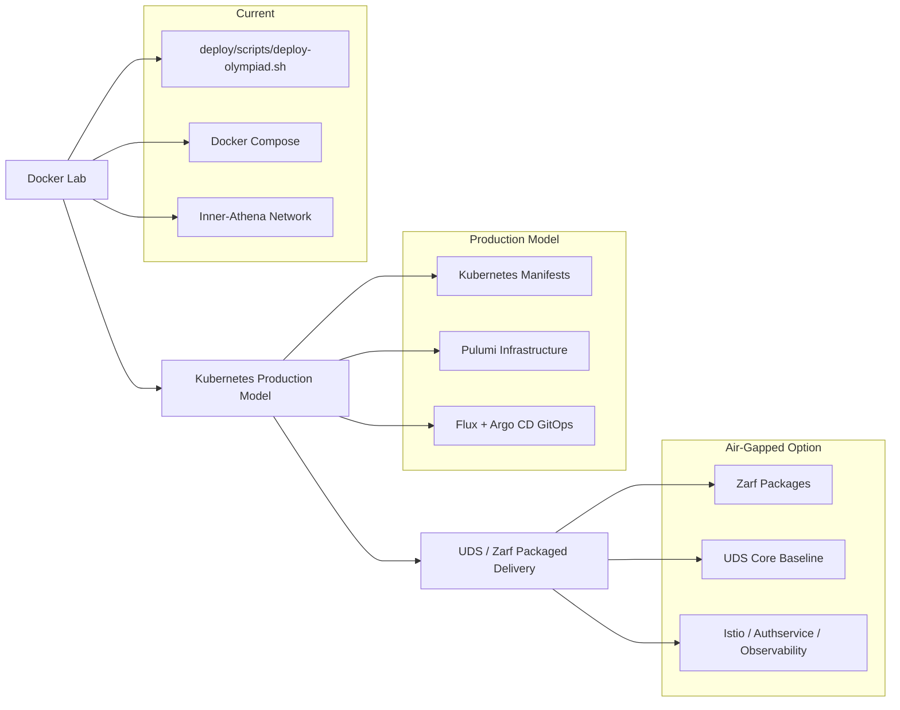

# Underground Nexus Component Architecture

This document maps the current Underground Nexus components to a refined target architecture. The goal is not to discard the current Docker lab, but to make each component clearer, safer, and easier to move into Kubernetes, GitOps, and eventually UDS/Zarf packaging.

## 0. Product Narrative (locked)

Underground Nexus is a **programmable fabric** plus a **secure software factory**, with an attached **red / blue / purple range**.

| Plane | Purpose | Primary surfaces |
| --- | --- | --- |
| Fabric | Deployable components, namespaces, identity, secrets, observability | Kubernetes manifests/overlays, Vault, MinIO (lab) / R2+D1 (prod) |
| Secure software factory | Build → SBOM → sign → attest → promote | CI + **Flux** (image automation / sync) + **Argo CD** (app delivery & governance) |
| Blue | SOC detection and ops UX | Headless Wazuh + sensors + AI triage + **Nexus Console** (+ optional `nexus-tui`) |
| Purple | Evaluate detections / models against ground truth | **Jupyter** agentic workspace + MCP |
| Red | Controlled stimulation / emulation | **Isolated Athena** + `athena-agents` |

**Human client surfaces (keep):** Nexus Console, Jupyter purple workspace, isolated Athena.

**Retire as product images:** `nexus-webtop-soc` and `nexus-webtop-workbench` full Linux desktops. Do not put SOC control-plane or factory trust into desktop images. Transitional compose recipes may live in those repos until headless SOC in `core-nexus` is sufficient, then archive.

**GitOps default:** Argo CD + Flux CD together (see `02-enterprise-production-setup.md` §5). Pulumi remains optional for cloud/infra provisioning, not a substitute for the GitOps loop.

**Object storage:** Lab uses MinIO (S3 API). Production prefers Cloudflare **R2** for blobs (`NEXUS_GW_OBJECT_STORE_BACKEND=r2`, overlay `deploy/kubernetes/soc/overlays/r2`) and **D1** for artifact/run metadata indexes (`platform/nexus-metadata` Worker + gateway `/api/v1/artifact-index`). Gateway object client: `platform/api-gateway` ObjectStoreClient — see `OBJECT_STORE.md`.

**Secure software factory implementation:** Prefer [`nebucloud/ssf`](https://github.com/nebucloud/ssf) (Go CLI: sign/attest/SBOM/policy via Cosign shellouts; `ssf.yaml` → kiln hermetic steps). Builds stay in [kiln](https://github.com/nebucloud/kiln); SSF secures outputs. Do **not** reinvent a parallel factory inside `core-nexus`. The older monorepo `nebucloud/secure-software-factory` (xDS + Hyperledger Fabric scaffolding) is a separate lineage — not the default Nexus factory path unless explicitly revived.

**Factory AI (secure coding / review):** Sibling [`nebucloud/factory-agents`](https://github.com/nebucloud/factory-agents) (ADR 0009) — review agent first, coding agent second; kiln is the hermetic verify/build **callee**, not the agent workspace. Wire human gates via Console Approvals / gateway; keep coding LLMs out of `platform/ai-inference`.

Existing SSF phases (2.4a–d) are early but real (binary artifact + pipeline + CUE); OCI and Flux/Argo wiring are follow-ons for Nexus image promotion.

## 1. Deployment Progression

Underground Nexus can support multiple deployment methods during the transition.

| Layer | Purpose | Status |
| --- | --- | --- |
| Docker lab | Fast local experimentation and current working deployment | Current |
| Kubernetes production model | Portable workload definitions and production-style operations | Proposed |
| Pulumi | Infrastructure provisioning | Proposed |
| Argo CD + Flux | GitOps app delivery + image automation | Sketch live (`deploy/gitops/`) |
| UDS / Zarf | Air-gapped delivery and hardened platform baseline | Proposed option |

## 2. Current Component Map

| Current component | Current role | Refined target role |
| --- | --- | --- |
| `deploy/scripts/deploy-olympiad.sh` | Orchestrates the Docker lab and bootstraps k3d | Keep for lab profile; later split into smaller profiles or replace with Compose/Kubernetes manifests |
| Docker Compose | Starts selected lab services such as Pi-hole and NGINX proxy | Keep for local lab validation |
| `Inner-Athena` Docker network | Shared lab network for containers | Map to Kubernetes namespaces, services, and network policies |
| Pi-hole | Lab DNS filtering and DNS control | Lab-only DNS filter; production Kubernetes DNS is handled by cluster DNS, while Istio handles service mesh traffic policy |
| NGINX proxy | Lab HTTP routing | Replace with Kubernetes ingress or UDS/Istio gateways in production |
| Nexus Console | Primary Platform UI | Custom React/Vite dashboard serving as the unified launchpad for all Underground Nexus services |
| Portainer | Manual host container UI | Lab-only; relegated to baseline container management, replaced by Nexus Console as primary UI |
| MinIO | Lab object storage for `/nexus-bucket` artifacts | Lab S3 backend; production blobs on Cloudflare R2 + metadata on D1 (S3-shaped app interface) |
| Vault dev mode | Development secrets service | Owned by `nexus-hashistack` / shared Vault (ADR 0008); not deployed from core-nexus |
| `nexus-webtop-soc` | Legacy SOC desktop with Suricata | **Retire** desktop image; keep headless Wazuh/sensor recipes only until `deploy/kubernetes/soc` is enough |
| `nexus-webtop-workbench` | Legacy analyst desktop | **Retire**; replaced by Jupyter purple workspace + Console |
| `nexus-athena` | Kali red-team container | Keep isolated red range with runtime profiles; not an analyst or factory client |
| `athena-agents` | LLM adversary orchestration | OPAR execution loop with configurable LLM backend, tool registry, safety controls, and ground-truth emission |
| `nexus-workbench` / `platform/workbench` | Agentic Workspace | JupyterLab purple workspace (sole purple human client) |
| `nexus-tui` | Terminal SOC console | Charmbracelet TUI for alert triage, agent feed, approvals, and skill browsing in SSH/air-gapped environments |
| Code server | Development editor | Merged into Agentic Workspace concepts (JupyterLab / VS Code) |
| Docker Swarm | Overlay networking experiment | De-emphasize for future architecture unless a specific lab requires it |
| k3d / KuberNexus | Local Kubernetes sandbox | Keep as local Kubernetes test path before full production deployment |

## 3. Refined Target Components

### SOC Services

The SOC should become a set of purpose-built services instead of a single webtop image.

Target SOC components:

- **Wazuh manager:** Event analysis, rules, API, and agent management.
- **Wazuh indexer:** Security event indexing and search.
- **Wazuh dashboard:** Analyst interface.
- **Wazuh agents:** Host and workload telemetry.
- **Suricata sensor:** Network intrusion detection and `eve.json` event generation.
- **Optional Zeek sensor:** Protocol metadata and richer network context (ADR 0011 hybrid overlay).
- **Falco:** Runtime threat detection (ADR 0011).
- **Tetragon:** eBPF runtime export (ADR 0011).

Prefer Chainguard images for Wazuh components where available. Suricata should run as a dedicated sensor image, not as software compiled into a desktop container.

### AI Triage

The AI layer should enrich SOC events rather than replace the SOC platform.

Target AI responsibilities:

- Read normalized Wazuh, Suricata, or Vector events.
- Calculate a threat score or false-positive probability.
- Emit structured JSON back into the event pipeline.
- Keep the input and output schema small, documented, and testable.

For tightly coupled Suricata experiments, the AI container can run as a sidecar and read `eve.json` from a memory-backed `emptyDir`. For production-style SOC workflows, it should consume normalized events from the SIEM or log pipeline.

### Athena

`nexus-athena` should remain the controlled red-team and security testing environment.

Refinement goals:

- Run only in isolated lab networks.
- Avoid host Docker socket mounts by default.
- Label generated traffic by lab scenario.
- Define required Linux capabilities for packet capture or attack simulation.
- Keep offensive tooling separate from workbench and SOC services.

Runtime profiles:

| Profile | Purpose | Capabilities |
| --- | --- | --- |
| `athena-standard` | Basic red-team commands against approved lab targets | Unprivileged or minimal |
| `athena-packet-lab` | Wireshark, packet capture, network analysis | `NET_ADMIN`, `NET_RAW` |
| `athena-exploit-lab` | Metasploit or attack simulation labs | Isolated network, explicit approval |
| `athena-agent` | LLM-driven autonomous emulation | Network to LLM inference endpoint |
| `athena-agent-ics` | Autonomous ICS/OT testing with safe-range enforcement | `ICS_WRITE`, `CAN_INJECT` + agent |

### Athena Agents (LLM Adversary Orchestration)

`athena-agents` implements the LLM-driven adversary emulation layer using an Observe/Plan/Act/Reflect (OPAR) execution loop.

Target responsibilities:

- **Observe:** Produce structured target-state snapshots (open ports, service banners, prior results).
- **Plan:** LLM selects the next technique and tool from the registry based on observations, action history, and loaded skills.
- **Act:** Execute the selected tool with safety controls (allowlist, rate limiter, capability gates, ICS safe ranges).
- **Reflect:** Evaluate the result, emit a labeled ground-truth record, and update action history.

Key architectural properties:

- Configurable LLM backend (Ollama, vLLM, llama.cpp) per environment.
- Allowlist verification (SHA-256 hash) before each execution cycle.
- Per-target token-bucket rate limiting.
- Capability gates: tools declare requirements, runtime profiles grant them.
- Ground-truth telemetry emission for SOC evaluation.
- Traffic labeling (`X-Athena-Scenario`, `X-Athena-Run-ID`) for dashboard filtering.
- `needs_review` flag halts execution for human approval.

### Agent Memory

A cross-cutting concern that provides persistent, portable knowledge across all agent sessions and tools.

Three layers:

- **Skill files (structured memory):** Proven approaches encoded as Markdown with front matter. Stored in `docs/skills/` (git), synced to `~/.kiro/skills/` (local) and MinIO `nexus-memory/skills/` (platform).
- **Session logs (episodic memory):** JSONL records of what each session accomplished. Stored in `docs/skills/sessions/` and synced to MinIO `nexus-memory/sessions/`.
- **Vector memory (semantic retrieval):** Embeddings of skills and sessions for RAG queries. Future: ChromaDB or equivalent, backed by MinIO.

Consumed by: Kiro (local skills), Claude Code / Codex (via AGENTS.md references), athena-agents OPAR Plan phase (from MinIO), nexus-tui Skill Browser panel.

### Nexus TUI (Terminal SOC Console)

`cmd/nexus-tui` provides a Charmbracelet-based terminal interface for SOC triage in air-gapped or SSH-only environments.

Panels:

- **Agent Feed:** Live OPAR loop events (observe/plan/act/reflect) from JSONL.
- **Alerts:** Wazuh/Suricata alerts with severity coloring and Athena traffic label detection.
- **Approvals:** `needs_review` queue with approve/reject workflow.
- **Skills:** Browse and view auto-generated skill files.

This complements (does not replace) the browser-based Nexus Console and Workbench.

### Workbench (purple)

The purple human surface is a **JupyterLab agentic workspace** (`platform/workbench` / `nexus-workbench` image), not a full Linux webtop.

Refinement goals:

- Evaluate detections and models against Athena ground-truth labels; use MCP for approved tool context.
- Deep-link to Wazuh, Grafana, and runbooks via Console where possible; notebooks for analysis.
- Optional IaC notebooks/CLIs; prefer GitOps (Argo/Flux) for cluster changes over long-lived admin desktops.
- Avoid host Docker socket mounts in the default profile; run unprivileged on a minimal base.
- Keep red-team tooling in Athena; keep SOC engines out of the workbench image.

## 4. Event and Logging Architecture

The architecture should separate platform logs from security events.

| Event type | Primary destination | Notes |
| --- | --- | --- |
| Platform and workload logs | Vector, Loki, Grafana | Useful for operations, troubleshooting, and cluster observability |
| Security alerts and telemetry | Wazuh manager, indexer, dashboard **or** Vector → ai-inference (ADR 0011 hybrid) | Primary SOC investigation path |
| Network sensor events | Suricata and Zeek → Vector (and optionally Wazuh) | Suricata = IDS (ADR 0007); Zeek = metadata |
| AI triage output | Wazuh or log pipeline | Should include source event ID, model version, score, and reason fields |

Recommended default: **Wazuh** for full SIEM labs (`overlays/test`); **Vector + hybrid sensors** for
compose-your-own labs without Wazuh (`overlays/hybrid-sensor`, ADR 0011). Loki remains for platform
and workload logs.

## 5. Network and Traffic Capture

Suricata traffic capture is a core design decision.

| Environment | Capture question |
| --- | --- |
| Docker lab | Should Suricata attach to `Inner-Athena`, host networking, or a mirrored traffic path? |
| Kubernetes | Should Suricata run as a DaemonSet, sidecar, gateway sensor, or dedicated capture pod? |
| UDS / Istio | How should traffic be observed when pod-to-pod traffic is protected by mTLS? |

Possible approaches:

- Gateway-level inspection.
- CNI or eBPF-based capture.
- Host-network capture.
- Selective plaintext test flows for lab scenarios.
- Telemetry-based detection from Wazuh, Envoy, or platform logs.

This decision should be made before treating Suricata as a production detection source in the service mesh.

## 6. Infrastructure Services

Some current services are useful lab components but need clearer production roles.

| Service | Lab role | Production question |
| --- | --- | --- |
| Pi-hole | DNS filtering and lab DNS | Keep as lab-only; do not treat Istio as a direct Pi-hole replacement |
| MinIO | Local object storage for artifacts and datasets | **Lab default.** Production-like blobs use Cloudflare R2; metadata uses D1 (ADR 0005). In-cluster MinIO HA is optional/air-gap only. |
| Vault | Dev secrets via sidecar | **External:** `nexus-hashistack` / shared Vault (ADR 0008). Never deploy Vault from core-nexus GitOps. |
| Nexus Console | Primary Platform UI | Custom React app serving as the launchpad for all Underground Nexus services |
| Portainer | Manual container UI | Lab-only host visibility; Flux + Argo for production-like GitOps (ADR 0001, 0003) |
| Code server | Developer editor | Merge into workbench or keep as separate development service? |

### Secrets Management

Vault is the preferred secrets manager for Underground Nexus. Ownership is
**outside** this repository: lab/local Vault via `nexus-hashistack`, later a
shared platform Vault (ADR 0008). Historical FRSCA-style factories also use Vault
for build trust — Nexus’s default factory is `nebucloud/ssf` + kiln (ADR 0004),
not a Tekton Chains stack inside core-nexus.

Recommended Vault roles:

- **Local lab:** Run Vault from `nexus-hashistack` (dev or file backend). Do **not**
  add Vault Helm/StatefulSet manifests under core-nexus.
- **Production-like:** HA Vault with auto-unseal, operated by hashistack / platform
  Vault ops — consumed by Nexus via AppRole and `sync-vault-to-k8s.sh`.
- **Build factory:** Store signing material, short-lived credentials, registry tokens,
  and pipeline secrets (factory CI + Vault).
- **Runtime platform:** Store SOC, Wazuh, object-store, database, API, and service credentials.
- **Deployment:** Feed Kubernetes secrets through explicit sync or injection — never commit secrets to Git.

Secrets should be separated by trust boundary:

| Secret class | Examples | Recommended owner |
| --- | --- | --- |
| Build and signing secrets | Cosign keys, registry credentials, attestation signing material | Secure software factory / Vault |
| Runtime application secrets | Wazuh credentials, MinIO credentials, API tokens | Platform secret manager / Vault |
| Identity and SSO config | OIDC client secrets | Identity platform plus Vault-backed storage |
| Lab-only secrets | Temporary tokens, demo passwords | Local Vault dev mode or disposable `.env` files |

For a production-like path, prefer short-lived or identity-bound credentials over long-lived static secrets. GitHub OIDC, SPIFFE/SPIRE workload identity, Vault dynamic secrets, and keyless Sigstore/Cosign flows all fit this direction.

### Object Storage (MinIO lab / R2+D1 prod)

S3-compatible object storage holds artifacts separate from live application state.
Per ADR 0005: **MinIO for lab**; **Cloudflare R2** for production-like blobs and
**D1** for artifact/run metadata (`platform/nexus-metadata`).

Good lab (MinIO) use cases:

- Store PCAP files from Wireshark, Suricata, Zeek, or Athena exercises.
- Store exported Wazuh alerts, Suricata `eve.json`, and AI training datasets.
- Store generated SBOMs, attestations, signed image metadata, and scan reports.
- Share files between Athena, Workbench, SOC tooling through a controlled bucket interface.
- Practice S3-compatible workflows without depending on a public cloud account.

Good production-like (R2 + D1) use cases:

- Immutable lab evidence and incident-response artifact blobs on R2.
- Model training datasets and evaluation outputs.
- Pipeline artifacts, SBOM archives, and release bundles.
- Queryable run/artifact indexes on D1 via the gateway.

Neither MinIO nor R2 is the primary SOC event database. Wazuh indexer handles
security investigation data; Loki handles platform logs. Object storage archives
selected exports when long-term blob retention is useful.

## 7. UDS Core Baseline

UDS should be treated as a hardened delivery and platform baseline, not as the secrets manager for the architecture.

Expected UDS Core capabilities:

- **Authservice:** SSO flows for mission applications.
- **Istio:** Service mesh networking.
- **Grafana and Prometheus:** Observability and metrics.
- **Loki and Vector:** Log storage and log aggregation.
- **Tetragon:** Runtime security via eBPF.
- **Velero:** Backup and recovery.

Secrets remain a separate design decision. Prefer Vault via `nexus-hashistack` /
shared Vault (ADR 0008), not UDS as the secrets backend.

## 8. Planning Milestones

### Decision Register

| Decision | Recommended default | Component docs |
| --- | --- | --- |
| Product spine | Programmable fabric + secure software factory; R/B/P range attached | This document §0 |
| GitOps | Flux (sync / image automation) + Argo CD (apps / governance) | `deploy/gitops/`, `02` §5 |
| SOC platform | Headless Wazuh + hybrid Suricata/runtime sensors | `deploy/kubernetes/soc`, ADR 0007 |
| Security event store | Wazuh indexer | SOC k8s / compose |
| Platform log store | Loki, with Vector aggregation | Core Nexus |
| Purple workspace | JupyterLab agentic workspace | `platform/workbench` |
| Blue UI | Nexus Console (+ optional `nexus-tui`) | `platform/nexus-console` |
| Red range | Isolated Athena profiles + `athena-agents` | `nexus-athena`, `athena-agents` |
| Desktop webtops | Retired as product images | `nexus-webtop-*` archive path |
| LLM adversary orchestration | OPAR loop with safety controls and ground-truth emission | `athena-agents` |
| Agent memory | Git-based skills (source of truth) + object-store sync for headless agents | Core Nexus `docs/skills/` |
| Secrets manager | Vault via `nexus-hashistack` / shared Vault (not deployed from core-nexus) | `12`, hashistack |
| UDS role | Platform baseline and Zarf delivery, not the secrets backend | Core Nexus |
| Object storage | MinIO (lab); Cloudflare R2 blobs + D1 metadata (prod) | Gateway / factory adapters |

### Milestone 1: Clarify Current Lab Profiles

- Split default and privileged runtime assumptions.
- Document which services are required, optional, and experimental.
- Remove host Docker access from default examples where possible.
- Keep Docker lab deployment working.

### Milestone 2: Refine Component Images

- Finish headless SOC in `core-nexus`; **`nexus-webtop-*` desktop images retired** (no remote k8s base pull).
- Keep Athena isolated (profiles + agents); Jupyter as sole purple client; Console as blue/ops UI.
- Define image signing, SBOM, and version pinning standards (factory review of existing repos comes next).

### Milestone 3: Add Kubernetes Workload Definitions

- Add manifests or Helm charts for SOC services.
- Add runtime profiles for Athena and Jupyter workbench.
- Abstract object store (MinIO lab / R2 prod) and D1 metadata schema for artifacts.
- Add network policies for fabric, blue, purple, and red zones.

### Milestone 4: Add GitOps and UDS Delivery

- Stand up **Flux + Argo CD** as the default programmatic fabric loop (image automation + app governance) — ADR 0003.
- Sketch bootstrap lives in `deploy/gitops/` (Argo app-of-apps + Flux image automation; lab Console/gateway app = `overlays/r2`; range = `overlays/gitops-range`).
- SSF OCI follow-on: `deploy/gitops/ssf-follow-on.md` → work in `nebucloud/ssf` (ADR 0004).
- Use Pulumi only where cloud/infra provisioning still needs it.
- Package with Zarf for UDS-based connected or air-gapped delivery when required.
- Decide which UDS Core services replace or wrap current platform services.
