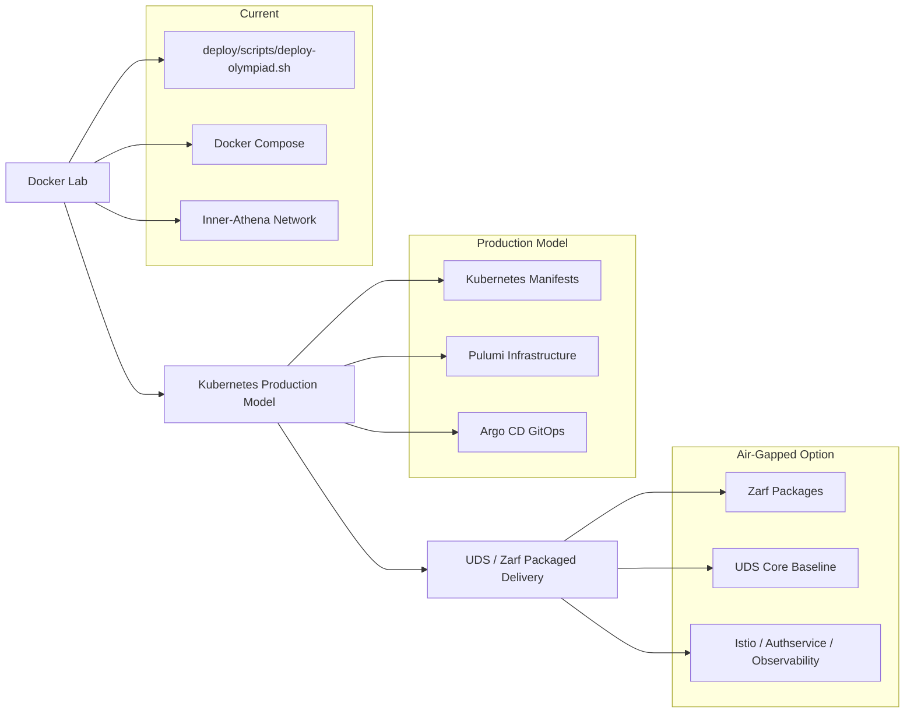

# Underground Nexus Component Architecture

This document maps the current Underground Nexus components to a refined target architecture. The goal is not to discard the current Docker lab, but to make each component clearer, safer, and easier to move into Kubernetes, GitOps, and eventually UDS/Zarf packaging.

## 1. Deployment Progression

Underground Nexus can support multiple deployment methods during the transition.

| Layer | Purpose | Status |
| --- | --- | --- |
| Docker lab | Fast local experimentation and current working deployment | Current |
| Kubernetes production model | Portable workload definitions and production-style operations | Proposed |
| Pulumi | Infrastructure provisioning | Proposed |
| Argo CD | GitOps reconciliation | Proposed |
| UDS / Zarf | Air-gapped delivery and hardened platform baseline | Proposed option |

## 2. Current Component Map

| Current component | Current role | Refined target role |
| --- | --- | --- |
| `deploy/scripts/deploy-olympiad.sh` | Orchestrates the Docker lab and bootstraps k3d | Keep for lab profile; later split into smaller profiles or replace with Compose/Kubernetes manifests |
| Docker Compose | Starts selected lab services such as Pi-hole and NGINX proxy | Keep for local lab validation |
| `Inner-Athena` Docker network | Shared lab network for containers | Map to Kubernetes namespaces, services, and network policies |
| Pi-hole | Lab DNS filtering and DNS control | Lab-only DNS filter; production Kubernetes DNS is handled by cluster DNS, while Istio handles service mesh traffic policy |
| NGINX proxy | Lab HTTP routing | Replace with Kubernetes ingress or UDS/Istio gateways in production |
| Nexus Console | Primary Platform UI | Custom React/Vite dashboard serving as the unified launchpad for all Underground Nexus services |
| Portainer | Manual host container UI | Lab-only; relegated to baseline container management, replaced by Nexus Console as primary UI |
| MinIO | Lab object storage for `/nexus-bucket` artifacts | Kubernetes-native MinIO (`StatefulSet` for base, Helm Distributed cluster for prod) |
| Vault dev mode | Development secrets service | Vault HA via Helm chart for prod; `StatefulSet` file backend for test |
| `nexus-webtop-soc` | Legacy SOC desktop with Suricata | Split into dedicated Wazuh SOC services and sensors; legacy webtop client removed |
| `nexus-athena` | Kali red-team container | Custom local build; keep as isolated lab traffic generator |
| `nexus-workbench` | Agentic Workspace | JupyterLab environment serving as the unified analyst client |
| Code server | Development editor | Merged into Agentic Workspace concepts (JupyterLab / VS Code) |
| Docker Swarm | Overlay networking experiment | De-emphasize for future architecture unless a specific lab requires it |
| k3d / KuberNexus | Local Kubernetes sandbox | Keep as local Kubernetes test path before full production deployment |

## 3. Refined Target Components

### SOC Services

The SOC should become a set of purpose-built services instead of a single webtop image.

Target SOC components:

- **Wazuh manager:** Event analysis, rules, API, and agent management.
- **Wazuh indexer:** Security event indexing and search.
- **Wazuh dashboard:** Analyst interface.
- **Wazuh agents:** Host and workload telemetry.
- **Suricata sensor:** Network intrusion detection and `eve.json` event generation.
- **Optional Zeek sensor:** Protocol metadata and richer network context.

Prefer Chainguard images for Wazuh components where available. Suricata should run as a dedicated sensor image, not as software compiled into a desktop container.

### AI Triage

The AI layer should enrich SOC events rather than replace the SOC platform.

Target AI responsibilities:

- Read normalized Wazuh, Suricata, or Vector events.
- Calculate a threat score or false-positive probability.
- Emit structured JSON back into the event pipeline.
- Keep the input and output schema small, documented, and testable.

For tightly coupled Suricata experiments, the AI container can run as a sidecar and read `eve.json` from a memory-backed `emptyDir`. For production-style SOC workflows, it should consume normalized events from the SIEM or log pipeline.

### Athena

`nexus-athena` should remain the controlled red-team and security testing environment.

Refinement goals:

- Run only in isolated lab networks.
- Avoid host Docker socket mounts by default.
- Label generated traffic by lab scenario.
- Define required Linux capabilities for packet capture or attack simulation.
- Keep offensive tooling separate from workbench and SOC services.

### Workbench

`nexus-workbench` should remain the analyst and administration desktop.

Refinement goals:

- Provide browser access to Wazuh, Grafana, documentation, and runbooks using JupyterLab.
- Keep Terraform or Pulumi tooling here by default.
- Treat QEMU/KVM/libvirt as an optional privileged profile.
- Avoid host Docker socket mounts in the default profile, running as unprivileged `nonroot` (UID `65532`) on a secure Chainguard base.
- Keep red-team tooling in Athena instead of the workbench.

## 4. Event and Logging Architecture

The architecture should separate platform logs from security events.

| Event type | Primary destination | Notes |
| --- | --- | --- |
| Platform and workload logs | Vector, Loki, Grafana | Useful for operations, troubleshooting, and cluster observability |
| Security alerts and telemetry | Wazuh manager, indexer, dashboard | Primary SOC investigation path |
| Network sensor events | Suricata to Wazuh, Vector, or both | Needs an explicit routing decision |
| AI triage output | Wazuh or log pipeline | Should include source event ID, model version, score, and reason fields |

Recommended default: Wazuh should be the primary security event store, while Loki should be reserved for platform and workload logs. Vector can still collect and route logs, but security investigation should start in Wazuh.

## 5. Network and Traffic Capture

Suricata traffic capture is a core design decision.

| Environment | Capture question |
| --- | --- |
| Docker lab | Should Suricata attach to `Inner-Athena`, host networking, or a mirrored traffic path? |
| Kubernetes | Should Suricata run as a DaemonSet, sidecar, gateway sensor, or dedicated capture pod? |
| UDS / Istio | How should traffic be observed when pod-to-pod traffic is protected by mTLS? |

Possible approaches:

- Gateway-level inspection.
- CNI or eBPF-based capture.
- Host-network capture.
- Selective plaintext test flows for lab scenarios.
- Telemetry-based detection from Wazuh, Envoy, or platform logs.

This decision should be made before treating Suricata as a production detection source in the service mesh.

## 6. Infrastructure Services

Some current services are useful lab components but need clearer production roles.

| Service | Lab role | Production question |
| --- | --- | --- |
| Pi-hole | DNS filtering and lab DNS | Keep as lab-only; do not treat Istio as a direct Pi-hole replacement |
| MinIO | Local object storage for artifacts and datasets | Migrated to Kubernetes-native StatefulSet (base) and Distributed Helm HA (prod) |
| Vault | Dev secrets | Migrated to official HashiCorp Vault Helm chart (HA/Raft) for prod |
| Nexus Console | Primary Platform UI | Custom React app serving as the launchpad for all Underground Nexus services |
| Portainer | Manual container UI | Relegated to baseline host management only |
| Code server | Developer editor | Merge into workbench or keep as separate development service? |

### Secrets Management

Vault is the best fit for Underground Nexus if the broader secure software factory is loosely based on FRSCA. FRSCA uses Vault as part of the secure build pipeline model, alongside Kubernetes, Tekton, Tekton Chains, Sigstore, SPIFFE/SPIRE, policy controls, and signed provenance.

Recommended Vault roles:

- **Local lab (`base` / `test`):** Run Vault dev mode or lightweight `StatefulSet` file backend for local integration testing.
- **Production (`prod`):** Run Vault HA via the official HashiCorp Helm chart with Integrated Storage (Raft) and auto-unseal backed by a KMS or equivalent trusted key source.
- **Build factory:** Store signing material, short-lived credentials, registry tokens, and pipeline secrets.
- **Runtime platform:** Store SOC, Wazuh, MinIO, database, API, and service credentials.
- **Deployment:** Feed Kubernetes secrets through an explicit sync or injection pattern rather than committing secrets to Git.

Secrets should be separated by trust boundary:

| Secret class | Examples | Recommended owner |
| --- | --- | --- |
| Build and signing secrets | Cosign keys, registry credentials, attestation signing material | Secure software factory / Vault |
| Runtime application secrets | Wazuh credentials, MinIO credentials, API tokens | Platform secret manager / Vault |
| Identity and SSO config | OIDC client secrets | Identity platform plus Vault-backed storage |
| Lab-only secrets | Temporary tokens, demo passwords | Local Vault dev mode or disposable `.env` files |

For a production-like path, prefer short-lived or identity-bound credentials over long-lived static secrets. GitHub OIDC, SPIFFE/SPIRE workload identity, Vault dynamic secrets, and keyless Sigstore/Cosign flows all fit this direction.

### MinIO Use Cases

MinIO is useful for Underground Nexus when the system needs S3-compatible object storage that is separate from live application state.

Good local lab use cases:

- Store PCAP files from Wireshark, Suricata, Zeek, or Athena exercises.
- Store exported Wazuh alerts, Suricata `eve.json`, and AI training datasets.
- Store generated SBOMs, attestations, signed image metadata, and scan reports.
- Share files between Athena, Workbench, SOC tooling, and code-server through a controlled bucket interface instead of broad host mounts.
- Practice S3-compatible workflows without depending on AWS.

Good production or production-like use cases:

- Store immutable lab evidence and incident-response artifacts.
- Store model training datasets and evaluation outputs for AI triage.
- Store Velero backup targets if the deployment needs an in-cluster or self-hosted S3-compatible endpoint.
- Store pipeline artifacts, release bundles, SBOM archives, and Zarf package artifacts.

MinIO should not be the primary SOC event database. Wazuh indexer should handle security investigation data, while Loki should handle platform logs. MinIO can archive selected exports from those systems when long-term object storage is useful.

## 7. UDS Core Baseline

UDS should be treated as a hardened delivery and platform baseline, not as the secrets manager for the architecture.

Expected UDS Core capabilities:

- **Authservice:** SSO flows for mission applications.
- **Istio:** Service mesh networking.
- **Grafana and Prometheus:** Observability and metrics.
- **Loki and Vector:** Log storage and log aggregation.
- **Tetragon:** Runtime security via eBPF.
- **Velero:** Backup and recovery.

Secrets remain a separate design decision. Vault HA, Kubernetes secrets with external secret integration, or another secret manager should be selected explicitly.

## 8. Planning Milestones

### Decision Register

| Decision | Recommended default | Component docs |
| --- | --- | --- |
| SOC platform | Wazuh manager, indexer, dashboard, agents, plus hybrid Suricata/runtime sensor | `nexus-webtop-soc` (headless services) |
| Security event store | Wazuh indexer | `nexus-webtop-soc` (headless services) |
| Platform log store | Loki, with Vector aggregation | Core Nexus |
| Workbench default profile | Unified Agentic Workspace (JupyterLab) | `nexus-workbench` |
| Workbench privileged profile | Explicit opt-in for virtualization or Docker administration | `nexus-workbench` |
| Athena default profile | Isolated red-team lab container without SSH or Docker socket | `nexus-athena` |
| Athena elevated profile | Explicit packet-capture or exploit-lab capabilities | `nexus-athena-elevated` |
| Primary UI | Custom Nexus Console Launchpad | `nexus-console` |
| Secrets manager | Vault HA via Helm (prod); Vault `StatefulSet` (test/dev) | Core Nexus |
| UDS role | Platform baseline and Zarf delivery, not the secrets backend | Core Nexus |
| MinIO role | Kubernetes-native Object storage (StatefulSet / Distributed Helm) | Core Nexus |

### Milestone 1: Clarify Current Lab Profiles

- Split default and privileged runtime assumptions.
- Document which services are required, optional, and experimental.
- Remove host Docker access from default examples where possible.
- Keep Docker lab deployment working.

### Milestone 2: Refine Component Images

- Convert `nexus-webtop-soc` into separate headless SOC services and sensors (legacy webtop client removed).
- Keep `nexus-athena` and `nexus-athena-elevated` focused on isolated red-team lab scenarios.
- Transition analyst workflows exclusively to the unified `nexus-workbench` Agentic Workspace.
- Define image signing, SBOM, and version pinning standards across repos.

### Milestone 3: Add Kubernetes Workload Definitions

- Add manifests or Helm charts for SOC services.
- Add runtime profiles for Athena and Workbench.
- Add storage definitions for Wazuh, MinIO, and any persistent data.
- Add network policies for lab, SOC, and admin zones.

### Milestone 4: Add GitOps and UDS Delivery

- Use Pulumi for infrastructure provisioning where needed.
- Use Argo CD for GitOps reconciliation.
- Package the architecture with Zarf for UDS-based connected or air-gapped delivery.
- Decide which UDS Core services replace or wrap current platform services.
