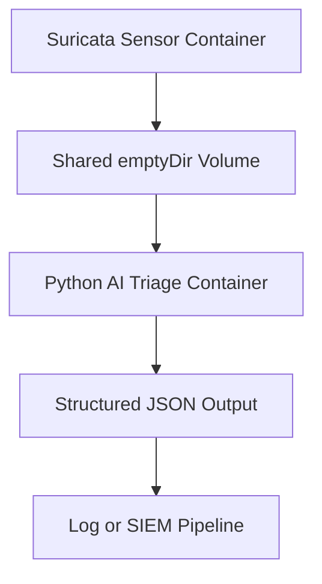
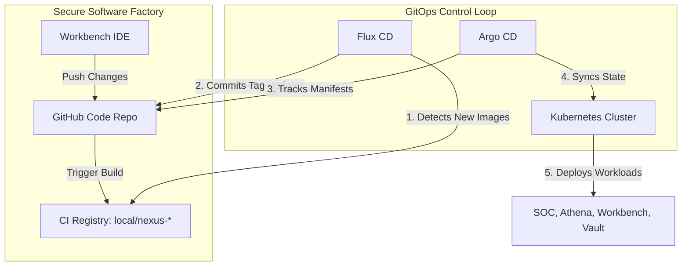

# Enterprise Production Setup: Underground Nexus

This document describes the production architecture direction before introducing UDS as an additional deployment option. The goal is to evolve Underground Nexus from a Docker-focused lab into an enterprise-style Kubernetes platform using Infrastructure as Code, GitOps, and stronger operational controls.

UDS/Zarf can later package and deliver this same architecture for air-gapped or hardened environments. In that model, UDS is a delivery and platform baseline option rather than a contradiction of Kubernetes.

## 1. Production Architectural Shifts

| Lab environment | Production environment | Security+ SY0-701 alignment |
| --- | --- | --- |
| Go script and k3d | Pulumi with Python | **Domains 3.1 and 4.7:** Infrastructure as Code declares cloud infrastructure state, reduces configuration drift, and allows testing of infrastructure logic. |
| Docker Compose | Kubernetes manifests | **Domain 3.4:** Kubernetes provides resilience and self-healing. If a container crashes, Kubernetes can restart it automatically. |
| Local host volumes | Kubernetes volumes, including `emptyDir` where appropriate | **Domain 3.2:** Ephemeral memory-backed volumes can keep selected transient logs off the host disk. Persistent data still needs explicit storage and retention design. |
| Portainer manual UI | Argo CD GitOps | **Domain 1.3:** Production changes are made through reviewed Git commits instead of manual UI clicks. |
| Vault dev mode | Vault HA with auto-unseal | **Domain 1.4:** Vault can run in high availability mode and use a KMS-backed auto-unseal workflow. |

## 2. Secrets and Secure Software Factory Alignment

Vault should remain the primary candidate for secrets management because the broader secure software factory direction is loosely based on FRSCA. In that model, Vault supports build and runtime trust boundaries rather than acting as a generic password bucket.

Recommended responsibilities:

- Store or broker access to signing material for Cosign, attestations, and SBOM workflows.
- Store registry credentials, deployment credentials, and automation tokens.
- Support Kubernetes workloads through secret injection or synchronization.
- Keep build pipeline secrets separate from runtime application secrets.
- Support HA and auto-unseal for production-like deployments.

This keeps the design close to FRSCA-style supply-chain patterns while still allowing GitHub OIDC or keyless signing where appropriate.

## 3. Deployment Options

Underground Nexus can support multiple deployment methods during the transition.

| Option | Role |
| --- | --- |
| Docker Compose / Docker scripts | Current lab deployment path and quick local validation. |
| Kubernetes manifests | Production-style workload definitions and portability layer. |
| Pulumi | Infrastructure provisioning and environment creation. |
| Argo CD | GitOps reconciliation for Kubernetes workloads. |
| UDS / Zarf | Air-gapped delivery, baseline platform services, and packaged deployment option. |

## 4. Kubernetes Sidecar Pattern

Kubernetes introduces the sidecar pattern for tightly coupled containers.

In Kubernetes, the smallest deployable unit is a Pod. A Pod can contain multiple containers that share the same local network namespace and storage volumes.

One proposed experimental pattern is to place a Suricata sensor container and an AI triage container in the same Pod while keeping them as separate logical components:

In this pattern, Suricata writes `eve.json` events to a shared memory-backed `emptyDir`, and the Python AI script reads those events locally. If the Pod is deleted, the shared memory volume disappears with it.

Important caveat: this only controls the lifecycle of the shared handoff volume. Container logs, SIEM events, node logs, crash dumps, and persisted observability data still need separate retention and protection policies.

### 5. DevSecOps Pipeline (Flux CD + Argo CD GitOps)

To automate the production architecture, Underground Nexus utilizes a combined **Flux CD** and **Argo CD** GitOps pipeline:

* **Flux CD (Synchronization & Image Automation)**: Acting as the low-level sync engine, Flux monitors the Git repositories, Helm charts, and image registries. Its *Image Automation Controller* detects newly built images (e.g. `nexus-workbench:latest` or `ai-inference:latest`), automatically commits the updated tags back to Git, and syncs basic infrastructure manifests.
* **Argo CD (Governance & visualization)**: Argo CD acts as the primary deployment orchestrator and dashboard. It pulls the updated manifests from Git, provides rich visual topology maps of application states, manages SSO authentication, and enforces RBAC policy control for the operational team.

### Developer Jumpbox: `nexus-workbench`
* **Role**: A containerized, secure JupyterLab workspace running on a Chainguard Python base, with standard data analysis libraries, `hvac` for secrets integration, Pulumi/Terraform, and Git tooling.
* **Security+ alignment**: **Domain 4.1, Secure Baselines.** Standardizes development environments and eliminates local laptop configuration drift.

### Version Control: GitHub
* **Role**: The source of truth for infrastructure manifests, deployment configurations, model parameters, and policies.
* **Security+ alignment**: **Domain 1.3, Change Management.** Audit trails, pull requests, and cryptographic commit signatures verify authorship.

### Continuous Deployment & Sync (Flux + Argo)
* **Role**: Automated reconcilers keeping the cluster state matching the Git repository.
* **Security+ alignment**: **Domain 4.7, Automation and Orchestration.** No human has direct write access to cluster production APIs; changes are applied by audited, automated service accounts.

---

## 6. Kubernetes Workload DOs and DON'Ts

The following guidelines outline non-negotiable workload security practices for deploying pods in the SOC environment:

### DOs
* **DO use minimal, hardened base images**: Build custom workbench and triage containers using verified secure bases (e.g., `cgr.dev/chainguard/python:latest-dev` for JupyterLab, `python:3.10-slim` for inference APIs) to keep the cluster CVE footprint at zero.
* **DO run workloads as non-root users**: Enforce non-root execution inside pod specifications (e.g. running the JupyterLab workbench under user `65532` and standard Athena pods under user `1000`).
* **DO request minimal Linux capabilities**: Only add specific privileges needed by a container (e.g., `capabilities.add: ["NET_ADMIN", "NET_RAW"]` for packet capture in the elevated `nexus-athena-elevated` pod, or `IPC_LOCK` for Vault memory locking).
* **DO manage secrets centrally via HashiCorp Vault**: Read and write credentials programmatically using Vault APIs (e.g. `hvac` Python client) or Vault agent sidecar injectors. 
* **DO label test namespaces/pods to bypass Zarf webhook**: Add `zarf.dev/agent: skip` to namespace or pod metadata during local development to prevent the Zarf agent from hijacking public image pulls.
* **DO enforce directory permissions for non-root volumes**: Use `securityContext.fsGroup` matching the container user (e.g., `65532` or `1000`) to guarantee that mounted PersistentVolumes are writable by non-root containers.
* **DO disable privilege escalation explicitly**: Always set container-level `securityContext.allowPrivilegeEscalation: false` in all container specifications to block processes from utilizing setuid/setgid binaries to escalate privileges.

### DON'Ts
* **DON'T mount the host Docker socket (`/var/run/docker.sock`) by default**: Standard analyst desktops, database indices, and triage APIs must run with absolute socket isolation. Only mount the docker socket on explicitly approved, elevated testing profiles in isolated namespaces.
* **DON'T run workloads in privileged mode (`privileged: true`) by default**: Always set `privileged: false` and `allowPrivilegeEscalation: false` for all baseline SOC and triage applications.
* **DON'T store plaintext secrets in git**: Credentials, API tokens, and private keys must never be committed to Git repositories. Utilize Vault or sealed secret wrappers.
* **DON'T colocate network sensor binaries (like Suricata) inside the desktop workspace**: Run packet sniffers as sidecars or daemonsets, sharing alerts through local memory volumes (`emptyDir`) or structured logging pipelines to isolate offensive/defensive domains.
* **DON'T allow unrestricted cross-namespace communication**: Restrict network traffic using `NetworkPolicies` so that test attacker workloads (Athena) cannot access admin panels or indices directly.

---

## 7. Relationship to UDS

UDS does not replace the Kubernetes architecture. It packages and hardens it.

In a UDS-based deployment:

- Zarf packages the application and dependencies for connected or air-gapped delivery.
  - **Local/Development Workloads and the Zarf Webhook**: When deploying external, non-packaged services to a cluster running Zarf, the Zarf Mutating Admission Webhook will automatically intercept Pod creation and rewrite image URLs to point to the local Zarf registry. To allow public image pulls or bypass this mutator, the namespace or pod must be labeled with `zarf.dev/agent: skip` or `zarf.dev/agent: ignore`.
- UDS Core can provide baseline services such as Keycloak for identity and SSO, Authservice for SSO flows, Istio for service mesh networking, Grafana and Prometheus for observability, Loki and Vector for logging, Falco for runtime security, and Velero for backup.
- The same Kubernetes workload boundaries still matter: SOC, Athena, Workbench, and AI triage should remain separate logical components, even when an experiment colocates tightly coupled containers in one Pod.
- Secrets remain a separate design decision. Vault HA or another secret manager should be chosen explicitly instead of treating UDS itself as the secrets backend.

---

## 8. Open Planning Questions

- Which services remain in the Docker lab profile and which move first to Kubernetes?
- Does Pulumi provision only infrastructure, or does it also install platform services?
- Does Argo CD remain part of the UDS deployment, or does Zarf handle initial delivery with GitOps added afterward?
- Where does Suricata capture traffic in Docker, Kubernetes, and Istio mTLS environments?
- Is Wazuh the primary security event store, with Loki used for platform logs, or should Vector fan out events to both?
- Which secrets move from development defaults into Vault HA or another selected secrets manager?
