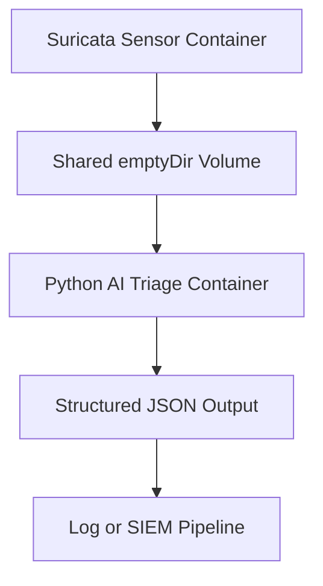
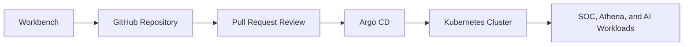

# Enterprise Production Setup: Underground Nexus

This document describes the production architecture direction before introducing UDS as an additional deployment option. The goal is to evolve Underground Nexus from a Docker-focused lab into an enterprise-style Kubernetes platform using Infrastructure as Code, GitOps, and stronger operational controls.

UDS/Zarf can later package and deliver this same architecture for air-gapped or hardened environments. In that model, UDS is a delivery and platform baseline option rather than a contradiction of Kubernetes.

## 1. Production Architectural Shifts

| Lab environment | Production environment | Security+ SY0-701 alignment |
| --- | --- | --- |
| Go script and k3d | Pulumi with Python | **Domains 3.1 and 4.7:** Infrastructure as Code declares cloud infrastructure state, reduces configuration drift, and allows testing of infrastructure logic. |
| Docker Compose | Kubernetes manifests | **Domain 3.4:** Kubernetes provides resilience and self-healing. If a container crashes, Kubernetes can restart it automatically. |
| Local host volumes | Kubernetes volumes, including `emptyDir` where appropriate | **Domain 3.2:** Ephemeral memory-backed volumes can keep selected transient logs off the host disk. Persistent data still needs explicit storage and retention design. |
| Portainer manual UI | Argo CD GitOps | **Domain 1.3:** Production changes are made through reviewed Git commits instead of manual UI clicks. |
| Vault dev mode | Vault HA with auto-unseal | **Domain 1.4:** Vault can run in high availability mode and use a KMS-backed auto-unseal workflow. |

## 2. Secrets and Secure Software Factory Alignment

Vault should remain the primary candidate for secrets management because the broader secure software factory direction is loosely based on FRSCA. In that model, Vault supports build and runtime trust boundaries rather than acting as a generic password bucket.

Recommended responsibilities:

- Store or broker access to signing material for Cosign, attestations, and SBOM workflows.
- Store registry credentials, deployment credentials, and automation tokens.
- Support Kubernetes workloads through secret injection or synchronization.
- Keep build pipeline secrets separate from runtime application secrets.
- Support HA and auto-unseal for production-like deployments.

This keeps the design close to FRSCA-style supply-chain patterns while still allowing GitHub OIDC or keyless signing where appropriate.

## 3. Deployment Options

Underground Nexus can support multiple deployment methods during the transition.

| Option | Role |
| --- | --- |
| Docker Compose / Docker scripts | Current lab deployment path and quick local validation. |
| Kubernetes manifests | Production-style workload definitions and portability layer. |
| Pulumi | Infrastructure provisioning and environment creation. |
| Argo CD | GitOps reconciliation for Kubernetes workloads. |
| UDS / Zarf | Air-gapped delivery, baseline platform services, and packaged deployment option. |

## 4. Kubernetes Sidecar Pattern

Kubernetes introduces the sidecar pattern for tightly coupled containers.

In Kubernetes, the smallest deployable unit is a Pod. A Pod can contain multiple containers that share the same local network namespace and storage volumes.

One proposed experimental pattern is to place a Suricata sensor container and an AI triage container in the same Pod while keeping them as separate logical components:

In this pattern, Suricata writes `eve.json` events to a shared memory-backed `emptyDir`, and the Python AI script reads those events locally. If the Pod is deleted, the shared memory volume disappears with it.

Important caveat: this only controls the lifecycle of the shared handoff volume. Container logs, SIEM events, node logs, crash dumps, and persisted observability data still need separate retention and protection policies.

## 5. DevSecOps Pipeline

To automate the production architecture, Underground Nexus can use a GitOps workflow.

### Developer Jumpbox: `nexus-webtop-workbench`

**Role:** A containerized, ephemeral workspace with the MATE desktop environment, Pulumi or Terraform, and optional Git tooling.

**Security+ alignment:** **Domain 4.1, Secure Baselines.** A standardized workbench reduces environment drift compared with unmanaged personal laptops.

### Version Control: GitHub

**Role:** The source of truth for Pulumi programs, Kubernetes manifests, Zarf packages, runbooks, and architecture documents.

**Security+ alignment:** **Domain 1.3, Change Management.** Git history, pull requests, and signed commits provide auditability and review.

### Continuous Deployment: Argo CD

**Role:** A Kubernetes controller that monitors the Git repository and reconciles declared manifests into the cluster.

**Security+ alignment:** **Domain 4.7, Automation and Orchestration.** Humans submit reviewed changes to Git; automated service accounts apply approved infrastructure changes.

### Target Workloads

**Role:** The deployed workloads that implement the Underground Nexus lab and SOC environment.

Target workload groups:

- **SOC services:** Wazuh manager, indexer, dashboard, agents, Suricata sensor, and optional Zeek.
- **AI triage:** Python/NumPy enrichment service that reads normalized events and emits scores.
- **Athena:** Controlled red-team and security testing workload.
- **Workbench:** Analyst and administration desktop.

## 6. Relationship to UDS

UDS does not replace the Kubernetes architecture. It packages and hardens it.

In a UDS-based deployment:

- Zarf packages the application and dependencies for connected or air-gapped delivery.
- UDS Core can provide baseline services such as Keycloak for identity and SSO, Authservice for SSO flows, Istio for service mesh networking, Grafana and Prometheus for observability, Loki and Vector for logging, Falco for runtime security, and Velero for backup.
- The same Kubernetes workload boundaries still matter: SOC, Athena, Workbench, and AI triage should remain separate logical components, even when an experiment colocates tightly coupled containers in one Pod.
- Secrets remain a separate design decision. Vault HA or another secret manager should be chosen explicitly instead of treating UDS itself as the secrets backend.

## 7. Open Planning Questions

- Which services remain in the Docker lab profile and which move first to Kubernetes?
- Does Pulumi provision only infrastructure, or does it also install platform services?
- Does Argo CD remain part of the UDS deployment, or does Zarf handle initial delivery with GitOps added afterward?
- Where does Suricata capture traffic in Docker, Kubernetes, and Istio mTLS environments?
- Is Wazuh the primary security event store, with Loki used for platform logs, or should Vector fan out events to both?
- Which secrets move from development defaults into Vault HA or another selected secret manager?
