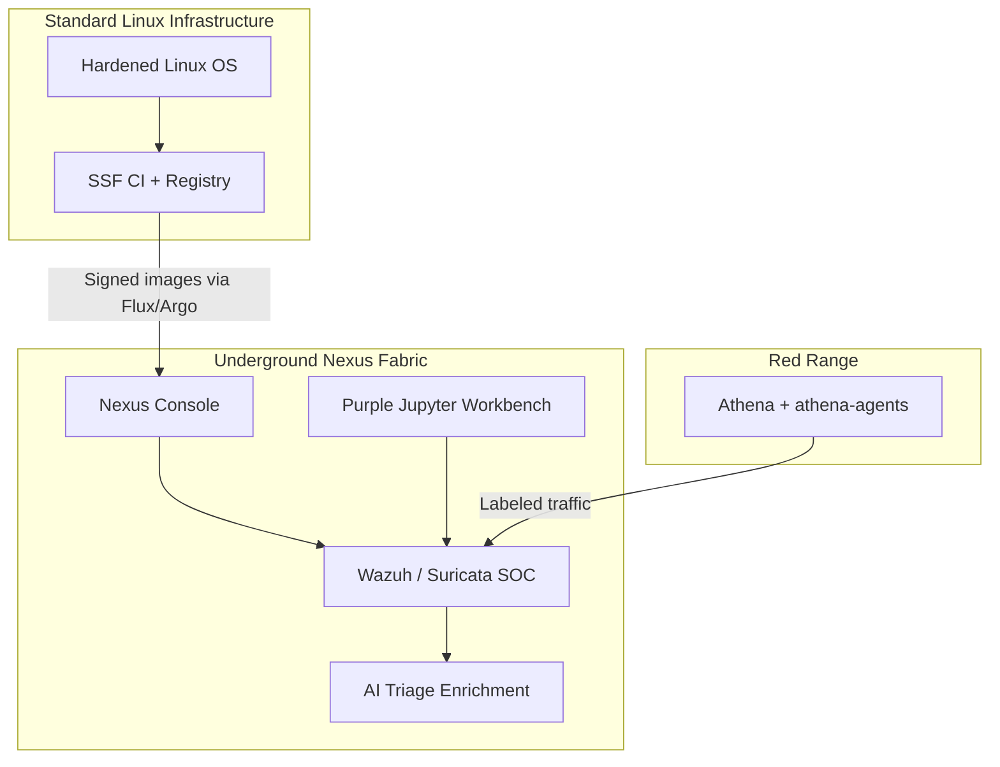
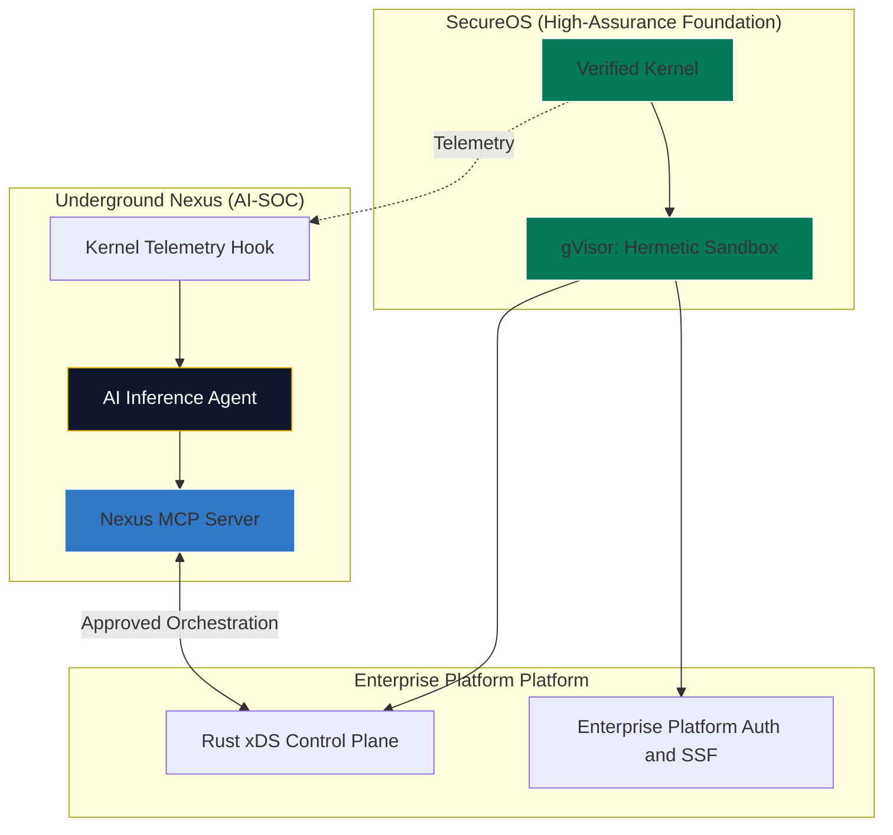

# Underground Nexus: Phased Implementation Roadmap

Building a from-scratch, high-assurance operating system such as SecureOS is a multi-year engineering effort. To keep Underground Nexus useful during that lifecycle, the Enterprise Platform platform and Nexus security workloads should evolve through phases.

This roadmap connects the current Linux-based bootstrap environment, the practical Kubernetes/UDS architecture, and the long-horizon AI-native Enterprise Platform target state.

## Phase 1: Bootstrap

**Status:** Current state

**Primary goal:** Operate the **fabric + factory + range** spine on hardened Linux /
Docker / Kubernetes: headless SOC (Wazuh + Suricata), Nexus Console, Jupyter purple
workspace, isolated Athena + `athena-agents`, GitOps (Flux + Argo), and
Vault-backed secrets via `nexus-hashistack`.

SecureOS / Enterprise Platform hosting of Nexus workloads is **out of scope** for
Phase 1 (see Phase 2–3 and docs `04` / `09`). Nexus may *observe* factory and lab
build activity; it is not waiting on SecureOS to be useful.

### Architecture

| Area | Phase 1 approach |
| --- | --- |
| Host OS | Hardened standard Linux distribution |
| Execution | Docker Compose lab + Kubernetes (e.g. Rancher Desktop / k3d) |
| GitOps | Flux image automation + Argo CD app sync (`deploy/gitops/`, ADR 0003) |
| Primary UI | `nexus-console` |
| SOC platform | Wazuh + Suricata (hybrid sensor, ADR 0007); thin spine may omit Suricata for RAM |
| Workbench | `nexus-workbench` (JupyterLab) purple workspace |
| Athena | `nexus-athena` with standard / packet-lab / exploit-lab / agent profiles |
| LLM Agents | `athena-agents` OPAR with safety controls and skill persistence (Phase 1 capable) |
| Agent Memory | Git-based skills (`docs/skills/`) + object-store sync |
| Terminal Console | `nexus-tui` (optional) |
| Secrets | Vault via `nexus-hashistack` (ADR 0008) |
| Objects | MinIO lab; R2 + D1 production-like (ADR 0005) |
| Supply chain | `nebucloud/ssf` + kiln / Cosign; publish workflow (ADR 0004) |
| Portainer | Lab-only visibility — not production GitOps (ADR 0001) |

### Underground Nexus Role

Underground Nexus exercises detection and purple evaluation against labeled red
traffic, and guards the near-term software factory loop (signed images → Flux →
Argo). Platform UI workloads under development are monitored like any other app;
they are not the destination for Nexus threat findings.

### Security+ Alignment

- **Domain 2.3:** Supply chain vulnerabilities
- **Domain 4.1:** Secure baselines
- **Domain 4.2:** Security monitoring

### Visual Plot

### Exit Criteria

- [x] Current Docker lab profiles are documented.
- [x] SOC baseline exists with Wazuh and Suricata paths (Suricata may be omitted from thin GitOps for resources).
- [x] Primary UI is Nexus Console (webtops retired as product — ADR 0006).
- [x] Workbench and Athena have standard and elevated runtime profiles.
- [x] LLM agent workflow operational (athena-agents OPAR with safety controls).
- [x] Vault ownership decided: consume `nexus-hashistack` / shared Vault (ADR 0008).
- [ ] SBOM, signing, vulnerability scanning, and attestation workflows fully documented and routine in CI.
- [ ] Suricata on by default in a documented full-SOC overlay (not only `overlays/test`).

## Phase 2: Hermetic Migration

**Status:** Beta target

**Primary goal:** Move Enterprise Platform control-plane workloads and selected Nexus workloads from standard Linux assumptions toward SecureOS and gVisor.

This phase begins once SecureOS has stable enough networking, process management, and observability hooks to support real workloads or realistic subsystem tests.

### Architecture

| Area | Phase 2 approach |
| --- | --- |
| Host OS | SecureOS for selected workloads; Linux remains available for fallback and comparison |
| Execution | gVisor becomes the preferred hermetic runtime for selected services |
| Telemetry | Early SecureOS tracing, eBPF-like hooks, or equivalent kernel telemetry |
| SOC platform | Wazuh and hybrid Suricata/runtime telemetry remain the known-good detection baseline while AI-native telemetry is validated |
| AI triage | Starts consuming SecureOS telemetry alongside existing SOC events |
| Workbench | Moves toward secured JupyterLab or VS Code Server if Enterprise Platform Auth is ready |
| Athena | Begins moving from Kali container workflows to controlled adversary automation via athena-agents OPAR loop (already operational in Phase 1) |

### Underground Nexus Role

The AI-SOC starts monitoring early SecureOS telemetry while still relying on Wazuh and Suricata network/protocol telemetry for comparison. The goal is to evolve Suricata into the network side of a hybrid sensor rather than discard it.

### Security+ Alignment

- **Domain 3.1:** Security architecture models
- **Domain 3.2:** Infrastructure considerations
- **Domain 4.7:** Automation and orchestration

### Exit Criteria

- gVisor can execute at least one non-trivial Nexus workload repeatably.
- SecureOS telemetry can be exported in a documented schema.
- AI triage can compare standard SOC events against SecureOS telemetry.
- Workloads have signed artifacts and provenance from the secure software factory.
- Fallback to the Linux/Kubernetes baseline remains available.

## Phase 3: High-Assurance Sovereign Cloud

**Status:** Target state

**Primary goal:** Merge formal verification, hermetic execution, and AI-native security operations.

This is the long-horizon target where SecureOS is mature enough to host Enterprise Platform platform services and Underground Nexus security workloads.

### Architecture

| Area | Phase 3 approach |
| --- | --- |
| Host OS | Mature SecureOS |
| Verification | Kernel verification with tools such as Frama-C; userspace verification with tools such as Creusot where practical |
| Execution | All core workloads run as hermetically sealed gVisor workloads |
| Telemetry | Kernel-native telemetry feeds the AI-SOC inference engine |
| Interface | Nexus MCP server exposes approved tools and context |
| Response | Rust xDS control plane coordinates approved response actions; data-plane APIs perform the runtime changes |

### Visual Plot

### Underground Nexus Role

Underground Nexus becomes the AI-native security subsystem for Enterprise Platform. The AI-SOC consumes kernel-native telemetry, the MCP server exposes approved response tools, and the workbench supports purple-team model refinement.

### Security+ Alignment

- **Domain 3.1:** Security architecture models
- **Domain 3.4:** Resilience and recovery
- **Domain 4.8:** Incident response

### Exit Criteria

- SecureOS can host the Enterprise Platform control plane and selected Nexus workloads.
- gVisor provides stable hermetic execution for production services.
- Kernel telemetry is documented, signed, and resistant to tampering.
- MCP response actions require identity, authorization, and audit trails.
- Model versions, telemetry schemas, training datasets, and inference outputs are signed and traceable.

## Roadmap Guardrails

- Keep Suricata as the network/protocol side of the hybrid sensor while AI-native runtime telemetry matures.
- Keep lab, production, and future Enterprise Platform tracks explicitly separate.
- Treat autonomous response as a later capability; start with human-approved actions.
- Sign and attest model artifacts with the same care as container images.
- Keep Athena-style adversarial generation isolated from production systems.
