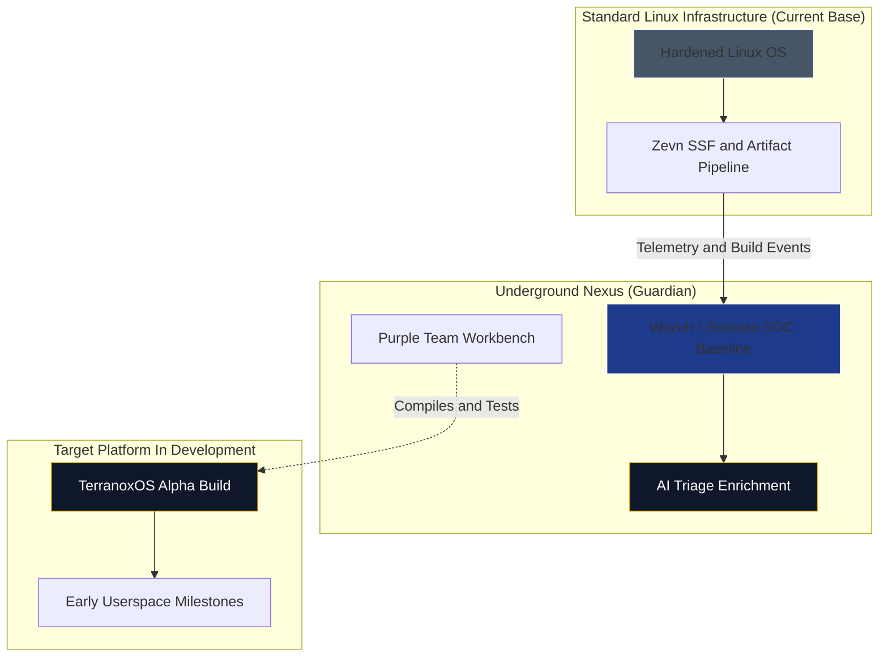
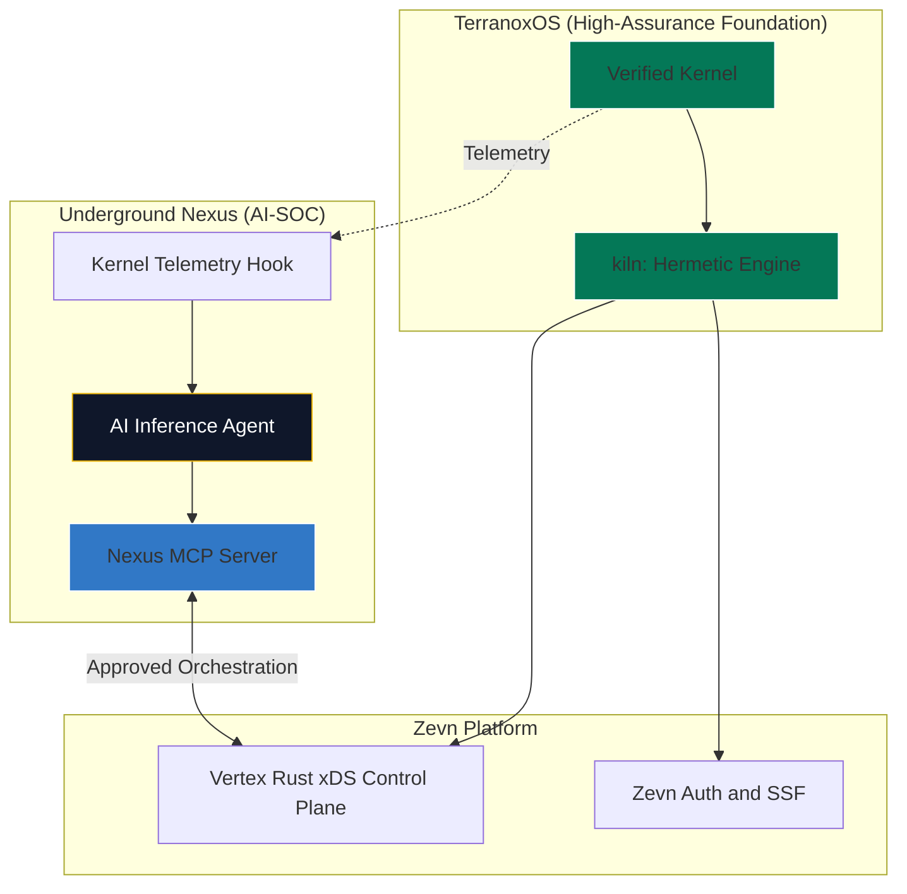

# Underground Nexus: Phased Implementation Roadmap

Building a from-scratch, high-assurance operating system such as TerranoxOS is a multi-year engineering effort. To keep Underground Nexus useful during that lifecycle, the Zevn platform and Nexus security workloads should evolve through phases.

This roadmap connects the current Linux-based bootstrap environment, the practical Kubernetes/UDS architecture, and the long-horizon AI-native Zevn target state.

## Phase 1: Bootstrap

**Status:** Current state

**Primary goal:** Secure the software supply chain and protect ongoing development of Zevn, TerranoxOS, Zeld UI, and the secure software factory.

TerranoxOS is still in early userspace development. It may render early UI elements such as a top bar or terminal, but it is not ready to host the Zevn control plane or Underground Nexus AI-SOC workloads.

### Architecture

| Area | Phase 1 approach |
| --- | --- |
| Host OS | Hardened standard Linux distribution, such as Alpine or Ubuntu |
| Execution | Docker containers, early `kiln` builds on Linux namespaces/cgroups, or both |
| SOC platform | Phase 1 target baseline being built: Wazuh, Suricata, optional Zeek, Vector, Loki, Grafana |
| Workbench | Current `nexus-webtop-workbench` refined into standard and privileged profiles |
| Athena | Current `nexus-athena` refined into isolated lab profiles |
| Secrets | Vault dev mode for local learning; begin designing Vault HA for production-like paths |
| Supply chain | Cosign, SBOMs, attestations, vulnerability scans, registry controls |

### Underground Nexus Role

Underground Nexus acts as the guardian of the factory. It monitors build servers, artifact pipelines, package outputs, approved test environments, and developer workflow anomalies. Zeld UI may be one workload under development, but it is not the destination for Nexus threat findings.

### Security+ Alignment

- **Domain 2.3:** Supply chain vulnerabilities
- **Domain 4.1:** Secure baselines
- **Domain 4.2:** Security monitoring

### Visual Plot

### Exit Criteria

- Current Docker lab profiles are documented.
- SOC baseline exists with Wazuh and Suricata separated from the webtop.
- Workbench and Athena have standard and elevated runtime profiles.
- SBOM, signing, vulnerability scanning, and attestation workflows are documented.
- Vault production direction is selected, even if only dev mode exists locally.

## Phase 2: Hermetic Migration

**Status:** Beta target

**Primary goal:** Move Zevn control-plane workloads and selected Nexus workloads from standard Linux assumptions toward TerranoxOS and `kiln`.

This phase begins once TerranoxOS has stable enough networking, process management, and observability hooks to support real workloads or realistic subsystem tests.

### Architecture

| Area | Phase 2 approach |
| --- | --- |
| Host OS | TerranoxOS for selected workloads; Linux remains available for fallback and comparison |
| Execution | `kiln` becomes the preferred hermetic runtime for selected services |
| Telemetry | Early TerranoxOS tracing, eBPF-like hooks, or equivalent kernel telemetry |
| SOC platform | Wazuh and hybrid Suricata/runtime telemetry remain the known-good detection baseline while AI-native telemetry is validated |
| AI triage | Starts consuming TerranoxOS telemetry alongside existing SOC events |
| Workbench | Moves toward secured JupyterLab or VS Code Server if Zevn Auth is ready |
| Athena | Begins moving from Kali container workflows to controlled adversary automation |

### Underground Nexus Role

The AI-SOC starts monitoring early TerranoxOS telemetry while still relying on Wazuh and Suricata network/protocol telemetry for comparison. The goal is to evolve Suricata into the network side of a hybrid sensor rather than discard it.

### Security+ Alignment

- **Domain 3.1:** Security architecture models
- **Domain 3.2:** Infrastructure considerations
- **Domain 4.7:** Automation and orchestration

### Exit Criteria

- `kiln` can execute at least one non-trivial Nexus workload repeatably.
- TerranoxOS telemetry can be exported in a documented schema.
- AI triage can compare standard SOC events against TerranoxOS telemetry.
- Workloads have signed artifacts and provenance from the secure software factory.
- Fallback to the Linux/Kubernetes baseline remains available.

## Phase 3: High-Assurance Sovereign Cloud

**Status:** Target state

**Primary goal:** Merge formal verification, hermetic execution, and AI-native security operations.

This is the long-horizon target where TerranoxOS is mature enough to host Zevn platform services and Underground Nexus security workloads.

### Architecture

| Area | Phase 3 approach |
| --- | --- |
| Host OS | Mature TerranoxOS |
| Verification | Kernel verification with tools such as Frama-C; userspace verification with tools such as Creusot where practical |
| Execution | All core workloads run as hermetically sealed `kiln` workloads |
| Telemetry | Kernel-native telemetry feeds the AI-SOC inference engine |
| Interface | Nexus MCP server exposes approved tools and context |
| Response | Vertex Rust xDS control plane coordinates approved response actions; data-plane APIs perform the runtime changes |

### Visual Plot

### Underground Nexus Role

Underground Nexus becomes the AI-native security subsystem for Zevn. The AI-SOC consumes kernel-native telemetry, the MCP server exposes approved response tools, and the workbench supports purple-team model refinement.

### Security+ Alignment

- **Domain 3.1:** Security architecture models
- **Domain 3.4:** Resilience and recovery
- **Domain 4.8:** Incident response

### Exit Criteria

- TerranoxOS can host the Zevn control plane and selected Nexus workloads.
- `kiln` provides stable hermetic execution for production services.
- Kernel telemetry is documented, signed, and resistant to tampering.
- MCP response actions require identity, authorization, and audit trails.
- Model versions, telemetry schemas, training datasets, and inference outputs are signed and traceable.

## Roadmap Guardrails

- Keep Suricata as the network/protocol side of the hybrid sensor while AI-native runtime telemetry matures.
- Keep lab, production, and future Zevn tracks explicitly separate.
- Treat autonomous response as a later capability; start with human-approved actions.
- Sign and attest model artifacts with the same care as container images.
- Keep Athena-style adversarial generation isolated from production systems.
