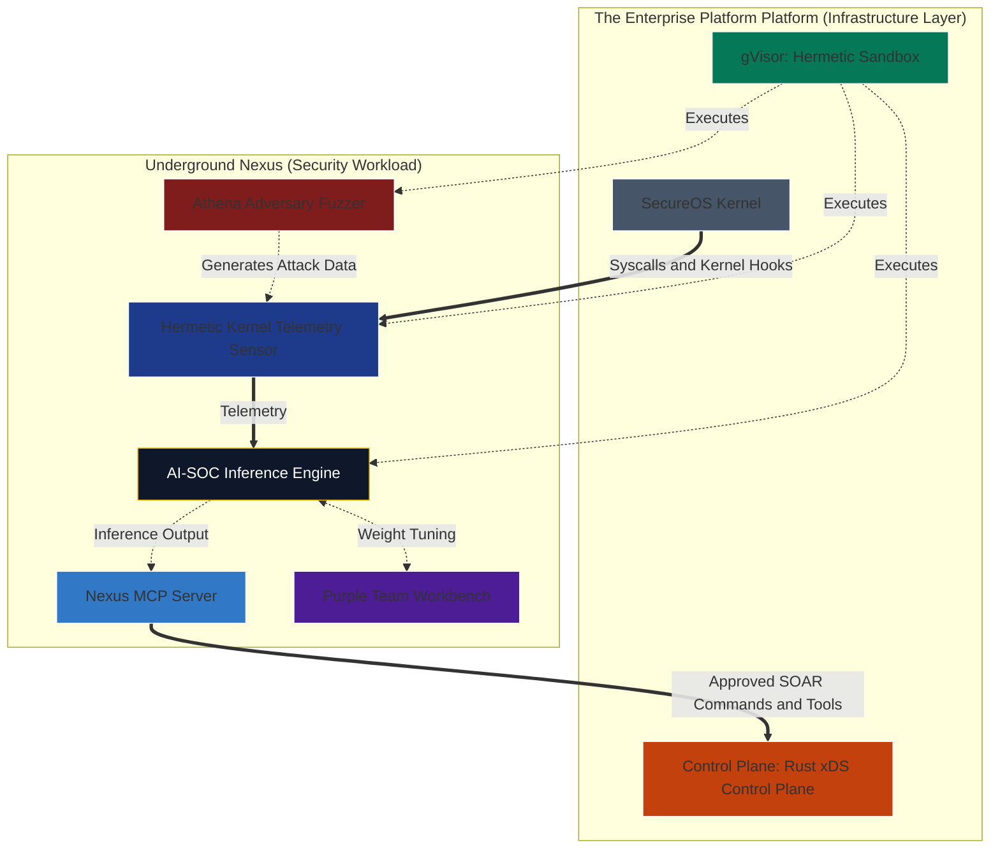

# Underground Nexus: AI-Native Component Proposal

This document describes a long-horizon Underground Nexus architecture in which the Enterprise Platform platform provides compute, network, identity, and execution boundaries. It should be treated as a future concept, not as the current Docker, Kubernetes, UDS, or Wazuh implementation plan.

In this model, Underground Nexus becomes an AI-driven security subsystem made of hermetic workloads executed in a gVisor sandbox on the SecureOS kernel.

## 1. Core Components

The proposed Nexus subsystem is composed of five specialized micro-workloads.

### A. Sensor: Hermetic Kernel Telemetry Monitor

**Replaces:** `nexus-webtop-soc` as a heavy Suricata desktop.

**What it is:** A lightweight, headless data collector. Instead of passively sniffing virtual networks only, it uses SecureOS-native tracing or eBPF-like kernel hooks once those interfaces exist.

**Function:** Streams system-call and network telemetry to the AI engine through zero-copy memory access or gRPC.

### B. Brain: AI-SOC Inference Engine

**Replaces:** Monolithic Python or shell-based triage scripts.

**What it is:** A high-speed tensor-processing API, such as FastAPI with ONNX Runtime or a Rust service using `tch-rs`, executed inside a gVisor sandbox.

**Function:** Ingests kernel/runtime telemetry in real time and applies custom neural-network weights trained from scratch to detect anomalies or malicious behavior in approved workloads. Claims about zero-day detection require evaluation evidence before they are treated as production capabilities.

### C. Interface: Nexus MCP Server

**Replaces:** Manual SOC dashboards and manual incident-response handoffs.

**What it is:** A TypeScript Model Context Protocol server.

**Function:** Translates AI-SOC findings into actionable tools and context. It allows Enterprise Platform Auth to verify security commands and exposes threat data to approved Nexus/SOC clients. Platform UI is a separate AI-enabled visual website and should not be treated as the destination for threat findings.

### D. Command Center: Purple Team Workbench

**Replaces:** `nexus-workbench` (originally a MATE desktop GUI, now updated to JupyterLab in Phase 1) with Terraform and GitHub tooling.

**What it is:** A secured JupyterLab or VS Code Server environment authenticated through Enterprise Platform Auth.

**Function:** Allows data scientists and security engineers to analyze predictions, tune neural-network weights, and push updated models through the Enterprise Platform secure software factory pipeline.

### E. Sparring Partner: Athena Adversary Fuzzer

**Replaces:** `nexus-athena` as a Kali Linux desktop.

**What it is:** A headless automated red-team agent.

**Function:** Continuously attacks designated sandbox environments inside a gVisor sandbox, generating the ground-truth malicious data needed to train and evaluate the AI-SOC inference engine.

## 2. Visual Plot: Nexus Subsystem Within Enterprise Platform

## 3. Security+ SY0-701 Value Proposition

If Enterprise Platform owns the OS, networking, execution, and identity layers, Underground Nexus can focus on:

- **Domain 4:** Security Operations
- **Domain 2:** Threats, Vulnerabilities, and Mitigations

The resulting system is a closed-loop AI security workflow:

1. Athena generates controlled adversarial behavior.
2. The sensor captures telemetry.
3. The AI-SOC engine detects suspicious behavior.
4. The MCP server exposes response actions and context.
5. The workbench supports purple-team analysis and model refinement.

## 4. Relationship to the Current Architecture

This proposal is a future architecture track. It does not replace the current near-term refinement plan.

| Current refinement track | AI-native Enterprise Platform track |
| --- | --- |
| Wazuh SOC services | AI-SOC inference engine and MCP server |
| Suricata sensor | Hybrid sensor: Suricata for network/protocol telemetry plus kernel/runtime telemetry |
| `nexus-athena` Kali container | Athena adversary fuzzer |
| `nexus-workbench` (JupyterLab) | Purple team JupyterLab or VS Code Server |
| UDS/Zarf platform option | Enterprise Platform platform execution and identity layer |

Near-term work should continue refining the current components. This proposal can guide future design once the Enterprise Platform platform abstractions are concrete enough to implement.

## 5. Open Questions

- Which Enterprise Platform components already exist, and which are conceptual?
- Is SecureOS an actual kernel target, a hardened OS profile, or a platform codename?
- Is gVisor a container runtime, sandbox runtime, build executor, or all three?
- What is the stable interface between Suricata's network/protocol telemetry and the kernel/runtime telemetry stream?
- Does the MCP server trigger response actions directly, or only expose context to an approved operator?
- How is ground-truth data validated so the adversary fuzzer does not poison model training?
- How are model versions, training data, and inference outputs signed and attested through the secure software factory?
