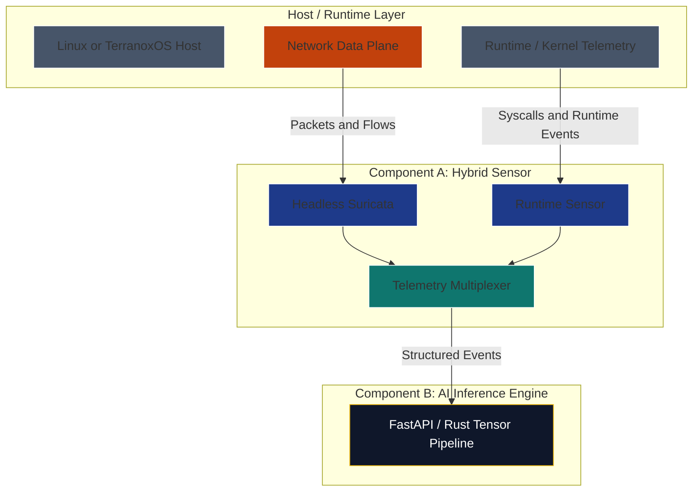

# Component A Deep Dive: Hermetic Sensor

The sensor is the most important data-quality boundary in the AI-native Underground Nexus design. If the AI receives incomplete, malformed, or tampered telemetry, the resulting security inferences will be weak no matter how good the model is.

This document describes the evolution from the current Suricata-based sensor path toward a future hybrid sensor that combines network telemetry with kernel/runtime telemetry.

## 1. Sensor Evolution

The sensor should evolve in phases rather than jumping directly from the current GUI-based SOC image to a fully AI-native kernel telemetry system.

| Phase | Sensor model | Purpose |
| --- | --- | --- |
| Phase 1: Bootstrap | Headless Suricata plus Wazuh telemetry | Establish a practical SOC baseline on Linux, Docker, Kubernetes, or UDS. |
| Phase 2: Hermetic migration | Hybrid Suricata plus early TerranoxOS runtime telemetry | Validate the hybrid stream against known-good SOC signals. |
| Phase 3: High-assurance target | Hybrid Suricata network telemetry plus kernel telemetry inside a gVisor sandbox | Feed AI-native inference from hardened, low-tamper telemetry streams. |

## 2. Dual Telemetry Model

The long-term sensor design should use two telemetry streams.

### Stream 1: Headless Suricata

**Role:** Network monitor.

**What it sees:** Layer 3 through Layer 7 network traffic, protocol metadata, signatures, anomalies, and selected file or flow events.

**Why it remains part of the hybrid sensor:** Suricata is already strong at known malicious packet signatures, protocol anomalies, DNS metadata, TLS metadata, and network intrusion detection. Runtime telemetry complements it; it does not automatically replace protocol-level IDS.

**Near-term implementation:** Run Suricata as a dedicated headless sensor that emits `eve.json` into Wazuh, Vector, or both.

**Future implementation:** Keep Suricata as the network/protocol stream and replace disk-based handoff with a socket, stream, or structured event bus when the runtime is ready.

### Stream 2: Kernel or Runtime Hooks

**Role:** Runtime monitor.

**What it sees:** Process execution, system calls, file access, memory behavior, container activity, and other host-level behavior.

**Why add it:** Suricata cannot see everything happening inside a container or workload. For example, an application spawning a shell, reading sensitive files, or performing unusual process activity may be invisible to network monitoring.

**Near-term implementation:** Use proven Linux runtime sensors such as Falco, Wazuh agents, audit telemetry, or eBPF-based tooling where appropriate.

**Future implementation:** Use TerranoxOS-native tracing or eBPF-like hooks once the kernel and execution model are mature enough.

Important caveat: eBPF is a Linux technology. If TerranoxOS is not Linux-compatible, the future sensor should be described as `eBPF-like`, kernel-native tracing, or a verified telemetry hook rather than literal eBPF.

## 3. Visual Plot: Hybrid Sensor Pipeline

## 4. Data Handoff Options

The sensor should support different handoff models depending on phase.

| Handoff | Best phase | Notes |
| --- | --- | --- |
| `eve.json` file | Phase 1 | Simple, compatible with Suricata and Wazuh, easy to debug. |
| Memory-backed `emptyDir` | Phase 1 and Phase 2 | Good for sidecar experiments where raw logs should be transient. |
| Unix domain socket | Phase 2 | Lower overhead than file polling and avoids open TCP ports. |
| gRPC stream | Phase 2 and Phase 3 | Useful when schemas are stable and services are split. |
| Shared memory or zero-copy path | Phase 3 | Only worth pursuing once the runtime boundary and safety model are clear. |

The near-term goal should be correctness and traceability. Zero-copy performance should come later.

## 5. Event Schema

The AI inference engine should not consume raw sensor output directly forever. A small normalized schema will make training, replay, and debugging easier.

Minimum event fields:

- `event_id`
- `timestamp`
- `sensor_type`
- `source_workload`
- `event_category`
- `severity`
- `raw_reference`
- `features`
- `labels`

Example categories:

- `network.flow`
- `network.alert`
- `dns.query`
- `tls.metadata`
- `process.exec`
- `file.access`
- `container.activity`

## 6. Security+ SY0-701 Alignment

- **Domain 4.4, Security Alerting and Monitoring:** Combines NIDS-style network monitoring with host/runtime telemetry.
- **Domain 3.2, Secure Enterprise Infrastructure:** Supports segmentation, sidecar patterns, local sockets, and reduced exposed ports.
- **Domain 2.4, Indicators of Malicious Activity:** Captures network indicators, process behavior, resource anomalies, and out-of-cycle logging.
- **Domain 4.8, Incident Response:** Produces evidence that can feed triage, containment, and post-incident review.

## 7. Engineering Implementation for Zevn

The future Zevn sensor workload can become a gVisor sandbox once the runtime is ready.

Potential bundle contents:

- Headless Suricata or a Suricata-compatible network sensor.
- Runtime telemetry collector written in Rust or Go.
- Loader for approved kernel/runtime probes.
- Telemetry multiplexer.
- Protobuf or another structured event schema.
- Signed configuration and sensor policy.

## 8. Guardrails

- Treat Suricata as the network/protocol side of the hybrid sensor, not as a temporary component to discard.
- Do not claim telemetry is tamper-proof until the kernel, runtime, and signing model are defined.
- Treat autonomous response as a separate decision from telemetry collection.
- Sign sensor binaries, probe definitions, and event-schema versions.
- Keep raw telemetry replayable for testing and model validation.
