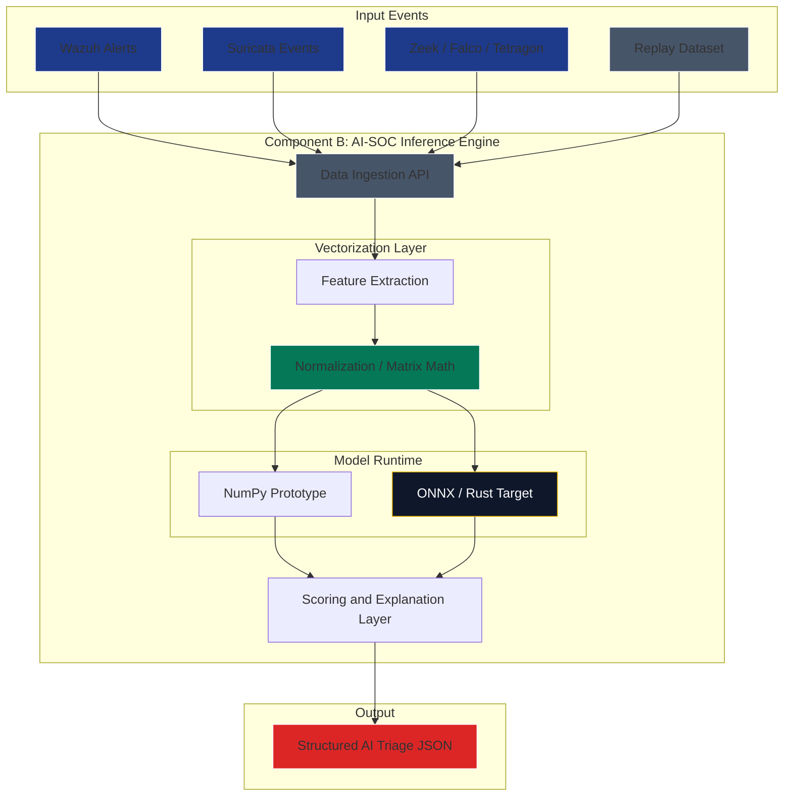

# Component B Deep Dive: AI-SOC Inference Engine

The AI-SOC inference engine is the mathematical enrichment layer of Underground Nexus. Its job is to transform security telemetry into structured scores, labels, and explanations that can support triage and response.

This component should evolve in phases. In the near term, it enriches events from Wazuh, Suricata, Zeek, Falco, Tetragon, Vector, or exported datasets. In compose-your-own labs (ADR 0011), Vector POSTs normalized sensor events to `POST /v1/triage` and persistence lives in ai-inference SQLite — not Wazuh indexer. In the long term, it can become a high-speed hermetic workload running inside a gVisor sandbox.

## 1. Inference Evolution

| Phase | Inference model | Purpose |
| --- | --- | --- |
| Phase 1: Bootstrap | Python/NumPy enrichment service | Score Wazuh, Suricata, and Vector-routed hybrid sensor events while the SOC baseline matures. |
| Phase 2: Hermetic migration | Stable model artifact, API boundary, and replayable datasets | Validate model behavior against standard SOC events and early SecureOS telemetry. |
| Phase 3: High-assurance target | Rust or minimal runtime loading signed ONNX artifacts inside a gVisor sandbox | Provide low-latency AI-native inference from trusted telemetry streams. |

## 2. Architectural Shift: From Text to Tensors

Traditional SOC workflows often search text logs with rules, regular expressions, and signature matching. Those methods are useful, but they can miss behavior that changes shape without matching a known signature.

The AI-native approach converts system behavior into numerical features.

Pipeline stages:

1. **Input:** Events arrive from the sensor layer, Wazuh, Suricata, Zeek, Falco, Tetragon, Vector, replay datasets, or future SecureOS telemetry.
2. **Feature extraction:** Raw events are converted into stable fields such as ports, protocols, process names, syscall categories, timing windows, and frequency counts.
3. **Vectorization:** Features are normalized into numerical tensors.
4. **Inference:** A model calculates a score or label.
5. **Output:** The engine emits structured JSON with traceable model metadata.

## 3. Visual Plot: Tensor Data Pipeline

## 4. Technology Stack

The inference engine should start simple and become more constrained as the runtime matures.

| Phase | Recommended stack | Notes |
| --- | --- | --- |
| Phase 1 | Python, NumPy, scikit-learn only if needed | Best for fast experimentation and Security+ labs. |
| Phase 2 | FastAPI or small service boundary plus signed model artifacts | Makes the model callable, replayable, and testable. |
| Phase 3 | Rust service with ONNX Runtime or another minimal inference runtime | Better fit for gVisor, memory safety, and reduced runtime dependencies. |

ONNX is useful because models can be trained in Python and exported into a portable runtime artifact. The runtime should verify model identity and version before loading it.

## 5. Output Schema

The inference engine should produce traceable output rather than only a raw confidence number.

Minimum output fields:

- `source_event_id`
- `timestamp`
- `model_name`
- `model_version`
- `model_digest`
- `score`
- `label`
- `threshold`
- `reason`
- `features_used`
- `recommended_action`

Example labels:

- `benign`
- `suspicious`
- `likely_true_positive`
- `likely_false_positive`
- `needs_human_review`

## 6. Model Governance

AI-SOC models should be treated like production artifacts.

Required controls:

- Signed model artifacts.
- SBOM or dependency metadata for model runtime images.
- Training dataset versioning.
- Evaluation results stored as artifacts.
- Replay tests against known-good and known-bad event sets.
- Human approval before a model changes production thresholds.

Autonomous response should not be enabled until model governance, audit trails, and approval workflows are in place.

## 7. Security+ SY0-701 Alignment

- **Domain 2.4, Indicators of Malicious Activity:** Uses behavioral features to detect suspicious activity.
- **Domain 3.2, Secure Enterprise Infrastructure:** Keeps sensitive telemetry handling scoped to controlled runtimes.
- **Domain 4.4, Security Alerting and Monitoring:** Enriches alerts with scores and triage labels.
- **Domain 5.1, Security Governance:** Requires model versioning, approval, and auditability.

## 8. Guardrails

- Keep Wazuh and Suricata as the source of truth until AI outputs are validated.
- Do not market the model as zero-day detection without evaluation evidence.
- Do not write raw sensitive telemetry to disk unless retention and protection are explicit.
- Sign model artifacts and record the digest in every inference output.
- Prefer human-approved response actions until confidence and governance mature.
