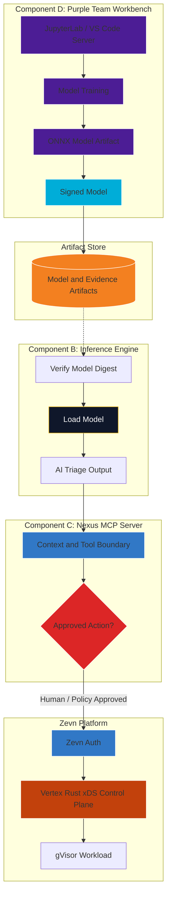

# Component C and D Deep Dive: Nexus MCP Server and Purple Team Workbench

The Nexus MCP server is the interface layer for AI-SOC findings. The Purple Team Workbench is the MLOps and investigation environment where humans evaluate detections, tune models, and approve changes.

Together, these components turn Underground Nexus from passive monitoring into governed security operations. They should not start as fully autonomous SOAR. Human approval and auditability come first.

## 1. Component C: Nexus MCP Server

The Nexus MCP server is a TypeScript service that translates AI-SOC findings into tools, context, and approved workflows.

### Role

- Receive structured AI triage output.
- Expose investigation tools and context.
- Expose security findings to approved Nexus/SOC clients.
- Enforce identity, authorization, and audit requirements before response actions.
- Provide a controlled boundary between AI output and operational actions.

### Response Model

| Phase | MCP behavior | Response posture |
| --- | --- | --- |
| Phase 1: Bootstrap | Context and tool exposure only | Human-approved investigation |
| Phase 2: Hermetic migration | Limited approved actions in sandbox environments | Human-approved containment |
| Phase 3: High-assurance target | Policy-gated response through Vertex and Zevn Auth | Carefully scoped automation |

## 2. Component D: Purple Team Workbench

The workbench is the environment where analysts, data scientists, and security engineers evaluate the AI-SOC and manage model changes.

### Role

- Query historical telemetry and labeled Athena datasets.
- Train or tune models with Python, PyTorch, scikit-learn, or similar tools.
- Export models into `.onnx` or another portable artifact format.
- Sign model artifacts through the secure software factory.
- Review model evaluation results before promotion.
- Maintain runbooks and investigation notes.

In the current Phase 1 architecture, this maps to `nexus-workbench` (implemented as a secure JupyterLab container on a Chainguard base). In the Zevn target architecture, this environment will be authenticated through Zevn Auth.

## 3. MLOps Workflow

1. Athena generates labeled adversarial data in a sandbox.
2. Sensors and Wazuh/Suricata capture telemetry.
3. The inference engine scores events.
4. The workbench compares predictions against ground-truth labels.
5. Analysts evaluate false positives, false negatives, and model drift.
6. A new model is trained or tuned.
7. The model is exported, signed, and stored as an artifact.
8. The inference engine verifies the model before loading it.

## 4. Visual Plot: MLOps and Response Loop

## 5. Model Promotion Controls

Model promotion should require more than a successful training run.

Required controls:

- Signed model artifact.
- Model digest recorded in release metadata.
- Training dataset version.
- Evaluation dataset version.
- False-positive and false-negative report.
- Human approval for threshold changes.
- Rollback model retained and trusted.

## 6. Security+ SY0-701 Alignment

- **Domain 4.8, Incident Response:** MCP provides controlled investigation and response workflows.
- **Domain 2.4, Malicious Activity and ML Risks:** Workbench supports model evaluation and poisoning resistance.
- **Domain 4.6, Identity and Access Management:** Response actions require identity and authorization.
- **Domain 5.1, Security Governance:** Model promotion and response actions are auditable.

## 7. Guardrails

- Do not allow raw AI confidence scores to trigger destructive actions automatically.
- Require Zevn Auth, policy, and audit logs for response workflows.
- Sign and attest model artifacts before production use.
- Keep training data and evaluation data separate.
- Keep the current workbench profile usable while the Zevn target environment matures.
