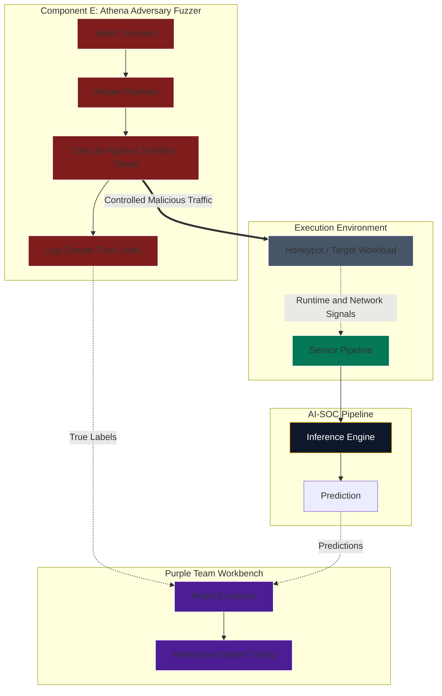
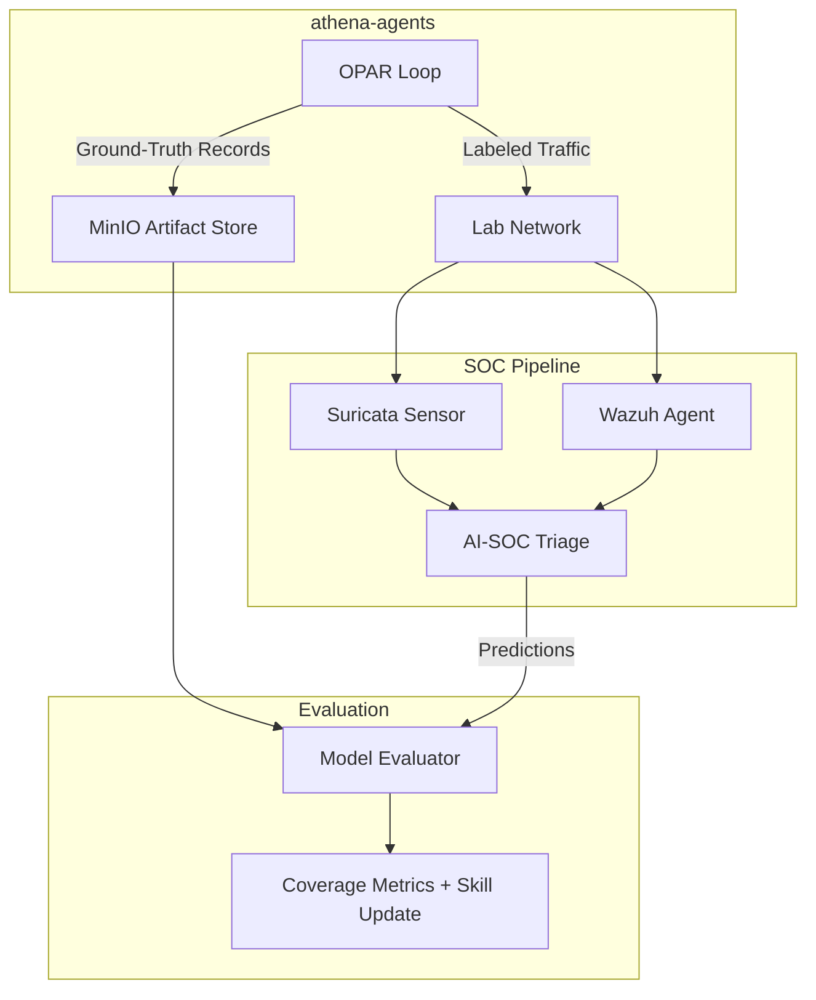

# Component E Deep Dive: Athena Adversary Fuzzer

Athena evolves from a manually operated Kali container into a controlled adversarial data generator. Its purpose is to produce labeled attack telemetry for training, evaluation, and SOC validation.

This component must remain isolated. It should never run against production systems or uncontrolled networks.

## 1. Athena Evolution

These rows are **Athena component maturity**, not architecture roadmap Phase 2/3
(SecureOS / hermetic). OPAR in `athena-agents` is **Phase 1 capable** on the
fabric/range spine (ADR 0002). Architecture Phase 2/3 remain future Enterprise
Platform / gVisor targets (`03`, `04`, `09`).

| Athena stage | Model | Purpose |
| --- | --- | --- |
| Bootstrap (arch Phase 1) | Isolated `nexus-athena` Kali container | Generate controlled lab traffic and validate Wazuh/Suricata detections. |
| LLM-Driven Emulation (arch Phase 1+) | OPAR agent loop (`athena-agents`) | Adaptive, labeled attack datasets with allowlist/capability gates. Optional SecureOS signal comparison later. |
| High-assurance target (arch Phase 2–3) | Headless adversary fuzzer in gVisor with LLM planning | Continuous sandbox stimulation with signed ground-truth; skills persist across runs. |

## 2. Architectural Shift: Continuous ML Data Generation

Machine learning models need balanced datasets. If the AI-SOC only sees normal traffic, it can become weak at recognizing malicious behavior. Athena supplies controlled, labeled malicious examples.

The goal is not random attack automation. The goal is repeatable adversarial scenarios with clear ground-truth labels.

With LLM agent orchestration (Athena LLM-Driven Emulation stage), this shifts from static scenario replay to adaptive stimulation. The LLM plans multi-step attack chains, mutates payloads based on target responses, and generates novel variations that exercise detection coverage gaps the SOC has not seen before.

Example scenarios:

- SQL injection attempts against approved lab targets.
- Malformed JWT or SD-JWT downgrade attempts.
- Replay attacks in a sandbox authentication flow.
- Suspicious process execution in a controlled workload.
- Protocol fuzzing against honeypot services.
- LLM-planned lateral movement chains across segmented lab networks.
- Adaptive ICS/OT probing with safe-range boundary awareness.
- Multi-stage exfiltration emulation with ground-truth labels at each step.

## 3. Internal Fuzzing Loop

### Static Mode (Phase 1)

1. **Select scenario:** Choose an approved test case and target.
2. **Generate payload:** Mutate payloads using deterministic fuzzing logic or curated test cases.
3. **Execute:** Send the payload to a sandbox target.
4. **Label:** Record timestamp, target, payload family, expected behavior, and scenario ID.
5. **Observe:** Let the sensor and SOC pipeline capture telemetry.
6. **Reconcile:** Compare ground-truth labels against AI-SOC predictions.
7. **Evaluate:** Calculate true positives, false positives, false negatives, and missed telemetry.

### LLM Agent Mode (Phase 2+)

The `athena-agents` repository implements this as an OPAR (Observe/Plan/Act/Reflect) execution cycle driven by a local LLM:

1. **Observe:** Produce a structured target-state snapshot (ports, services, prior action results).
2. **Plan:** The LLM selects the next technique and tool from the registry based on observations, action history, and loaded skills.
3. **Act:** Execute the selected tool with safety controls (allowlist, rate limiter, capability gates, ICS safe ranges).
4. **Reflect:** Evaluate the result, emit a labeled ground-truth record, and update action history.
5. **Loop:** Continue until max_actions is reached, the scenario objective is met, or a `needs_review` flag halts execution.

The LLM agent mode subsumes the static loop — it can replay curated scenarios but also deviate intelligently when target responses indicate unexplored attack surface.

## 4. Visual Plot: Closed-Loop Training Lifecycle

## 5. Ground-Truth Schema

Athena output should be structured enough for replay and model evaluation.

Minimum fields:

- `scenario_id`
- `run_id`
- `timestamp`
- `target`
- `payload_family`
- `technique`
- `expected_result`
- `safety_boundary`
- `label`
- `artifact_reference`

Example labels:

- `malicious`
- `benign_control`
- `failed_attack`
- `successful_simulation`
- `needs_review`

## 6. Safety Controls

Athena should have stronger guardrails than normal test tooling.

Required controls:

- Isolated network or namespace.
- Approved target allowlist.
- No default production credentials.
- No broad Docker socket access.
- Explicit packet-capture or exploit-lab profile when needed.
- Rate limits and stop conditions.
- Signed scenario definitions.

## 7. Security+ SY0-701 Alignment

See Section 9 below (merged with LLM agent context).

## 8. LLM Agent Implementation: `athena-agents`

The `athena-agents` repository is the canonical implementation of LLM-driven adversary emulation for Phase 2+.

### Components

| Component | Purpose |
| --- | --- |
| `orchestrator/agent.py` | Core OPAR loop with safety controls |
| `orchestrator/llm/` | Configurable LLM backends (Ollama, vLLM, llama.cpp) |
| `orchestrator/tool_registry.py` | Config-driven offensive tool catalog |
| `orchestrator/allowlist.py` | SHA-256 verified target allowlist |
| `orchestrator/rate_limiter.py` | Per-target token-bucket rate limiting |
| `orchestrator/ics_safety.py` | ICS/OT boundary validation |
| `orchestrator/ground_truth.py` | Labeled telemetry emission |
| `orchestrator/traffic_labeling.py` | HTTP headers and env vars for SOC filtering |
| `config/tool-registry.toml` | Tool definitions with capability gates |
| `config/targets/` | Per-target TOML configs (safe ranges, rate limits) |
| `eval/ics_metrics.py` | Coverage and compliance metrics |

### Agent Skill Persistence

After an agent completes a scenario, the approach is captured as a reusable skill:

- **What:** Technique sequence, target characteristics, indicators observed, pitfalls encountered.
- **Why:** Eliminates redundant LLM planning on repeat encounters. Reduces token spend.
- **Where:** Skills are stored in MinIO (platform level) or `~/.kiro/skills/` (development level).
- **When loaded:** At the start of the OPAR Plan phase, relevant skills are injected into the LLM context.

This mirrors the Hermes Agent auto skill generation pattern adapted for offensive security workflows.

### Integration with SOC Pipeline

## 9. Security+ SY0-701 Alignment

- **Domain 5.5, Penetration Testing and Assessments:** Performs controlled offensive validation in a known environment.
- **Domain 2.4, Application Attacks:** Generates realistic indicators for replay, downgrade, injection, and fuzzing scenarios.
- **Domain 4.7, Automation and Orchestration:** Automates repeatable validation without relying on manual red-team commands. LLM agent mode extends this to adaptive, autonomous orchestration.
- **Domain 4.8, Incident Response:** Produces labeled evidence for detection evaluation and post-test review.

## 10. Guardrails

- Keep Athena isolated from production systems.
- Treat generated attack data as training data, not proof that the model is production-ready.
- Prevent model poisoning by signing scenario definitions and validating labels.
- Keep a benign control dataset alongside malicious examples.
- Require human approval before using Athena-generated results to change production model thresholds.
- LLM agents must operate within allowlist and rate-limit constraints at all times.
- Agent skills must be versioned and signed before use in unattended scenarios.
