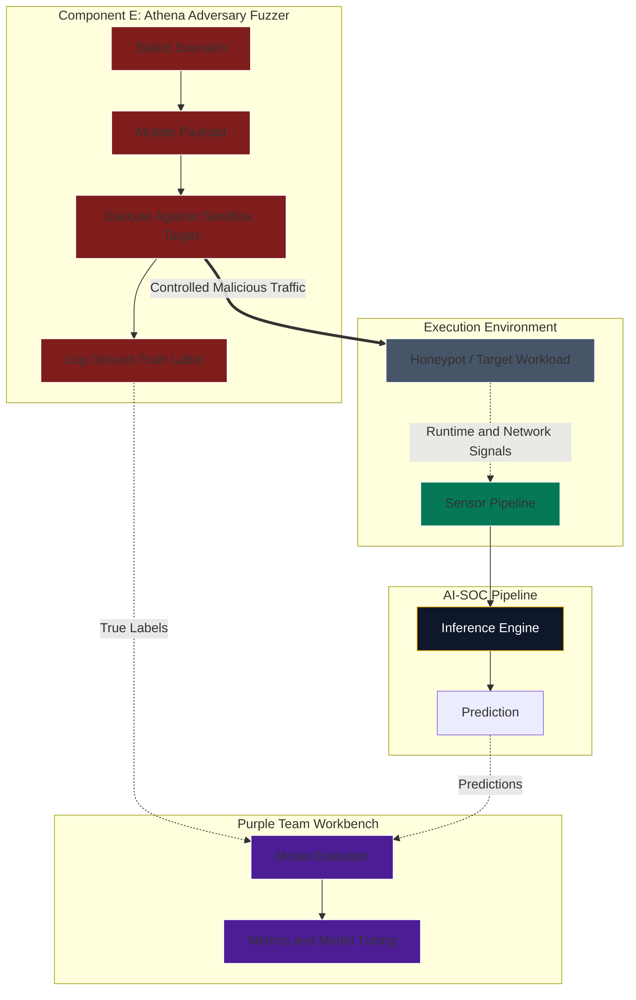

# Component E Deep Dive: Athena Adversary Fuzzer

Athena evolves from a manually operated Kali container into a controlled adversarial data generator. Its purpose is to produce labeled attack telemetry for training, evaluation, and SOC validation.

This component must remain isolated. It should never run against production systems or uncontrolled networks.

## 1. Athena Evolution

| Phase | Athena model | Purpose |
| --- | --- | --- |
| Phase 1: Bootstrap | Isolated `nexus-athena` Kali container | Generate controlled lab traffic and validate Wazuh/Suricata detections. |
| Phase 2: Hermetic migration | Programmatic adversary runner with scenario labels | Produce repeatable attack datasets and compare Linux/Kubernetes signals against SecureOS telemetry. |
| Phase 3: High-assurance target | Headless adversary fuzzer inside a gVisor sandbox | Continuously test designated sandbox workloads and feed signed ground-truth data into the AI-SOC loop. |

## 2. Architectural Shift: Continuous ML Data Generation

Machine learning models need balanced datasets. If the AI-SOC only sees normal traffic, it can become weak at recognizing malicious behavior. Athena supplies controlled, labeled malicious examples.

The goal is not random attack automation. The goal is repeatable adversarial scenarios with clear ground-truth labels.

Example scenarios:

- SQL injection attempts against approved lab targets.
- Malformed JWT or SD-JWT downgrade attempts.
- Replay attacks in a sandbox authentication flow.
- Suspicious process execution in a controlled workload.
- Protocol fuzzing against honeypot services.

## 3. Internal Fuzzing Loop

1. **Select scenario:** Choose an approved test case and target.
2. **Generate payload:** Mutate payloads using deterministic fuzzing logic, curated test cases, or a local model.
3. **Execute:** Send the payload to a sandbox target.
4. **Label:** Record timestamp, target, payload family, expected behavior, and scenario ID.
5. **Observe:** Let the sensor and SOC pipeline capture telemetry.
6. **Reconcile:** Compare ground-truth labels against AI-SOC predictions.
7. **Evaluate:** Calculate true positives, false positives, false negatives, and missed telemetry.

## 4. Visual Plot: Closed-Loop Training Lifecycle

## 5. Ground-Truth Schema

Athena output should be structured enough for replay and model evaluation.

Minimum fields:

- `scenario_id`
- `run_id`
- `timestamp`
- `target`
- `payload_family`
- `technique`
- `expected_result`
- `safety_boundary`
- `label`
- `artifact_reference`

Example labels:

- `malicious`
- `benign_control`
- `failed_attack`
- `successful_simulation`
- `needs_review`

## 6. Safety Controls

Athena should have stronger guardrails than normal test tooling.

Required controls:

- Isolated network or namespace.
- Approved target allowlist.
- No default production credentials.
- No broad Docker socket access.
- Explicit packet-capture or exploit-lab profile when needed.
- Rate limits and stop conditions.
- Signed scenario definitions.

## 7. Security+ SY0-701 Alignment

- **Domain 5.5, Penetration Testing and Assessments:** Performs controlled offensive validation in a known environment.
- **Domain 2.4, Application Attacks:** Generates realistic indicators for replay, downgrade, injection, and fuzzing scenarios.
- **Domain 4.7, Automation and Orchestration:** Automates repeatable validation without relying on manual red-team commands.
- **Domain 4.8, Incident Response:** Produces labeled evidence for detection evaluation and post-test review.

## 8. Guardrails

- Keep Athena isolated from production systems.
- Treat generated attack data as training data, not proof that the model is production-ready.
- Prevent model poisoning by signing scenario definitions and validating labels.
- Keep a benign control dataset alongside malicious examples.
- Require human approval before using Athena-generated results to change production model thresholds.
