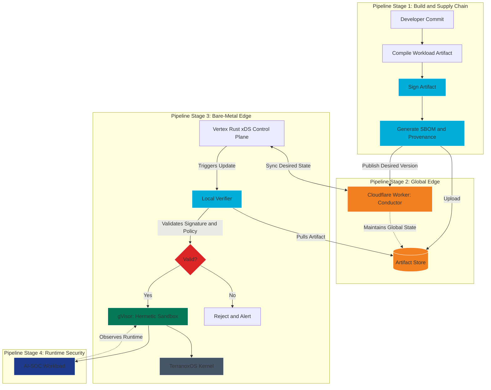

# Production Deployment Lifecycle: Cloudflare to TerranoxOS

This document describes a future Zevn bare-metal deployment lifecycle for hermetic workloads. It is a long-horizon production path, not the current Docker, Kubernetes, Argo CD, or UDS/Zarf deployment model.

The core idea is a zero-trust supply chain: build artifacts are signed before distribution, and TerranoxOS nodes verify signatures locally before handing workloads to the gVisor RuntimeClass.

## 1. Deployment Architecture

The future production architecture has two physical domains.

| Domain | Role |
| --- | --- |
| Global edge | Cloudflare Workers, artifact coordination, global state, identity-aware routing |
| Bare-metal edge | TerranoxOS nodes, Vertex Rust xDS control plane, data-plane APIs, local verification, gVisor execution, AI-SOC runtime monitoring |

## 2. Step-by-Step Production Flow

1. **Build and sign:** A developer pushes code for AI-SOC, Zeld UI, or another Zevn workload. The secure software factory compiles it into a workload artifact and signs it with Cosign or an equivalent signing flow.
2. **Publish artifact:** The signed artifact, SBOM, provenance, and scan results are uploaded to the artifact store.
3. **Update global state:** A Cloudflare Worker, published through Wrangler, updates the desired production version.
4. **Synchronize nodes:** TerranoxOS nodes receive or poll desired state through the Vertex Rust xDS control plane.
5. **Pull and verify:** A node downloads the artifact and verifies the signature, provenance, and policy requirements locally.
6. **Execute:** If verification succeeds, the workload is handed to the gVisor RuntimeClass for hermetic execution.
7. **Monitor:** Underground Nexus observes runtime behavior and reports deployment anomalies.
8. **Reject and alert:** If verification fails, the node rejects the artifact and raises an alert.

## 3. Visual Plot: Production Deployment Pipeline

## 4. Verification Policy

Local verification should check more than "is the signature valid?"

Recommended checks:

- Signature identity matches an approved issuer or key.
- Artifact digest matches the desired state.
- SBOM is present.
- Provenance is present.
- Vulnerability scan result meets policy.
- Artifact version is allowed for the target environment.
- Rollback version is known and still trusted.

## 5. Security+ SY0-701 Alignment

- **Domain 2.3, Software Supply Chain Security:** Signed artifacts and local verification reduce supply-chain poisoning risk.
- **Domain 4.7, Automation and Orchestration:** Desired state is updated through an automated conductor rather than manual SSH.
- **Domain 3.2, Secure Enterprise Infrastructure:** Bare-metal nodes verify artifacts before execution.
- **Domain 4.8, Incident Response:** Rejected artifacts and runtime anomalies become alertable events.

## 6. Operational Summary

In this target state, operators do not SSH into servers to deploy workloads. They publish signed artifacts and update desired state. TerranoxOS nodes verify artifacts locally, execute trusted workloads inside a gVisor sandbox, and report anomalies to Underground Nexus.

## 7. Guardrails

- Keep this lifecycle separate from the current Argo CD and UDS/Zarf deployment path.
- Do not rely on artifact storage integrity alone; local verification is mandatory.
- Treat Cloudflare as a conductor and distribution layer, not the root of trust.
- Keep rollback artifacts signed, retained, and policy-approved.
- Alert on failed verification, unexpected rollback, or unsigned workload attempts.
