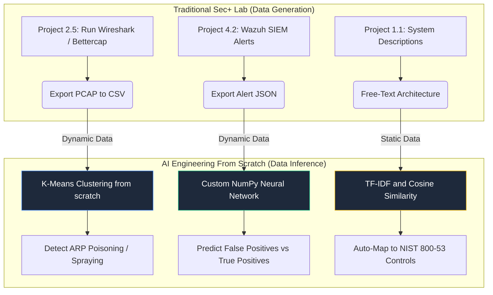

# AI-Infused Security+ (SY0-701) Scenario Projects

This guide takes traditional infrastructure labs from a Security+ study path and adds "from scratch" AI elements. The goal is to generate realistic static or dynamic security data with traditional IT tools, then process that data with custom-built AI algorithms.

## Visual Review: Static Labs to AI Workflows



## Hybrid Project 1: AI-Powered Network Anomaly Detector

**Enhances:** Claude's Project 2.5, Network Attacks Lab

**Security+ domains:** 2.4, Indicators of Compromise; 4.4, Alerting Concepts

**AI concept:** Unsupervised learning with K-Means clustering from scratch

### Data

Follow the network attacks lab to run an ARP poisoning attack or password spray from Kali Linux. Capture the traffic with Wireshark and export packet data to CSV.

Recommended fields:

- Timestamp
- Source IP
- Destination IP
- Protocol
- Length

### AI Element

Build a K-Means clustering algorithm with pure NumPy. The model does not need a predefined attack signature. Instead, it groups traffic by mathematical behavior.

### How It Works

Map packet length and packet frequency to a 2D grid. The algorithm places centroids and groups normal traffic together. A password spray or ARP poisoning attack should behave differently, often as a rapid burst of small packets, so the model can cluster it as an anomaly without a static firewall rule.

## Hybrid Project 2: Smart SIEM Alert Triage

**Enhances:** Claude's Project 4.2, SIEM Build with Wazuh

**Security+ domains:** 4.2, Security Monitoring; 4.3, Vulnerability Analysis

**AI concept:** Supervised learning with a multi-layer perceptron neural network

### Data

Set up Wazuh as instructed and let it run on your network long enough to generate realistic JSON alerts.

Example alerts:

- Failed SSH login
- High CPU usage
- Suspicious process activity
- Authentication failures

Manually tag a CSV of these alerts as:

- `0`: False positive
- `1`: True threat

### AI Element

Repurpose a NumPy log-classifier neural network.

### How It Works

Feed Wazuh alert parameters into the neural network.

Useful input features include:

- Severity level
- Time of day
- Rule ID
- Source IP frequency
- Host or agent name

Train the weights and biases on the tagged CSV. Once trained, connect the Python script to the live Wazuh API. When a new alert arrives, the custom AI predicts the probability that it is a false positive, reducing SIEM fatigue.

## Hybrid Project 3: NLP Control Mapping Engine

**Enhances:** Claude's Project 1.1, Control Mapping for a Real System

**Security+ domains:** 1.1, Security Controls; 5.1, Security Governance

**AI concept:** Natural language processing with TF-IDF and cosine similarity

### Data

Use a JSON file containing NIST 800-53 controls or CIS Controls v8. Pair it with a plain-English description of your homelab.

Example description:

```text
I require users to log in with a password and a YubiKey.
```

### AI Element

Repurpose the CVE blast-radius semantic search pattern.

### How It Works

Tokenize the plain-English system description and calculate cosine similarity against the control database. The model should map terms like `YubiKey` to relevant identity and authentication controls, such as NIST 800-53 `IA-2`, Identification and Authentication (Organizational Users).

## Hybrid Project 4: AI Volatility Memory Clustering

**Enhances:** Claude's Project 4.5, Memory Forensics with Volatility

**Security+ domains:** 4.8, Incident Response; 4.9, Data Sources and Forensics

**AI concept:** Statistical outlier detection with standard deviation math

### Data

Dump the RAM of a Windows VM with DumpIt or a similar tool. Run Volatility 3 `pslist` to collect running processes, parent process IDs, memory usage, and memory addresses.

### AI Element

Write a pure Python script to analyze the process tree.

### How It Works

Calculate the standard deviation of memory usage for common processes, such as `svchost.exe`. If a process falls three standard deviations outside the norm, has an unusual parent process, or has no parent process where one is expected, flag it as potential injected malicious code.

## Review Notes

- This file is a scenario planning document, not a statement that these labs are already implemented in this repository.
- Add concrete input and output schemas before turning any project into code.
- Keep attack generation in an isolated lab network and avoid running offensive tooling against systems you do not own or have explicit permission to test.
