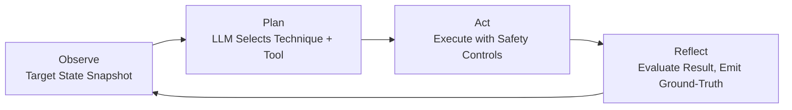

# AI-Native Integration Principles

**Status:** Proposed / Draft
**Context:** This document outlines the architectural shift from "bolted-on AI" (where AI is treated as an external chat widget) to an "AI-native" environment within the Underground Nexus. These principles are inspired by the Odysseus self-hosted workspace model and adapted for a secure, Kubernetes-based security lab and SOC environment.

## 1. Cookbook Architecture (Hardware-Aware AI Inference)

The inference layer (`platform/ai-inference`) must be deeply aware of the hardware it runs on. Rather than relying on static deployment configurations, the Nexus should dynamically adapt to available resources.

### Key Concepts

- **Pre-flight Hardware Scanning**: Inference pods use init-containers or DaemonSets to scan the underlying node for GPU availability (e.g., checking for CUDA, ROCm, or Metal).
- **Dynamic Serving Engine Selection**:
  - **High-Tier (NVIDIA/AMD GPUs)**: Deploy `vLLM` serving highly optimized formats like FP8 or AWQ for maximum throughput.
  - **Low-Tier (CPU-only / Edge)**: Fallback to `llama.cpp` serving highly quantized GGUF models.
- **Automated Model Provisioning**: The "Cookbook" acts as an internal model registry (backed by MinIO). When the lab bootstraps, it pulls the appropriate model size based on the hardware scan, ensuring the lab is immediately functional without manual tuning.

## 2. Agentic Workspace (MCP)

The user interface (`platform/workbench`) is not just a terminal and a browser; it is an intelligent agentic client powered by the Model Context Protocol (MCP).

### Key Concepts

- **Workbench as an MCP Client**: The analyst's desktop environment natively connects to a local LLM and orchestrates tools.
- **Infrastructure as Tools**: Every major component in the lab is exposed via MCP Servers:
  - **Wazuh MCP Server**: Allows the agent to query logs and pull alerts.
  - **MinIO MCP Server**: Allows the agent to read and write PCAPs, artifacts, and reports.
  - **k3d / Kubernetes MCP Server**: Allows the agent to spin up adversary emulation pods in the `Athena` environment automatically.
- **"Assisted, Not Delegated" UX**: The analyst drives the investigation. The AI provides inline ghost-text for complex Suricata rules, highlights anomalies directly in logs, and auto-completes incident reports in the editor, rather than forcing the user to switch context to a separate chat window.

## 3. AI-Native Triage Layer (SOC)

In a traditional SOC, human analysts review raw event streams. In an AI-native SOC (`platform/soc`), the AI serves as the front-line triage agent, processing data before a human ever sees it.

### Key Concepts

- **Continuous Inference Loop**: High-fidelity alerts from Suricata and Wazuh are streamed directly into the local inference engine.
- **Automated Enrichment**:
  - **Auto-Tagging**: The AI assigns urgency and categorizes the threat.
  - **Auto-Summarization**: Raw JSON event logs are translated into human-readable attack narratives.
  - **Mitigation Drafting**: The AI preemptively drafts Kubernetes Network Policies or firewall rules to block the threat, awaiting human approval.
- **Persistent Vector Memory**: 
  - Using a vector database (e.g., ChromaDB or Milvus), every analyzed event, incident report, and executed command is embedded into a semantic memory store.
  - When a new event occurs, the AI performs a RAG (Retrieval-Augmented Generation) query to pull context from similar past incidents, allowing the agent's knowledge to compound and evolve over time.

## 4. LLM Agent Stimulation & Emulation

Beyond passive triage, the Underground Nexus uses LLM agents as active participants in attack simulation and adversary emulation. This is the architectural bridge between the Athena red-team tooling and the AI-SOC detection pipeline.

### Core Concepts

- **Stimulation:** LLM agents autonomously generate labeled attack traffic against approved targets. The agent decides what to probe, how to mutate payloads, and when to escalate — producing ground-truth telemetry that feeds directly into the SOC evaluation loop. This replaces static replay scripts with adaptive, context-aware traffic generation.
- **Emulation:** LLM agents assume adversary roles, reasoning through multi-step attack chains (lateral movement, privilege escalation, data exfiltration) against sandbox environments. The agent's planning phase draws on threat intelligence, MITRE ATT&CK mappings, and scenario constraints to produce realistic attack narratives that challenge the blue team.

### Architecture: OPAR Execution Loop

The `athena-agents` repository implements this as an Observe/Plan/Act/Reflect (OPAR) cycle:

1. **Observe:** Produce a structured snapshot of target state (open ports, service banners, prior results).
2. **Plan:** The LLM backend (Ollama, vLLM, or llama.cpp) selects the next technique and tool from the registry based on observations and action history.
3. **Act:** Execute the selected tool with safety controls (allowlist verification, rate limiting, capability gates, safe-range validation for ICS targets).
4. **Reflect:** Evaluate the result, emit a labeled ground-truth record, and append to action history for the next planning iteration.

### Safety Controls

LLM-driven autonomy requires stronger guardrails than scripted attacks:

- **Allowlist integrity:** Target list is SHA-256 verified before each cycle.
- **Rate limiting:** Per-target token-bucket rate limiter prevents runaway execution.
- **Capability gates:** Tools declare required capabilities (e.g., `ICS_WRITE`, `CAN_INJECT`). The agent can only invoke tools matching its active profile.
- **Boundary enforcement:** Write operations to ICS registers are validated against configured safe ranges before execution.
- **Human review checkpoints:** Actions flagged `needs_review` require analyst approval before continuation.

### LLM Backend Configuration

The inference backend is configurable per environment:

| Environment | Backend | Model | Purpose |
|-------------|---------|-------|---------|
| Local lab | Ollama | `llama3:8b` | Fast iteration, low resource |
| GPU node | vLLM | `llama3:70b` (FP8) | High-quality planning decisions |
| Edge/air-gap | llama.cpp | GGUF quantized | Offline adversary emulation |

### Skill-Driven Agent Memory

Inspired by Hermes Agent's auto skill generation, the Nexus uses persistent skill files to avoid redundant LLM reasoning:

- After an agent solves a novel scenario, the approach is encoded as a reusable skill (method, patterns, pitfalls).
- On subsequent encounters, the agent loads the relevant skill first, skipping the discovery phase.
- Skills accumulate across sessions, building domain-specific competence over time.
- This reduces token spend on repeat work and improves consistency across runs.

Implementation in Kiro uses `~/.kiro/skills/` with a `Stop` hook for auto-generation. The same pattern applies at the platform level: agent skills can be stored in MinIO and loaded into the OPAR planning context.

### Cross-Reference

- `athena-agents/` — Full OPAR loop implementation with LLM backend, tool registry, and ground-truth emission.
- `docs/architecture/08-athena-adversary-fuzzer.md` — Athena evolution roadmap (Phase 2/3 are implemented by athena-agents).
- `platform/athena/` — Platform-level Athena component definitions.
- `config/tool-registry.toml` (in athena-agents) — Offensive tool catalog with capability gates.

## 5. Multi-Project Security & Orchestration Layer

Underground Nexus does not function solely as an isolated security workspace. It acts as an integration and orchestration layer across external projects and development targets.

### Key Concepts

- **Cross-Boundary Telemetry Ingestion**: The AI-SOC inference layer (`platform/ai-inference`) is exposed via secure gRPC/HTTPS interfaces to ingest telemetry (logs, network flows, process events) from other projects running outside the local namespace or cluster.
- **Universal MCP Interface**: By exposing the Nexus workspace as an MCP Server gateway, external LLM agents and workflows in other projects can access the tools and security context hosted in the Nexus (e.g., executing fuzzer runs, retrieving analysis reports, querying indexed security states).
- **Federated Attestation & Policy Enforcer**: The secure build pipelines and secrets boundaries within the Nexus secure software factory can broker trust and attestations for external software bundles, creating a centralized security assurance service for your entire project ecosystem.
