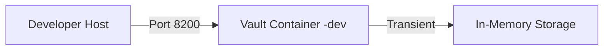
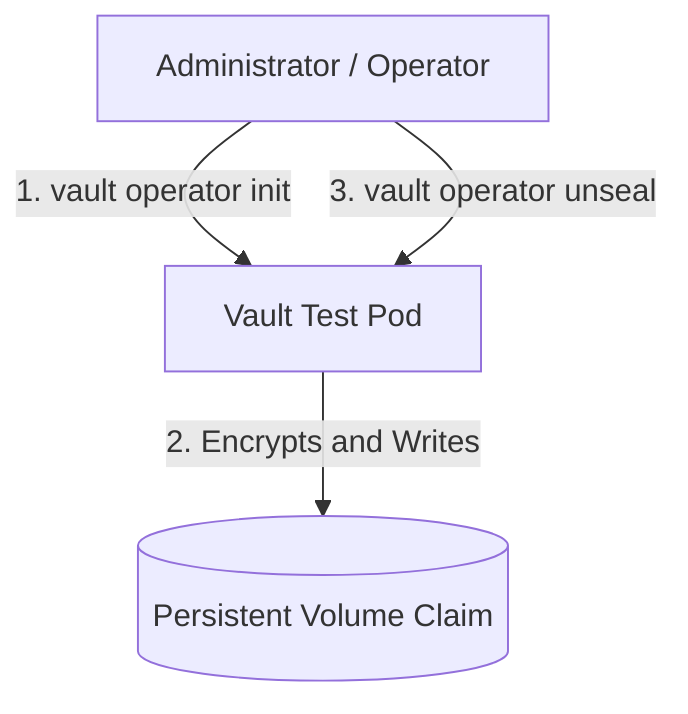
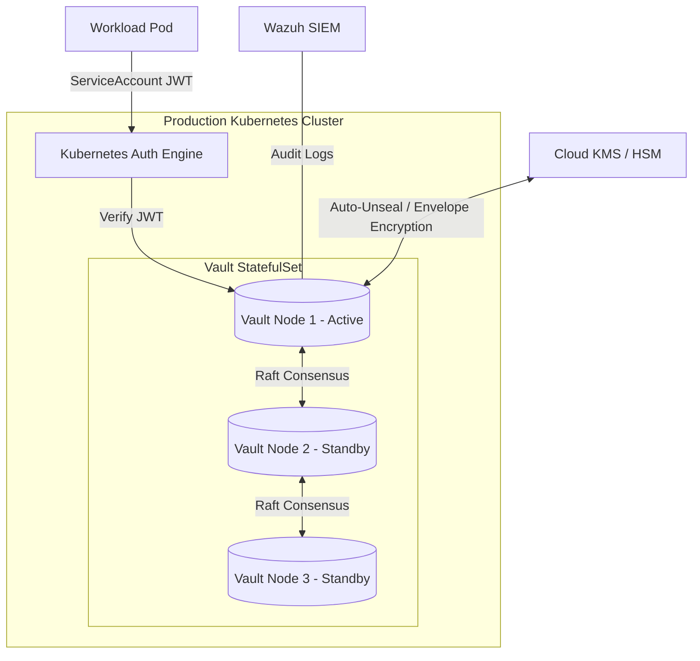

# HashiCorp Vault Environment Specification

This document defines the architecture, storage layouts, unseal mechanisms, and security controls for HashiCorp Vault across the development, test/staging, and production environments of the Underground Nexus.

---

## 1. Environment Matrix

| Control Category | Development (Dev) | Test / Staging (Staging) | Production (Prod) |
| :--- | :--- | :--- | :--- |
| **Topology** | Single container | Single-node deployment | Multi-node StatefulSet (3 or 5 pods) |
| **Storage Backend** | In-Memory (Transient) | Local Persistent Volume (Raft / File) | Integrated Raft Storage (Replicated) |
| **Unseal Workflow** | Auto-unsealed (Dev mode) | Manual (Shamir Secret Sharing) | Automatic (Cloud KMS or Hardware HSM) |
| **Authentication** | Static root token (`myroot`) | AppRoles & ServiceAccounts (Static tokens permitted) | Kubernetes Auth Method (No static credentials) |
| **Secret Injection** | Direct Env / Kubernetes Secret fallback | Mounted Kubernetes Secret | Vault Agent Injector / External Secrets Operator |
| **TLS Mode** | Disabled (Localhost-only or dev cluster) | Enabled (Internal CA / Self-signed) | Enabled (Production PKI / TLS 1.3 strict) |
| **Audit Logging** | Disabled / Stdout | Local file rotation | Streamed directly to Wazuh and Loki |

---

## 2. Development Environment (Dev)

The Dev environment focuses on developer velocity, rapid bootstrapping, and API integration testing.

### Specifications
* **Command**: Runs with the `-dev` flag to automatically bootstrap, mount the KV-v2 engine at `secret/`, and pre-authenticate the CLI.
* **Auto-Unseal**: Vault handles unsealing automatically and logs the keys/token to stdout.
* **Root Token**: Configured with a static token (e.g., `VAULT_DEV_ROOT_TOKEN_ID=myroot`) to allow local automation scripts to interact with Vault deterministically.
* **Storage**: In-memory only. Any restarts destroy all secrets, matching the ephemeral nature of local code development.
* **Local lab pack**: Use the sibling repo [nexus-hashistack](https://github.com/acald-creator/nexus-hashistack) (`./scripts/nexus-dev-up.sh`) beside this stack. Feed secrets into compose with `./scripts/dev-stack.sh up --from-vault` after exporting AppRoles.

---

## 3. Test / Staging Environment (Test)

The Test/Staging environment simulates production-like workflows, forcing validation of the unsealing process, configuration persistence, and custom policies.

### Specifications
* **Persistence**: Backed by a Kubernetes `PersistentVolume` (using the cluster's default storage class, e.g., `local-path` or `gp2`) to preserve state across pod restarts.
* **Manual Init/Unseal**: Simulates real disaster recovery and initialization. Administrators must manually initialize Vault via `vault operator init` and unseal the node using Shamir's Secret Sharing keys (typically 3 out of 5 key shares).
* **Configuration**: Declared in a `vault.hcl` configuration file mounted via a `ConfigMap`.
* **Testing Scope**: Used to test authentication workflows, ACL policies, and bootstrap scripts before they are promoted to Production.

---

## 4. Production Environment (Prod)

The Production environment enforces high availability, zero-trust access control, automated recovery, and robust auditing.

### Specifications
* **High Availability (HA)**: Deployed as a 3-node or 5-node StatefulSet using Vault's **Integrated Storage (Raft)**. Data is replicated across nodes using the Raft consensus protocol.
* **KMS Auto-Unseal**: Nodes are automatically unsealed upon startup or restart using envelope encryption backed by a Cloud Key Management Service (such as AWS KMS, Azure Key Vault, or GCP KMS) or a local hardware security module (HSM).
* **Workload Identity (Kubernetes Auth)**: No static Vault tokens or user credentials are allowed. Workloads authenticate dynamically:
  1. The workload presents its native Kubernetes `ServiceAccount` JWT to Vault.
  2. Vault validates the token against the Kubernetes API.
  3. Vault returns a short-lived token scoped strictly to the application's policy mapping.
* **Secret Injection**:
  - **Vault Agent Injector**: A mutating webhook injects Vault Agent sidecars into application pods. The agent handles authentication and writes secrets to a shared memory-backed `emptyDir` volume, ensuring credentials never touch physical disk storage.
  - **External Secrets Operator (ESO)**: Synchronizes Vault secret engines directly into native Kubernetes Secrets, useful for applications that require secrets in environment variables.
* **Auditing and Compliance**:
  - Vault audit logs are enabled on all active nodes and streamed to the centralized **Wazuh** manager and **Loki** instance for threat detection and compliance tracking.
  - IPC memory locking (`IPC_LOCK` capability) is enforced in the Pod Security Context to prevent Vault data from being swapped out to disk.
