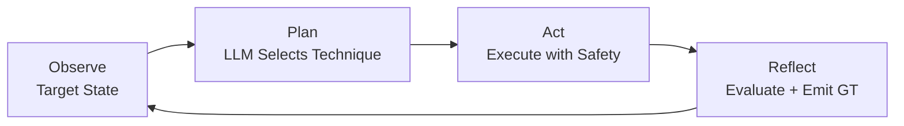
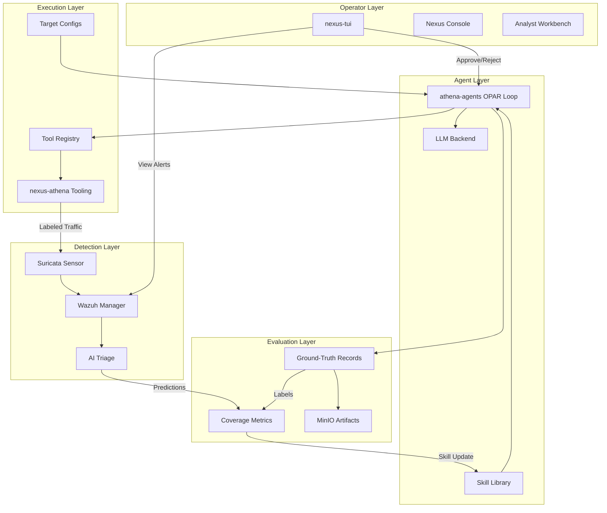

# Agent Workflows and Memory

**Status:** Active / Implemented
**Context:** This document describes the LLM agent execution architecture, persistent memory system, and terminal operator interface that enable autonomous adversary emulation and skill-driven SOC workflows within Underground Nexus.

## 1. OPAR Execution Loop

The `athena-agents` repository implements an Observe/Plan/Act/Reflect execution cycle driven by a local LLM.



### Phases

| Phase | Input | Output | LLM Involved |
|-------|-------|--------|-------------|
| Observe | Target host, prior action history | Structured state snapshot | No |
| Plan | State snapshot + skills + tool registry | Selected technique + tool + arguments | Yes |
| Act | Tool invocation spec | ActionResult + ground-truth record | No |
| Reflect | ActionResult + expectations | ReflectSummary appended to history | Yes (optional) |

### LLM Backend Configuration

| Environment | Backend | Model | Use case |
|-------------|---------|-------|----------|
| Local lab | Ollama | `llama3:8b` | Fast iteration, low resource |
| GPU node | vLLM | `llama3:70b` (FP8) | High-quality planning |
| Edge/air-gap | llama.cpp | GGUF quantized | Offline emulation |

## 2. Safety Controls

LLM-driven autonomy requires layered safety:

### Pre-execution

- **Allowlist integrity:** Target list SHA-256 verified before each cycle.
- **Capability gates:** Tools declare required capabilities (`ICS_WRITE`, `CAN_INJECT`, `NET_RAW`). Agent can only invoke tools matching its active profile.
- **Rate limiting:** Per-target token-bucket rate limiter prevents runaway execution.

### During execution

- **Safe-range validation:** Write operations to ICS registers checked against configured min/max before network transmission.
- **Traffic labeling:** All outbound requests carry `X-Athena-Scenario` and `X-Athena-Run-ID` headers.
- **Max actions:** Configurable loop limit (1-1000) halts execution.

### Post-execution

- **Ground-truth emission:** Every action produces a labeled record (malicious, benign_control, failed_attack, successful_simulation, needs_review).
- **Human review:** `needs_review` flag halts the loop until analyst approves/rejects via nexus-tui or API.

## 3. Agent Memory Architecture

```
┌────────────────────────────────────────────────────────────────┐
│                    Three-Layer Memory                            │
├────────────────────────────────────────────────────────────────┤
│                                                                 │
│  Layer 1: Skills        Layer 2: Sessions     Layer 3: Vectors │
│  (how to solve)         (what happened)       (what's similar) │
│                                                                 │
│  Markdown files         JSONL records          Embeddings       │
│  with front matter      with schema            in vector DB     │
│                                                                 │
│  docs/skills/*.md       docs/skills/           Future:          │
│  ~/.kiro/skills/        sessions/*.jsonl       ChromaDB/Milvus  │
│  MinIO skills/          MinIO sessions/        backed by MinIO  │
│                                                                 │
└────────────────────────────────────────────────────────────────┘
```

### Skill Files

Encode proven approaches as reusable knowledge:

```yaml
---
name: <Skill Name>
description: <One-line summary>
tags: [domain, sub-domain]
inclusion: manual
---
## When to Apply
## Approach
## Key Patterns
## Pitfalls
## References
```

### Session Logs

Record episodic memory of what each agent session accomplished:

```json
{
  "session_id": "ses-2026-08-17-001",
  "timestamp": "2026-08-17T14:00:00Z",
  "agent": "kiro|claude-code|athena-opar",
  "domain": "red-team",
  "task": "...",
  "approach": "...",
  "outcome": "success|partial|failed|blocked",
  "skill_generated": "filename.md",
  "tokens_spent": 12400
}
```

### Sync Workflow

```bash
# Git (source of truth) → local Kiro
scripts/sync-skills.sh push-local

# Local Kiro → Git (after auto-generation)
scripts/sync-skills.sh pull-local

# Git → MinIO (for headless agents)
scripts/sync-skills.sh push-minio

# MinIO → Git (after autonomous runs)
scripts/sync-skills.sh pull-minio
```

## 4. Tool Registry

Tools are defined in `athena-agents/config/tool-registry.toml`:

```toml
[tools.modbus-read]
binary = "athena-modbus"
args = ["--action", "read", "--target", "{target}", "--unit-id", "{unit_id}"]
capabilities_required = []

[tools.modbus-write]
binary = "athena-modbus"
args = ["--action", "write", "--target", "{target}", "--unit-id", "{unit_id}"]
capabilities_required = ["ICS_WRITE"]

[tools.canbus-inject]
binary = "athena-canbus"
args = ["--action", "inject", "--interface", "{interface}"]
capabilities_required = ["CAN_INJECT"]
```

The Plan phase selects tools from this registry. Tools requiring capabilities not in the active profile are filtered out before the LLM sees them.

## 5. Target Configuration

Targets are defined per-environment in TOML:

```toml
# config/targets/openplc.toml
target_id = "openplc-lab"
host = "10.0.3.20"
port = 502
protocol = "ModbusTcp"
ics_rate_limit = 10  # actions per second

[[safe_ranges]]
register_address = 40
min_value = 0
max_value = 400

[[safe_ranges]]
register_address = 10
min_value = 0
max_value = 300
```

## 6. Nexus TUI (Terminal Console)

`cmd/nexus-tui` provides the operator interface for environments without browser access.

```
┌─────────────────────────────────────────────────────┐
│ ⚡ Nexus Triage Console                              │
├─────────────────────────────────────────────────────┤
│ [1] Agent Feed  [2] Alerts  [3] Approvals  [4] Skills│
├─────────────────────────────────────────────────────┤
│                                                      │
│  Panel content (scrollable viewport)                 │
│                                                      │
├─────────────────────────────────────────────────────┤
│ Tab/←→: switch | q: quit | Alerts: N | Pending: M   │
└─────────────────────────────────────────────────────┘
```

### Panels

| Panel | Source | Purpose |
|-------|--------|---------|
| Agent Feed | `NEXUS_AGENT_LOG` (JSONL) | Watch OPAR events in real-time |
| Alerts | `NEXUS_ALERTS_FILE` (JSON/JSONL) | Triage Wazuh/Suricata alerts with severity coloring |
| Approvals | `NEXUS_APPROVAL_QUEUE` (JSONL) | Approve/reject `needs_review` actions |
| Skills | `NEXUS_SKILLS_DIR` (default: `~/.kiro/skills/`) | Browse and view skill library |

### Future

- Live tailing via fsnotify (watch log files for new events)
- WebSocket connection to running OPAR agent for real-time feed
- Write-back for approvals (currently display-only)
- Split-pane views for parallel monitoring

## 7. Integration Diagram



## 8. Cross-References

| Document | Relationship |
|----------|-------------|
| `08-athena-adversary-fuzzer.md` | Athena evolution roadmap, Phase 2/3 agent integration |
| `11-ai-native-integration-principles.md` Section 4 | LLM stimulation/emulation architecture |
| `01-component-architecture.md` Section 3 | Component definitions for agents, memory, TUI |
| `docs/skills/README.md` | Skill format, sync workflow, domains |
| `docs/skills/sessions/README.md` | Session log JSONL schema |

## 9. Security+ SY0-701 Alignment

- **Domain 4.7, Automation and Orchestration:** OPAR loop automates offensive validation with safety constraints.
- **Domain 5.5, Penetration Testing:** LLM agents perform controlled offensive testing against approved targets.
- **Domain 4.8, Incident Response:** Ground-truth records enable detection evaluation and post-test review.
- **Domain 4.1, Secure Baselines:** Safety controls (allowlist, rate limit, capability gates) enforce baseline security for autonomous agents.
